---
## Front matter
title: Лабораторная работа № 1
subtitle: Установка ОС Linux
author:
  - Жукова С. В. НПИбд-01-24
institute:
  - Российский университет дружбы народов, Москва, Россия
date: 5 марта 2024

## Formatting
toc: false
slide_level: 2
theme: metropolis
header-includes: 
 - \metroset{progressbar=frametitle,sectionpage=progressbar,numbering=fraction}
 - '\makeatletter'
 - '\beamer@ignorenonframefalse'
 - '\makeatother'
aspectratio: 43
section-titles: true
---

## Докладчик

:::::::::::::: {.columns align=center}
::: {.column width="70%"}

  * Жукова София Викторовна
  * студентка
  * направления прикладной информатика
  * Российский университет дружбы народов
  * [1032240966@pfur.ru](mailto:1032240966@pfur.ru)
  * <https://svzhukova.github.io/ru/>

:::
::: {.column width="30%"}

:::
::::::::::::::

# Вводная часть

Лабораторная работа Установка ОС Linux

## Цель

Целью данной работы является приобретение практических навыков установки операционной системы на виртуальную машину, настройки минимально необходимых для дальнейшей работы сервисов.

# Установка Virtual Box и Fedora

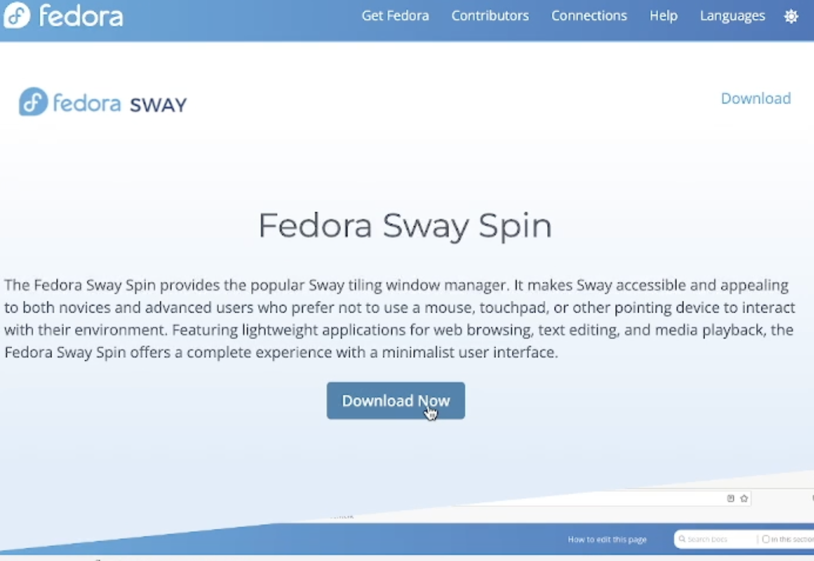{ #fig:001 width=70% }

## 

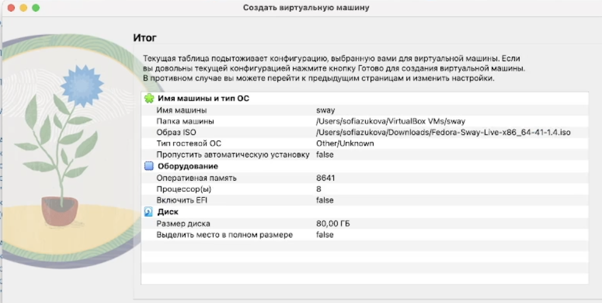{ #fig:002 width=70% }

# После установки

Переключимся на роль супер-пользователя

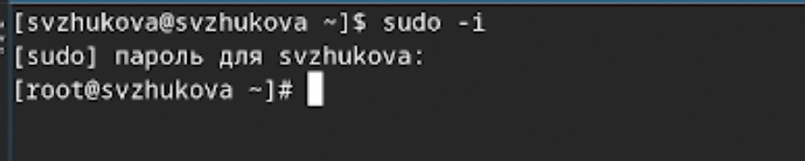{#fig:001 width=70%}

# Обновления

Установим средства разработки

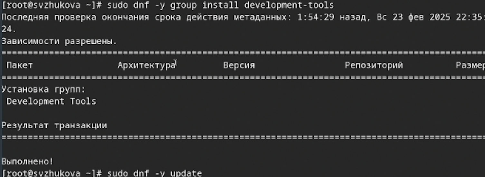{#fig:002 width=70%}

Обновим все пакеты

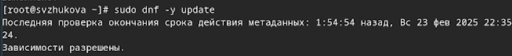{#fig:003 width=70%}

# Повышение комфорта работы

Программы для удобства работы в консоли

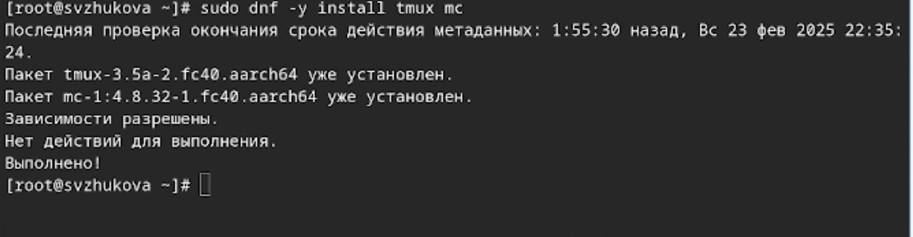{#fig:004 width=70%}

# Автоматическое обновление

Установка программного обеспечения

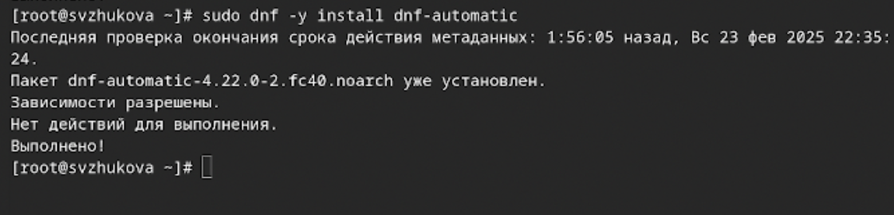{#fig:005 width=70%}

Зададим необходимую конфигурацию в файле /etc/dnf/automatic.conf

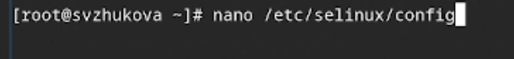{#fig:006 width=70%}

## Запустим таймер

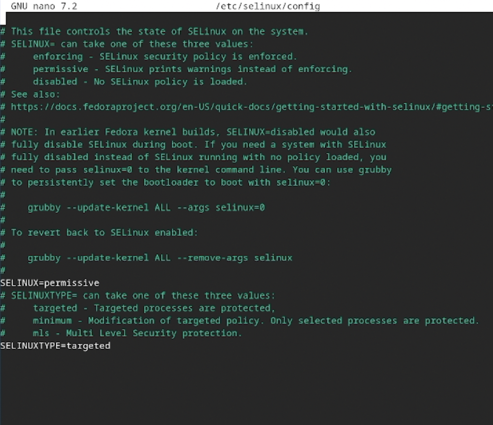{#fig:007 width=70%}

# Отключение SELinux

В данном курсе мы не будем рассматривать работу с системой безопасности SELinux.

 В файле /etc/selinux/config заменим значение

SELINUX=enforcing на значение SELINUX=permissive

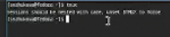{#fig:008 width=70%}

# Настройка раскладки клавиатуры

Запустим терминальный мультиплексор tmux

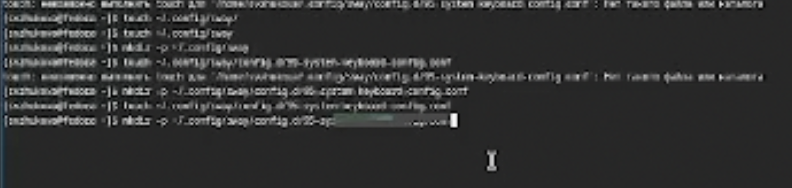{#fig:009 width=70%}

## Создадим конфигурационный файл ~/.config/sway/config.d/95-system-keyboard-config.conf

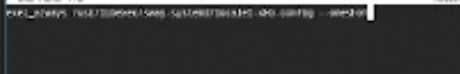{#fig:010 width=70%}

Отредактируем конфигурационный файл ~/.config/sway/config.d/95-system-keyboard-config.conf

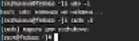{#fig:011 width=70%}

## Отредактируем конфигурационный файл /etc/X11/xorg.conf.d/00-keyboard.conf

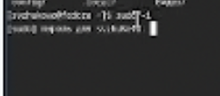{#fig:013 width=70%}

Перегрузим виртуальную машину

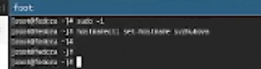{#fig:014 width=70%}

# Установка имени пользователя и названия хоста

Запустим терминальный мультиплексор tmux

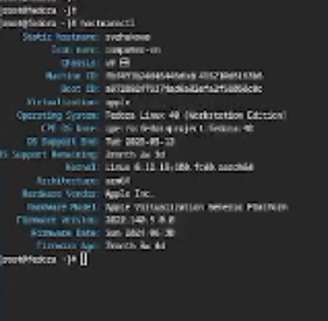{#fig:015 width=70%}

Переключимся на роль супер-пользователя

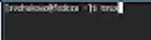{#fig:016 width=70%}

## Создадим пользователя (вместо username укажем наш логин в дисплейном классе)

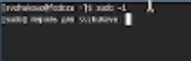{#fig:017 width=70%}

Зададим пароль для пользователя (вместо username укажим наш логин в дисплейном классе)

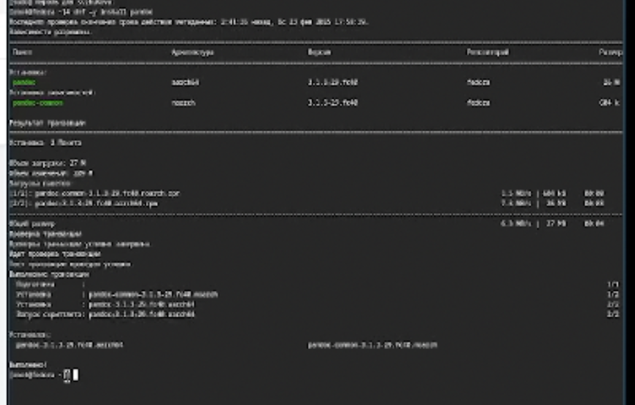{#fig:018 width=70%}

## Установим имя хоста (вместо username укажите ваш логин в дисплейном классе)

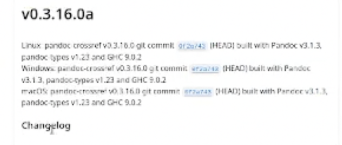{#fig:019 width=70%}

Проверим, что имя хоста установлено верно

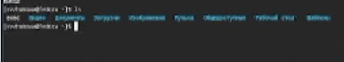{#fig:120 width=70%}

# Работа с языком разметки Markdown

Средство pandoc для работы с языком разметки Markdown.

Установим с помощью менеджера пакетов

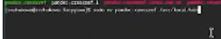{#fig:123 width=70%}

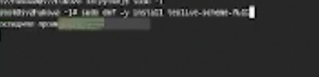{#fig:124 width=70%}

## Распакуем архивы

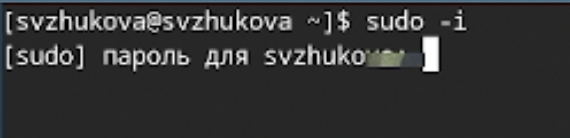{#fig:125 width=70%}

Обе программы собраны в виде статически-линкованных бинарных файлов.
Поместим их в каталог /usr/local/bin

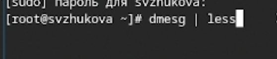{#fig:126 width=70%}

## Установим дистрибутив TeXlive:

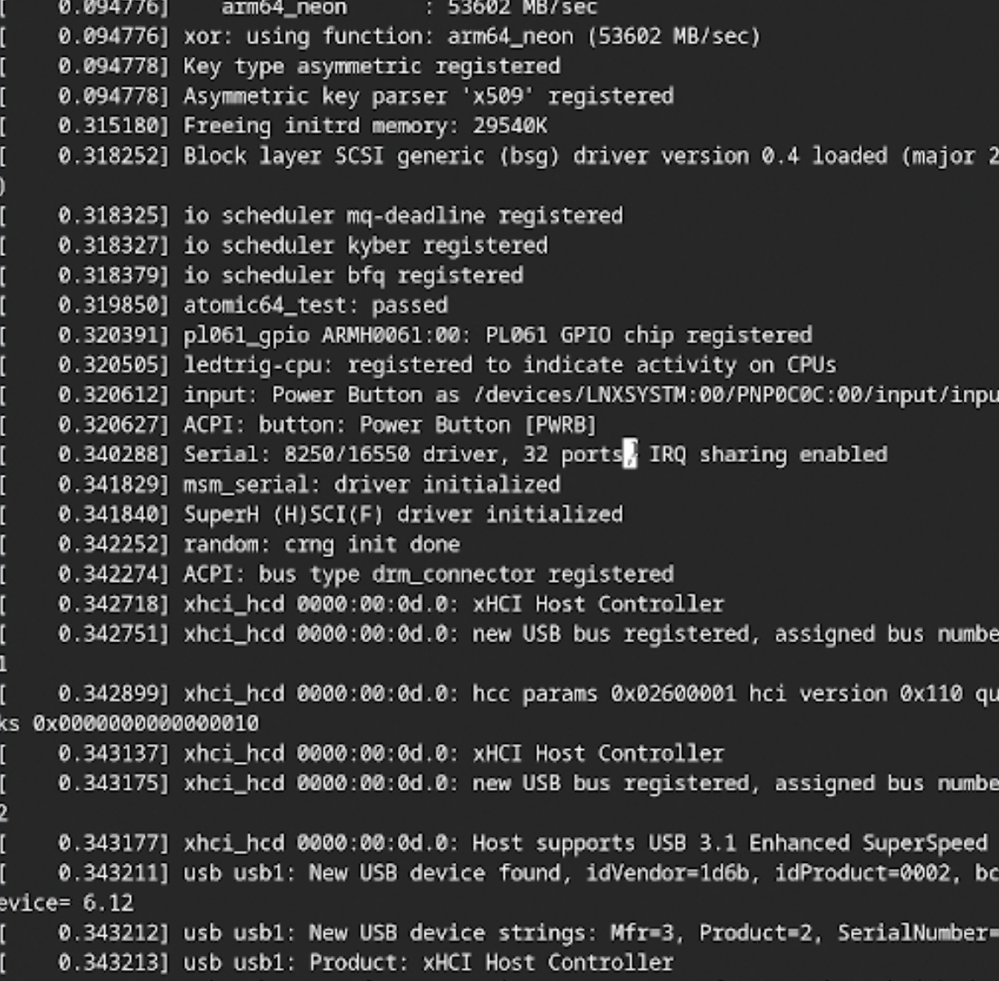{#fig:127 width=70%}

# Домашнее задание

Дождемся загрузки графического окружения и откроем терминал. В окне терминала проанализируем последовательность загрузки системы

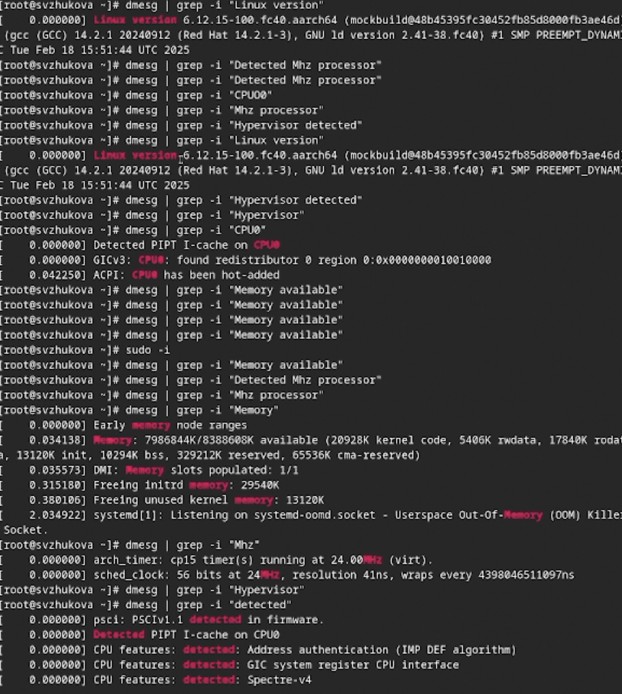{#fig:128 width=70%}

# Заключение

Мы приобрели практические навыки установки операционной системы на виртуальную машину, настроили минимально необходимые для дальнейшей работы сервисов.

