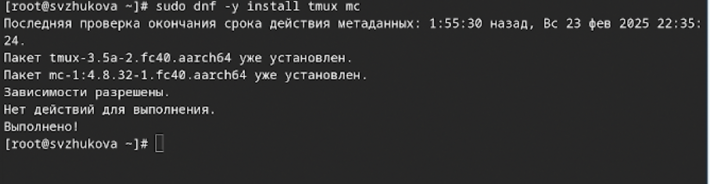

---
## Front matter
title: "Лабораторная работа № 1"
subtitle: "Лабораторная работа Установка ОС Linux."
author: "Жукова София Викторовна"

## Generic otions
lang: ru-RU
toc-title: "Содержание"

## Bibliography
bibliography: bib/cite.bib
csl: pandoc/csl/gost-r-7-0-5-2008-numeric.csl

## Pdf output format
toc: true # Table of contents
toc-depth: 2
lof: true # List of figures
lot: true # List of tables
fontsize: 12pt
linestretch: 1.5
papersize: a4
documentclass: scrreprt
## I18n polyglossia
polyglossia-lang:
  name: russian
  options:
	- spelling=modern
	- babelshorthands=true
polyglossia-otherlangs:
  name: english
## I18n babel
babel-lang: russian
babel-otherlangs: english
## Fonts
mainfont: IBM Plex Serif
romanfont: IBM Plex Serif
sansfont: IBM Plex Sans
monofont: IBM Plex Mono
mathfont: STIX Two Math
mainfontoptions: Ligatures=Common,Ligatures=TeX,Scale=0.94
romanfontoptions: Ligatures=Common,Ligatures=TeX,Scale=0.94
sansfontoptions: Ligatures=Common,Ligatures=TeX,Scale=MatchLowercase,Scale=0.94
monofontoptions: Scale=MatchLowercase,Scale=0.94,FakeStretch=0.9
mathfontoptions:
## Biblatex
biblatex: true
biblio-style: "gost-numeric"
biblatexoptions:
  - parentracker=true
  - backend=biber
  - hyperref=auto
  - language=auto
  - autolang=other*
  - citestyle=gost-numeric
## Pandoc-crossref LaTeX customization
figureTitle: "Рис."
tableTitle: "Таблица"
listingTitle: "Листинг"
lofTitle: "Список иллюстраций"
lotTitle: "Список таблиц"
lolTitle: "Листинги"
## Misc options
indent: true
header-includes:
  - \usepackage{indentfirst}
  - \usepackage{float} # keep figures where there are in the text
  - \floatplacement{figure}{H} # keep figures where there are in the text
---

# Цель работы

Целью данной работы является приобретение практических навыков установки операционной системы на виртуальную машину, настройки минимально необходимых для дальнейшей работы сервисов.

# Выполнение лабораторной работы

**После установки**

Переключимся на роль супер-пользователя: (рис. [-@fig:001]).

{#fig:001 width=70%}

**Обновления**

Установим средства разработки: (рис. [-@fig:002]).

{#fig:002 width=70%}

Обновим все пакеты (рис. [-@fig:003]).

{#fig:003 width=70%}

**Повышение комфорта работы**

Программы для удобства работы в консоли: (рис. [-@fig:004]).

{#fig:004 width=70%}

**Автоматическое обновление**

Установка программного обеспечения: (рис. [-@fig:005]).

{#fig:005 width=70%}

Зададим необходимую конфигурацию в файле /etc/dnf/automatic.conf. (рис. [-@fig:006]).

{#fig:006 width=70%}

Запустим таймер: (рис. [-@fig:007]).

{#fig:007 width=70%}

Отключение SELinux

В данном курсе мы не будем рассматривать работу с системой безопасности SELinux.

Поэтому отключим его.

 В файле /etc/selinux/config заменим значение

SELINUX=enforcing на значение SELINUX=permissive (рис. [-@fig:008]).

{#fig:008 width=70%}

Перегрузим виртуальную машину:

Настройка раскладки клавиатуры

Запустим терминальный мультиплексор tmux: (рис. [-@fig:009]).

{#fig:009 width=70%}

Создадим конфигурационный файл ~/.config/sway/config.d/95-system-keyboard-config.conf: (рис. [-@fig:010]).

{#fig:010 width=70%}

Отредактируем конфигурационный файл ~/.config/sway/config.d/95-system-keyboard-config.conf: (рис. [-@fig:011]).

{#fig:011 width=70%}

Переключимся на роль супер-пользователя:(рис. [-@fig:012]).

{#fig:012 width=70%}

Отредактируем конфигурационный файл /etc/X11/xorg.conf.d/00-keyboard.conf:

(рис. [-@fig:013]).

{#fig:013 width=70%}

Перегрузим виртуальную машину:(рис. [-@fig:014]).

{#fig:014 width=70%}

**Установка имени пользователя и названия хоста**

Запустим терминальный мультиплексор tmux:(рис. [-@fig:015]).

{#fig:015 width=70%}

Переключимся на роль супер-пользователя:(рис. [-@fig:016]).

{#fig:016 width=70%}

Создадим пользователя (вместо username укажем наш логин в дисплейном классе):(рис. [-@fig:017]).

{#fig:017 width=70%}

Зададим пароль для пользователя (вместо username укажим наш логин в дисплейном классе):(рис. [-@fig:018]).

{#fig:018 width=70%}

Установим имя хоста (вместо username укажите ваш логин в дисплейном классе):
(рис. [-@fig:019]).

{#fig:019 width=70%}

Проверим, что имя хоста установлено верно:(рис. [-@fig:120]).

{#fig:120 width=70%}

**Установка программного обеспечения для создания документации**

Запустим терминальный мультиплексор tmux:(рис. [-@fig:121]).

{#fig:121 width=70%}

Переключимся на роль супер-пользователя:(рис. [-@fig:122]).

{#fig:122 width=70%}

**Работа с языком разметки Markdown**

Средство pandoc для работы с языком разметки Markdown.

Установим с помощью менеджера пакетов:(рис. [-@fig:123]).

{#fig:123 width=70%}

Скачаем необходимую версию pandoc-crossref (https://github.com/lierdakil/pandoc-crossref/releases).
Скачайте соответствующую версию pandoc (https://github.com/jgm/pandoc/releases).(рис. [-@fig:124]).

{#fig:124 width=70%}

Распакуем архивы.(рис. [-@fig:125]).

{#fig:125 width=70%}

Обе программы собраны в виде статически-линкованных бинарных файлов.
Поместим их в каталог /usr/local/bin.(рис. [-@fig:126]).

{#fig:126 width=70%}

**Установим дистрибутив TeXlive:**(рис. [-@fig:014]).

{#fig:127 width=70%}

**Домашнее задание**

Дождемся загрузки графического окружения и откроем терминал. В окне терминала проанализируем последовательность загрузки системы, выполнив команду dmesg. Можно просто просмотреть вывод этой команды:(рис. [-@fig:128]).

{#fig:128 width=70%}

Можно использовать поиск с помощью grep:(рис. [-@fig:129]).

{#fig:129 width=70%}

Получите следующую информацию.
       Версия ядра Linux (Linux version).
       Частота процессора (Detected Mhz processor).
       Модель процессора (CPU0).
       Объём доступной оперативной памяти (Memory available).
       Тип обнаруженного гипервизора (Hypervisor detected).
       Тип файловой системы корневого раздела.
       Последовательность монтирования файловых систем.
(рис. [-@fig:130]).

{#fig:130 width=70%}

**Контрольные вопросы**

1) Какую информацию содержит учётная запись пользователя?

Имя пользователя, Пароль для авторизации, Gруппа(принадлежность к определённой группе пользователей), Права доступа, Домашний каталог, Учетные записи приложений

2) Укажите команды терминала и приведите примеры:
       для получения справки по команде - man
       для перемещения по файловой системе - cd
       для просмотра содержимого каталога - ls 
       для определения объёма каталога - du -sh 
       для создания / удаления каталогов / файлов :
       Создание: mkdir , touch 
       Удаление: rmdir , rm 
       для задания определённых прав на файл / каталог - chmod 
       для просмотра истории команд - history

3) Что такое файловая система? Приведите примеры с краткой характеристикой.

Файловая система — это метод и структура, используемая для организации и хранения файлов на устройствах хранения. Файловые системы управляют доступом, именами, размещением и метаданными файлов.

Примеры файловых систем:
FAT32**: Широко используется на флеш-накопителях, максимальный размер файла 4 ГБ.

4)Как посмотреть, какие файловые системы подмонтированы в ОС? - df -h

5)Как удалить зависший процесс?

control+C / kill -9 

# Выводы

Мы приобрели практические навыки установки операционной системы на виртуальную машину, настройки минимально необходимых для дальнейшей работы сервисов.

