---
## Front matter
title: Лабораторная работа № 2
subtitle: GitHub
author:
  - Жукова С. В. НПИбд-01-24
institute:
  - Российский университет дружбы народов, Москва, Россия
date: 5 марта 2024

## Formatting
toc: false
slide_level: 2
theme: metropolis
header-includes: 
 - \metroset{progressbar=frametitle,sectionpage=progressbar,numbering=fraction}
 - '\makeatletter'
 - '\beamer@ignorenonframefalse'
 - '\makeatother'
aspectratio: 43
section-titles: true
---

## Докладчик

:::::::::::::: {.columns align=center}
::: {.column width="70%"}

  * Жукова София Викторовна
  * студентка
  * направления прикладной информатика
  * Российский университет дружбы народов
  * [1032240966@pfur.ru](mailto:1032240966@pfur.ru)
  * <https://svzhukova.github.io/ru/>

:::
::: {.column width="30%"}

:::
::::::::::::::

# Вводная часть

GitHub

## Цель

Изучить идеологию и применение средств контроля версий.

Освоить умения по работе с git.

## Задание

Создать базовую конфигурацию для работы с git.
Создать ключ SSH.
Создать ключ PGP.
Настроить подписи git.
Зарегистрироваться на Github.
Создать локальный каталог для выполнения заданий по предмету.

# Выполнение лабораторной работы

## Установка программного обеспечения

Установка git

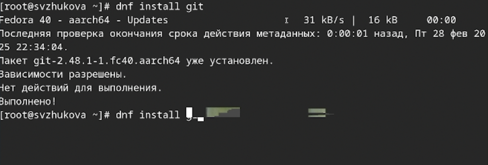{#fig:001 width=70%}

Установка gh

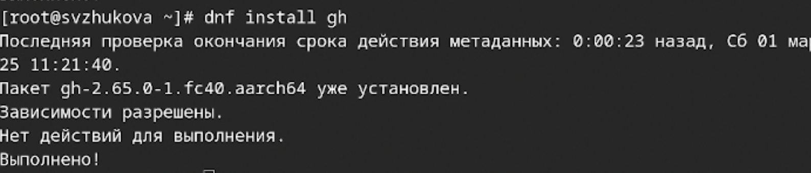{#fig:002 width=70%}

## Базовая настройка git

Зададим имя и email владельца репозитория

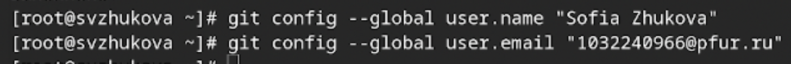{#fig:003 width=70%}

Настроим utf-8 в выводе сообщений git

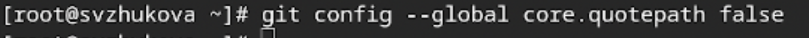{#fig:004 width=70%}

 

Зададим имя начальной ветки (будем называть её master)

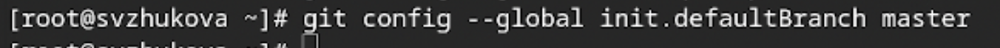{#fig:005 width=70%}

  
## Параметр autocrlf:

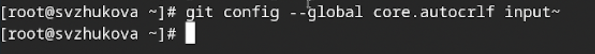{#fig:006 width=70%}

Параметр safecrlf

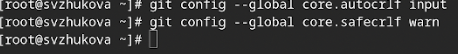{#fig:007 width=70%}

    

## Создадим ключи ssh

по алгоритму rsa с ключём размером 4096 бит

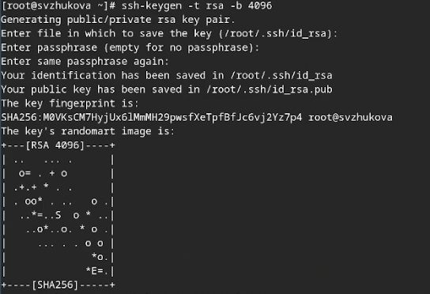{#fig:008 width=70%}

## Создадим ключи pgp

Генерируем ключ 

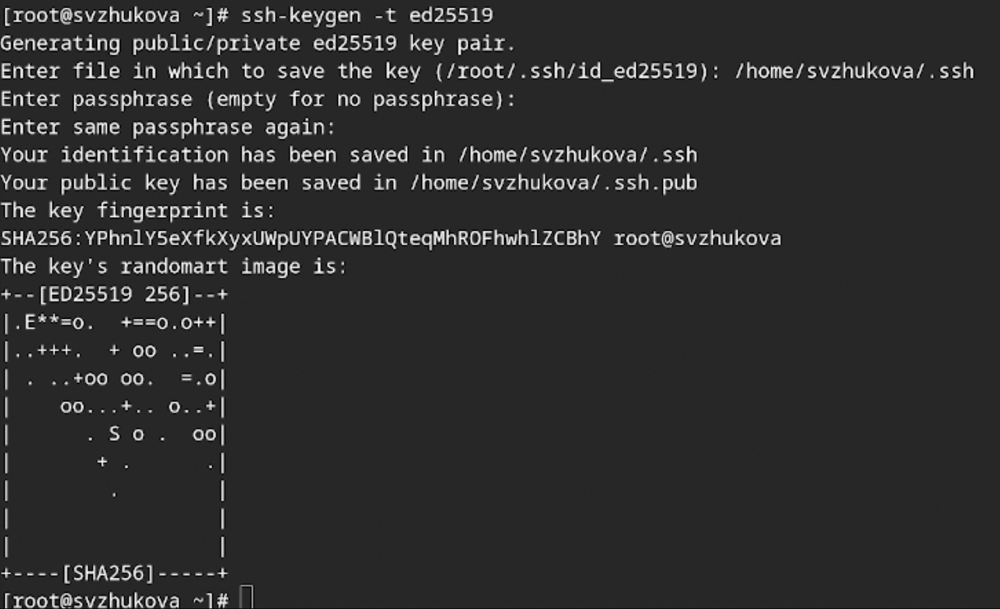{#fig:009 width=70%}

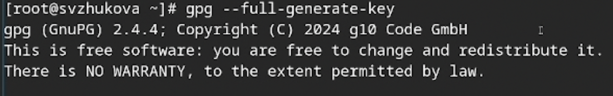{#fig:010 width=70%}

## Добавление PGP ключа в GitHub

 Выводим список ключей и копируем отпечаток приватного ключа

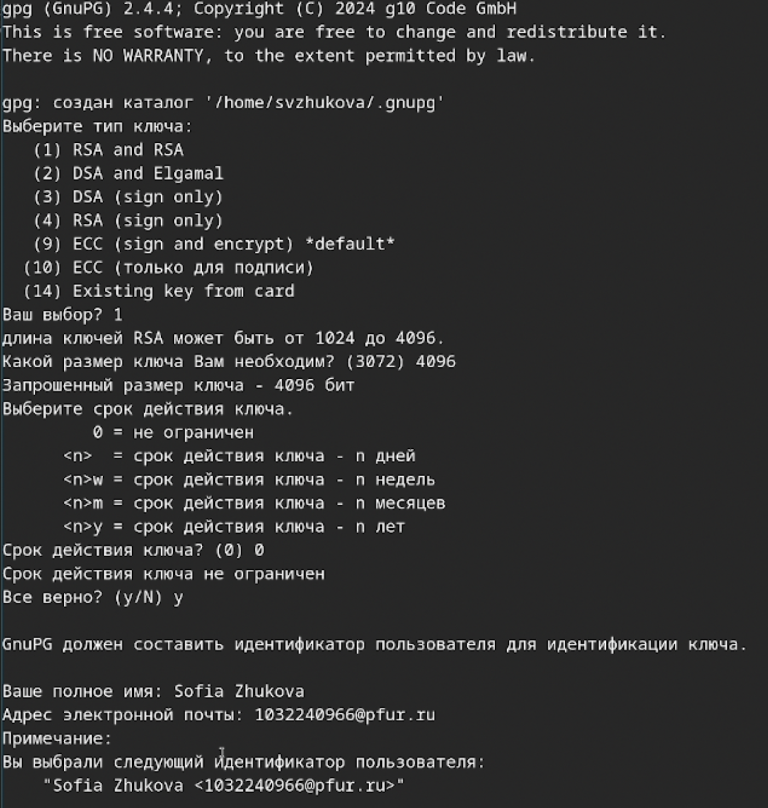{#fig:011 width=70%}

   
## Cкопируйте ваш сгенерированный PGP ключ в буфер обмена

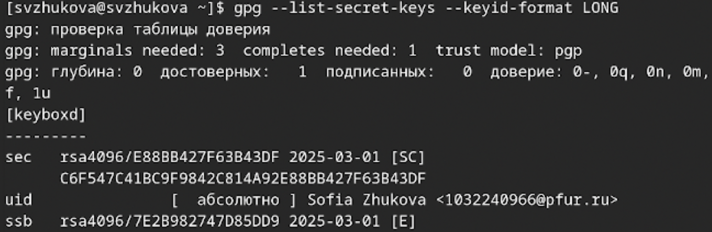{#fig:012 width=70%}

 

Перейдем в настройки GitHub 

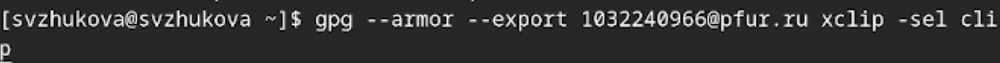{#fig:013 width=70%}

##

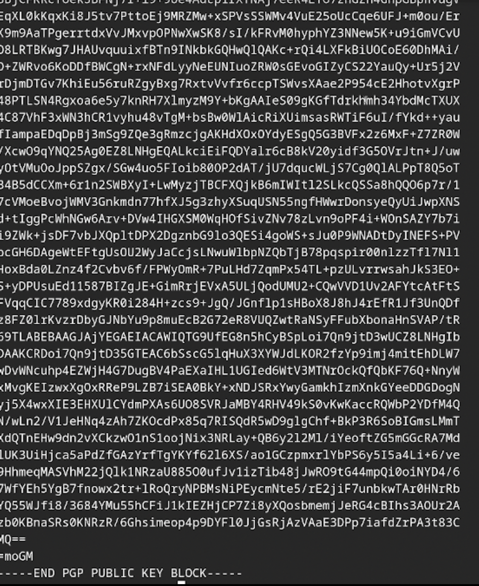{#fig:014 width=70%}

## Настройка автоматических подписей коммитов git

Используя введёный email, укажем Git применять его при подписи коммитов:

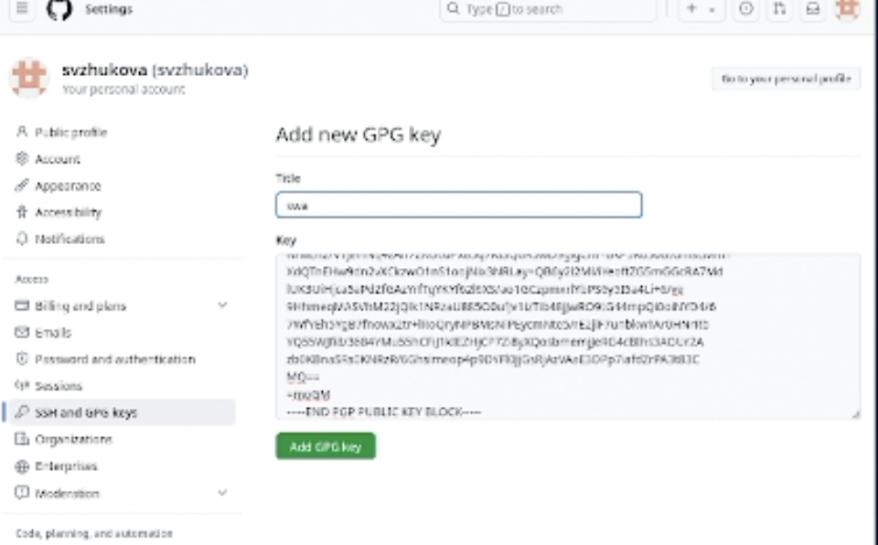{#fig:015 width=70%}

## Настройка gh

Для начала необходимо авторизоваться 

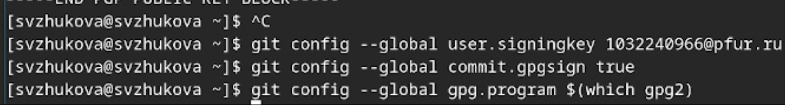{#fig:016 width=70%}

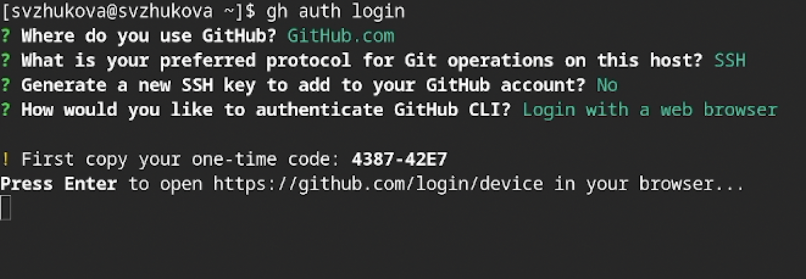{#fig:017 width=70%}

## Создание репозитория курса на основе шаблона

Создадим шаблон рабочего пространства 

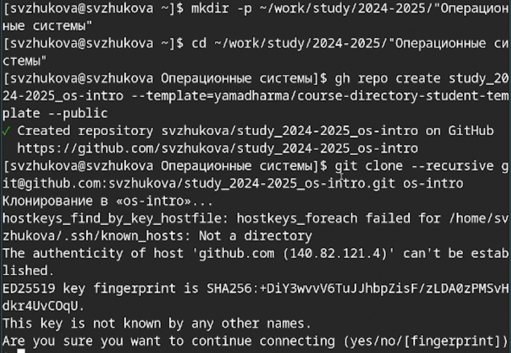{#fig:018 width=70%}

## Настройка каталога курса

 Перейдем в каталог курса:

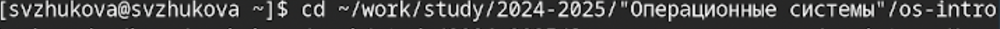{#fig:019 width=70%}

Удалим лишние файлы

{#fig:020 width=70%}

## Создадим необходимые каталоги

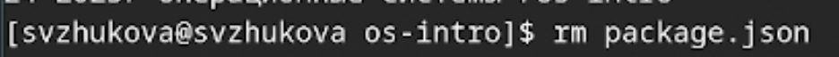{#fig:021 width=70%}

Отправим файлы на сервер

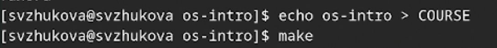{#fig:022 width=70%}

# Заключение

Мы изучили идеологию и применение средств контроля версий и освоили умения по работе с git.

