---
## Front matter
title: "Лабораторная работа № 2"
subtitle: "GitHub"
author: "Жукова София Викторовна"

## Generic otions
lang: ru-RU
toc-title: "Содержание"

## Bibliography
bibliography: bib/cite.bib
csl: pandoc/csl/gost-r-7-0-5-2008-numeric.csl

## Pdf output format
toc: true # Table of contents
toc-depth: 2
lof: true # List of figures
lot: true # List of tables
fontsize: 12pt
linestretch: 1.5
papersize: a4
documentclass: scrreprt
## I18n polyglossia
polyglossia-lang:
  name: russian
  options:
	- spelling=modern
	- babelshorthands=true
polyglossia-otherlangs:
  name: english
## I18n babel
babel-lang: russian
babel-otherlangs: english
## Fonts
mainfont: IBM Plex Serif
romanfont: IBM Plex Serif
sansfont: IBM Plex Sans
monofont: IBM Plex Mono
mathfont: STIX Two Math
mainfontoptions: Ligatures=Common,Ligatures=TeX,Scale=0.94
romanfontoptions: Ligatures=Common,Ligatures=TeX,Scale=0.94
sansfontoptions: Ligatures=Common,Ligatures=TeX,Scale=MatchLowercase,Scale=0.94
monofontoptions: Scale=MatchLowercase,Scale=0.94,FakeStretch=0.9
mathfontoptions:
## Biblatex
biblatex: true
biblio-style: "gost-numeric"
biblatexoptions:
  - parentracker=true
  - backend=biber
  - hyperref=auto
  - language=auto
  - autolang=other*
  - citestyle=gost-numeric
## Pandoc-crossref LaTeX customization
figureTitle: "Рис."
tableTitle: "Таблица"
listingTitle: "Листинг"
lofTitle: "Список иллюстраций"
lotTitle: "Список таблиц"
lolTitle: "Листинги"
## Misc options
indent: true
header-includes:
  - \usepackage{indentfirst}
  - \usepackage{float} # keep figures where there are in the text
  - \floatplacement{figure}{H} # keep figures where there are in the text
---

# Цель работы

Изучить идеологию и применение средств контроля версий.

Освоить умения по работе с git.

# Задание

Создать базовую конфигурацию для работы с git.
Создать ключ SSH.
Создать ключ PGP.
Настроить подписи git.
Зарегистрироваться на Github.
Создать локальный каталог для выполнения заданий по предмету.

# Выполнение лабораторной работы

**Установка программного обеспечения**

Установка git (рис. [-@fig:001]).

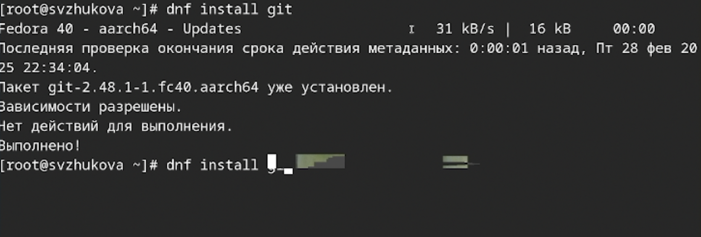{#fig:001 width=70%}

Установка gh (рис. [-@fig:002]).

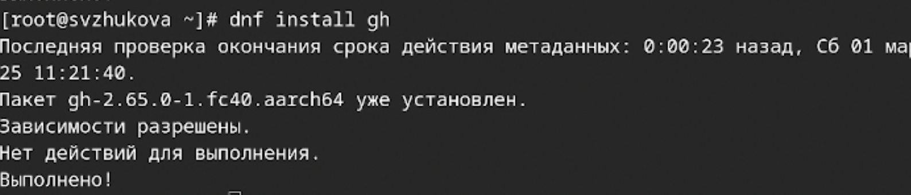{#fig:002 width=70%}

Базовая настройка git

Зададим имя и email владельца репозитория: (рис. [-@fig:003]).

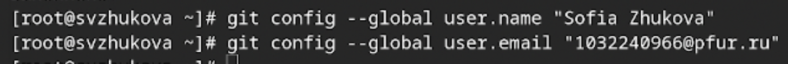{#fig:003 width=70%}

Настроим utf-8 в выводе сообщений git: (рис. [-@fig:004]).

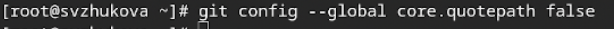{#fig:004 width=70%}

 

Зададим имя начальной ветки (будем называть её master): (рис. [-@fig:005]).

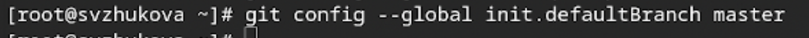{#fig:005 width=70%}

  
Параметр autocrlf: (рис. [-@fig:006]).

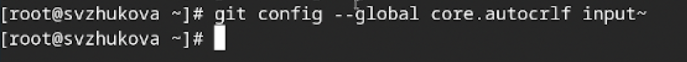{#fig:006 width=70%}

Параметр safecrlf: (рис. [-@fig:007]).

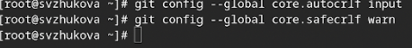{#fig:007 width=70%}

    

**Создадим ключи ssh**

по алгоритму rsa с ключём размером 4096 бит:

(рис. [-@fig:008]).

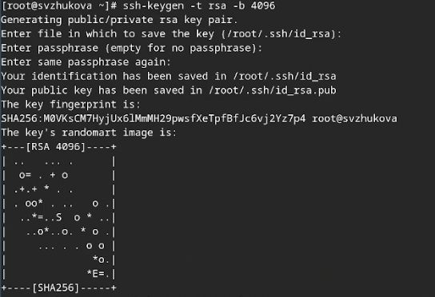{#fig:008 width=70%}

**Создадим ключи pgp**

Генерируем ключ (рис. [-@fig:009]).

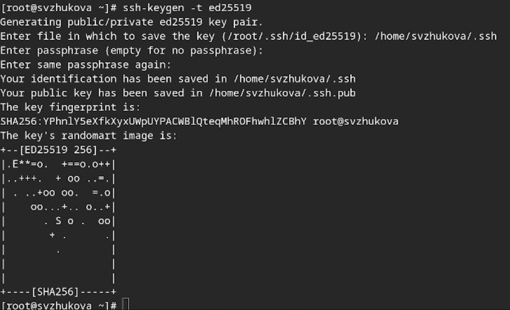{#fig:009 width=70%}

Из предложенных опций выбираем:
      тип RSA and RSA;
      размер 4096;
      выберем срок действия; значение по умолчанию — 0 (срок действия не истекает никогда).
    GPG запросит личную информацию, которая сохранится в ключе:
    Комментарий. Нажму клавишу ввода, чтобы оставить это поле пустым.
    

(рис. [-@fig:010]).

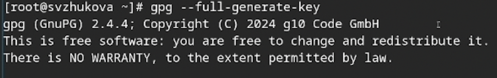{#fig:010 width=70%}

**Добавление PGP ключа в GitHub**

 Выводим список ключей и копируем отпечаток приватного ключа:(рис. [-@fig:011]).

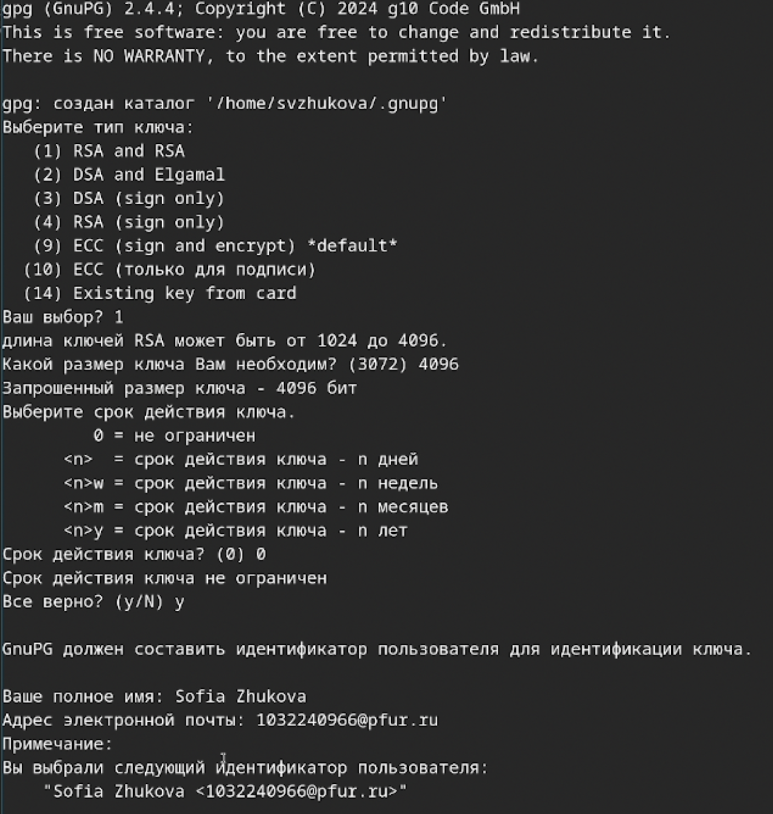{#fig:011 width=70%}

   
Cкопируйте ваш сгенерированный PGP ключ в буфер обмена:(рис. [-@fig:012]).

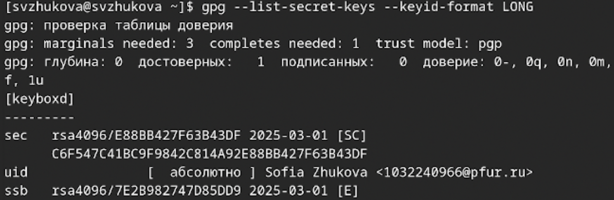{#fig:012 width=70%}

 

Перейдем в настройки GitHub (https://github.com/settings/keys), нажмем на кнопку New GPG key и вставим полученный ключ в поле ввода.(рис. [-@fig:013]).

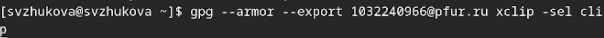{#fig:013 width=70%}

(рис. [-@fig:014]).

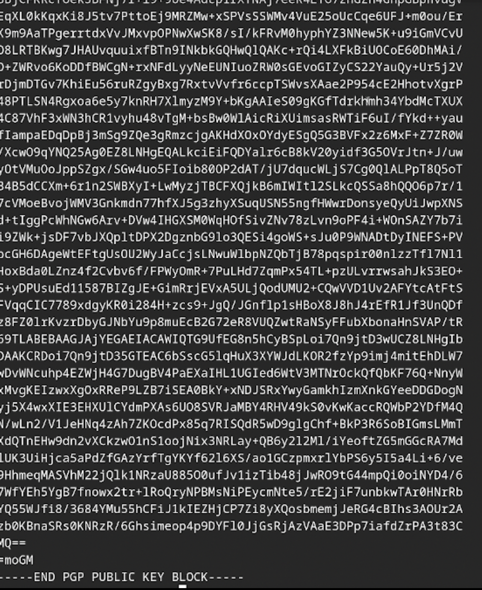{#fig:014 width=70%}

**Настройка автоматических подписей коммитов git**

Используя введёный email, укажем Git применять его при подписи коммитов:

(рис. [-@fig:015]).

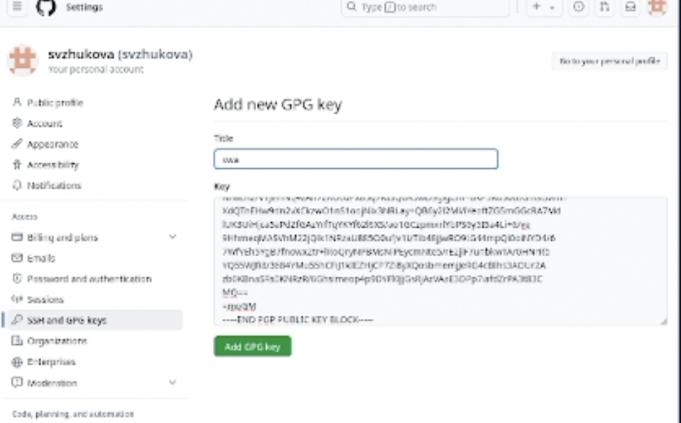{#fig:015 width=70%}

**Настройка gh**

Для начала необходимо авторизоваться  (рис. [-@fig:016]).

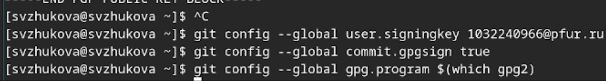{#fig:016 width=70%}

(рис. [-@fig:017]).

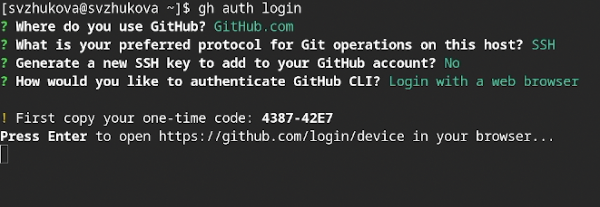{#fig:017 width=70%}

**Создание репозитория курса на основе шаблона**

Создадим шаблон рабочего пространства (рис. [-@fig:018]).

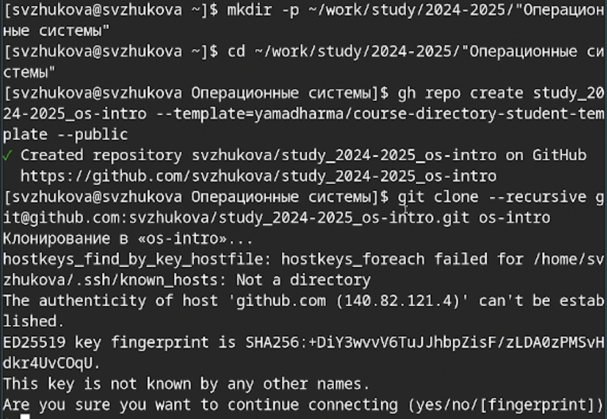{#fig:018 width=70%}

**Настройка каталога курса**

 Перейдем в каталог курса:(рис. [-@fig:019]).

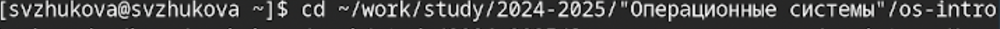{#fig:019 width=70%}

Удалим лишние файлы: (рис. [-@fig:020]).

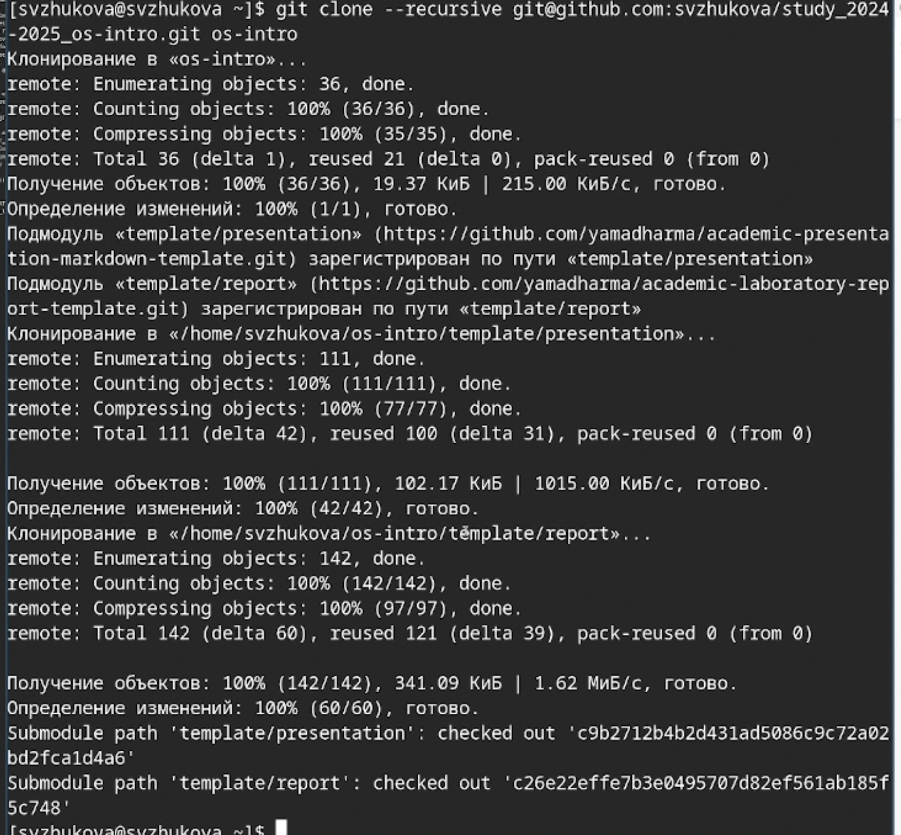{#fig:020 width=70%}

Создадим необходимые каталоги: (рис. [-@fig:021]).

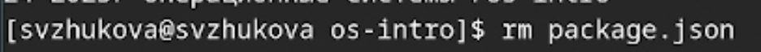{#fig:021 width=70%}

Отправим файлы на сервер: (рис. [-@fig:022]).

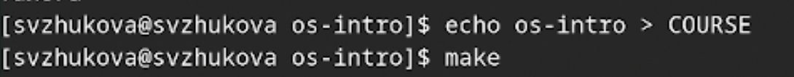{#fig:022 width=70%}

**Контрольные вопросы**

    1) Что такое системы контроля версий (VCS) и для решения каких задач они предназначаются?
    
Системы контроля версий (Version Control Systems, VCS) — это программные инструменты, которые помогают разработчикам отслеживать изменения в исходном коде и управлять различными версиями файлов. Они предназначены для решения следующих задач: Отслеживание изменений, Совместная работа, Управление версиями. 
    2) Объясните следующие понятия VCS и их отношения: хранилище, commit, история, рабочая копия.
    
Хранилище: Это место, где сохраняются все версии проекта, включая историю изменений. Хранилище может быть локальным (на компьютере) или удаленным (на сервере).
Commit: Это действие, при котором изменения в рабочей копии фиксируются в хранилище. Каждый commit содержит уникальный идентификатор (обычно хеш), описание изменений и может ссылаться на предыдущую версию.
История: Это последовательность всех commit-ов, записанных в хранилище, с возможностью просмотра изменений, дат, авторов и описаний.
Рабочая копия Это локальное копирование проекта на компьютере разработчика, где он вносит изменения.

    3) Что представляют собой и чем отличаются централизованные и децентрализованные VCS? Приведите примеры VCS каждого вида.
    
Централизованные VCS (CVCS): В этой модели имеется центральный сервер, содержащий все версии проекта. Разработчики работают с копией, загружая или обновляя её из центрального хранилища. Примеры CVCS: Subversion (SVN), CVS.
  
Децентрализованные VCS (DVCS): Каждое рабочее пространство разработчика является полным репозиторием, что позволяет работать локально и синхронизировать изменения с другими разработчиками, не зависимо от централизованного сервера. Примеры DVCS: Git, Mercurial.

    4) Опишите действия с VCS при единоличной работе с хранилищем.

При работе исключительно с хранилищем, разработчик может:

- Клонировать репозиторий для создания локальной рабочей копии.
- Вносить изменения в файлы.
- Использовать команды `add` для добавления изменений в индекс.
- Выполнять `commit` для записи изменений в локальное хранилище.
- Использовать `checkout` для переключения между версиями или ветками.
- Выполнять `push` для отправки изменений в удаленное хранилище, если оно используется.

    5) Опишите порядок работы с общим хранилищем VCS.
    
1. Клонирование репозитория 
2. Внесение изменений в рабочей копии.
3. Добавление (add) изменений в индекс.
4. Фиксация изменений (commit) с описанием внесенных изменений.
5. Получение последних изменений из общего хранилища (pull).
6. Решение конфликтов, если они имеются.
7. Отправка изменений на общий сервер (push).

    6) Каковы основные задачи, решаемые инструментальным средством git?

Отслеживание изменений кода: Git регистрирует изменения, что позволяет всегда иметь доступ к предыдущим версиям.
Совместная работа: Git позволяет нескольким разработчикам эффективно работать над одним проектом.
Управление ветками: Легкое создание и использование веток для разработки новых функций или исправления ошибок.
Слияние изменений: Хранит историю изменений и помогает объединять разные версии кода.
    7) Назовите и дайте краткую характеристику командам git.
 
 - `git init`: Инициализация нового репозитория.
- `git clone`: Клонирование удаленного репозитория на локальную машину.
- `git add`: Добавление изменений в индекс для последующего коммита.
- `git commit`: Фиксация изменений в истории.
- `git status`: Проверка статуса рабочей копии.
- `git push`: Отправка локальных коммитов в удаленное хранилище.
- `git pull`: Получение изменений из удаленного репозитория.
- `git branch`: Управление ветками (создание, удаление, показ).
- `git merge`: Объединение изменений из одной ветки в другую.

    8) Приведите примеры использования при работе с локальным и удалённым репозиториями.
    
Локальный репозиторий: `git init` для создания нового репозитория; `git add .` и `git commit -m "Initial commit"` для фиксации изменений. 
Удаленный репозиторий: `git clone <url>` для клонирования репозитория; после изменения кода использовать `git add`, `git commit` и `git push` для загрузки изменений на сервер.

    9) Что такое и зачем могут быть нужны ветви (branches)?

Ветви в Git позволяют создавать независимые линии разработки внутри одного репозитория. Исходный код может развиваться в разных направлениях (например, для новых функций или исправлений), без влияния на основной код. Ветвление позволяет: Упрощать параллельную разработку и слияние изменений после завершения работы над функцией, легко тестировать новые функции.Упрощать 

    10) Как и зачем можно игнорировать некоторые файлы при commit?

Иногда нужно исключить определённые файлы из коммитов, например, временные файлы, конфигурационные файлы среды или файлы сборки. Для этого создаётся файл `.gitignore`, в который добавляются паттерны файлов и директорий, которые Git будет игнорировать. Это позволяет избежать случайного добавления нежелательных файлов в систему контроля версий, сохраняя чистоту репозитория. 

# Выводы

Мы изучили идеологию и применение средств контроля версий и освоили умения по работе с git.

