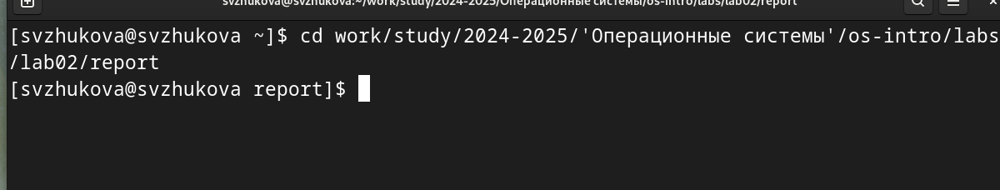
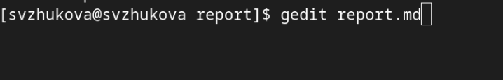
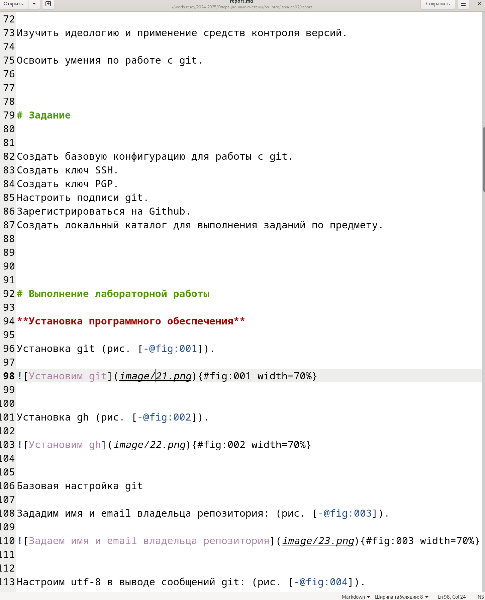
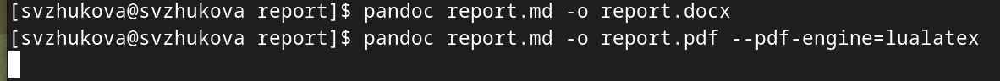

---
## Front matter
title: Лабораторная работа № 3
subtitle: Markdown
author:
  - Жукова С. В. НПИбд-01-24
institute:
  - Российский университет дружбы народов, Москва, Россия
date: 5 марта 2024

## Formatting
toc: false
slide_level: 2
theme: metropolis
header-includes: 
 - \metroset{progressbar=frametitle,sectionpage=progressbar,numbering=fraction}
 - '\makeatletter'
 - '\beamer@ignorenonframefalse'
 - '\makeatother'
aspectratio: 43
section-titles: true
---

## Докладчик

:::::::::::::: {.columns align=center}
::: {.column width="70%"}

  * Жукова София Викторовна
  * студентка
  * направления прикладной информатика
  * Российский университет дружбы народов
  * [1032240966@pfur.ru](mailto:1032240966@pfur.ru)
  * <https://svzhukova.github.io/ru/>

:::
::: {.column width="30%"}

:::
::::::::::::::

# Вводная часть

## Цели и задачи

- Создать шаблон презентации в Markdown
- Описать алгоритм создания выходных форматов презентаций
- Полученный `html`-файл содержит в себе все ресурсы: изображения, css, скрипты

# Выполнение лабораторной работы

Перейдем в папку с лабораторной работой 2 

{#fig:001 width=70%}

Откроем файл с помощью команды gedit 

{#fig:002 width=70%}

## Заполняем файл 

{#fig:003 width=70%}

## Конверитируем  файл в формат pdf и docx

{#fig:004 width=70%}

{#fig:005 width=70%}

## Заключение

Мы научились создавать шаблон презентации в Markdown

