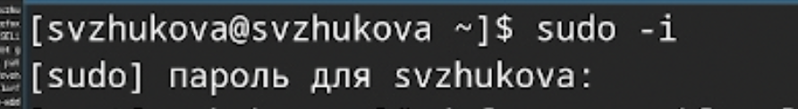

---
## Front matter
title: "Лабораторная работа № 4"
subtitle: "Продвинутое использование git"
author: "Жукова София Виктровна"

## Generic otions
lang: ru-RU
toc-title: "Содержание"

## Bibliography
bibliography: bib/cite.bib
csl: pandoc/csl/gost-r-7-0-5-2008-numeric.csl

## Pdf output format
toc: true # Table of contents
toc-depth: 2
lof: true # List of figures
lot: true # List of tables
fontsize: 12pt
linestretch: 1.5
papersize: a4
documentclass: scrreprt
## I18n polyglossia
polyglossia-lang:
  name: russian
  options:
	- spelling=modern
	- babelshorthands=true
polyglossia-otherlangs:
  name: english
## I18n babel
babel-lang: russian
babel-otherlangs: english
## Fonts
mainfont: IBM Plex Serif
romanfont: IBM Plex Serif
sansfont: IBM Plex Sans
monofont: IBM Plex Mono
mathfont: STIX Two Math
mainfontoptions: Ligatures=Common,Ligatures=TeX,Scale=0.94
romanfontoptions: Ligatures=Common,Ligatures=TeX,Scale=0.94
sansfontoptions: Ligatures=Common,Ligatures=TeX,Scale=MatchLowercase,Scale=0.94
monofontoptions: Scale=MatchLowercase,Scale=0.94,FakeStretch=0.9
mathfontoptions:
## Biblatex
biblatex: true
biblio-style: "gost-numeric"
biblatexoptions:
  - parentracker=true
  - backend=biber
  - hyperref=auto
  - language=auto
  - autolang=other*
  - citestyle=gost-numeric
## Pandoc-crossref LaTeX customization
figureTitle: "Рис."
tableTitle: "Таблица"
listingTitle: "Листинг"
lofTitle: "Список иллюстраций"
lotTitle: "Список таблиц"
lolTitle: "Листинги"
## Misc options
indent: true
header-includes:
  - \usepackage{indentfirst}
  - \usepackage{float} # keep figures where there are in the text
  - \floatplacement{figure}{H} # keep figures where there are in the text
---

# Цель работы

Получение навыков правильной работы с репозиториями git.

# Задание

Выполнить работу для тестового репозитория.
Преобразовать рабочий репозиторий в репозиторий с git-flow и conventional commits.

# Выполнение лабораторной работы

**Установка программного обеспечения**

Установим git-flow 

Установим из коллекции репозиториев Copr (https://copr.fedorainfracloud.org/coprs/elegos/gitflow/):(рис. [-@fig:001]).

{#fig:001 width=70%}

рис. [-@fig:001]).

{#fig:002 width=70%}

рис. [-@fig:003]).

{#fig:003 width=70%}

**Установка Node.js**

На Node.js базируется программное обеспечение для семантического версионирования и общепринятых коммитов.

Fedora рис. [-@fig:004]).

{#fig:004 width=70%}

**Настройка Node.js**

Для работы с Node.js добавим каталог с исполняемыми файлами, устанавливаемыми yarn, в переменную PATH.

Запустим  рис. [-@fig:005]).

{#fig:005 width=70%}

Выполним:  рис. [-@fig:006]).

{#fig:006 width=70%}

**Общепринятые коммиты**

 commitizen

Данная программа используется для помощи в форматировании коммитов.  рис. [-@fig:007]).

{#fig:007 width=70%}

Данная программа используется для помощи в создании логов.  рис. [-@fig:008]).

{#fig:008 width=70%}

**Практический сценарий использования git**

**Создание репозитория git**

Подключение репозитория к github 

Создайте репозиторий на GitHub. Для примера назовём его git-extended.рис. [-@fig:009]).

{#fig:009 width=70%}

рис. [-@fig:010]).

{#fig:010 width=70%}

        
Делаем первый коммит и выкладываем на github:  рис. [-@fig:011]).

{#fig:011 width=70%}

Конфигурация общепринятых коммитов

Конфигурация для пакетов Node.js  рис. [-@fig:012]).

{#fig:012 width=70%}

Необходимо заполнить несколько параметров пакета.

Название пакета, Лицензия пакета.(Предлагается выбирать лицензию CC-BY-4.0)

Сконфигурим формат коммитов. Для этого добавим в файл package.json команду для формирования коммитов: рис. [-@fig:013]).

{#fig:013 width=70%}

Добавим новые файлы, Выполним коммит,Отправим на github рис. [-@fig:014]).

{#fig:014 width=70%}

**Конфигурация git-flow**

Инициализируем git-flow рис. [-@fig:015]).

{#fig:015 width=70%}

Префикс для ярлыков установим в v.

Проверим, что мы на ветке develop: рис. [-@fig:016]).

{#fig:016 width=70%}

Загрузим весь репозиторий в хранилище: рис. [-@fig:017]).

{#fig:017 width=70%}

Установим внешнюю ветку как вышестоящую для этой ветки: рис. [-@fig:018]).

{#fig:018 width=70%}

Создадим релиз с версией 1.0.0 рис. [-@fig:019]).

{#fig:019 width=70%}

Создадим журнал изменений рис. [-@fig:020]).

{#fig:020 width=70%}

Добавим журнал изменений в индекс рис. [-@fig:021]).

{#fig:021 width=70%}

Зальём релизную ветку в основную ветку рис. [-@fig:022]).

{#fig:022 width=70%}

Отправим данные на github рис. [-@fig:023]).

{#fig:023 width=70%}

Создадим релиз на github. Для этого будем использовать утилиты работы с github: рис. [-@fig:024]).

{#fig:024 width=70%}

**Работа с репозиторием git**

Разработка новой функциональности

Создадим ветку для новой функциональности: рис. [-@fig:025]).

{#fig:025 width=70%}

Далее, продолжаем работу c git как обычно.

По окончании разработки новой функциональности следующим шагом следует объединить ветку feature_branch c develop: рис. [-@fig:026]).

{#fig:026 width=70%}

**Создание релиза git-flow**

Создадим релиз с версией 1.2.3: рис. [-@fig:027]).

{#fig:027 width=70%}

Обновим номер версии в файле package.json. Установите её в 1.2.3.

Создадим журнал изменений рис. [-@fig:028]).

{#fig:028 width=70%}

Добавим журнал изменений в индекс рис. [-@fig:029]).

{#fig:029 width=70%}

Зальём релизную ветку в основную ветку рис. [-@fig:030]).

{#fig:030 width=70%}

Отправим данные на github рис. [-@fig:031]).

{#fig:031 width=70%}

Создадим релиз на github с комментарием из журнала изменений:(рис. [-@fig:032]).

{#fig:032 width=70%}

# Выводы

Мы получили навыки правильной работы с репозиториями git.
