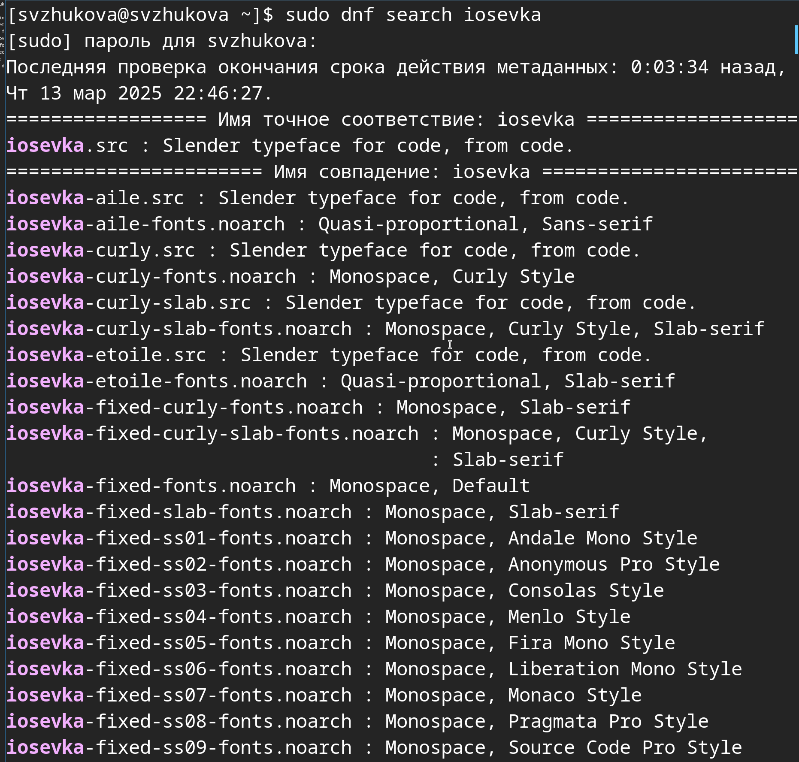

---
## Front matter
title: Лабораторная работа № 5
subtitle: Менеджер паролей pass
author:
  - Жукова С. В. НПИбд-01-24
institute:
  - Российский университет дружбы народов, Москва, Россия
date: 15 марта 2024

## Formatting
toc: false
slide_level: 2
theme: metropolis
header-includes: 
 - \metroset{progressbar=frametitle,sectionpage=progressbar,numbering=fraction}
 - '\makeatletter'
 - '\beamer@ignorenonframefalse'
 - '\makeatother'
aspectratio: 43
section-titles: true
---

## Докладчик

:::::::::::::: {.columns align=center}
::: {.column width="70%"}

  * Жукова София Викторовна
  * студентка
  * направления прикладной информатика
  * Российский университет дружбы народов
  * [1032240966@pfur.ru](mailto:1032240966@pfur.ru)
  * <https://svzhukova.github.io/ru/>

:::
::: {.column width="30%"}

:::
::::::::::::::

# Вводная часть

# Цель работы

Настройка рабочей среды.

# Выполнение лабораторной работы

**Менеджер паролей pass**

Установка pass 

{#fig:001 width=70%}

##

{#fig:002 width=70%}

## **Настройка**

Ключи GPG, просмотр списка ключей:

{#fig:003 width=70%}

## **Инициализация хранилища**

Инициализируем хранилище:

{#fig:005 width=70%}

**Синхронизация с git**

Создадим структуру git: 

{#fig:006 width=70%}

## Также можно задать адрес репозитория на хостинге (репозиторий необходимо предварительно создать): 

{#fig:007 width=70%}

## Зададим адрес репозитория на хостинге 

{#fig:008 width=70%}

## Для синхронизации выполним следующую команду: 

{#fig:009 width=70%}

## **Прямые изменения**

{#fig:010 width=70%}

Проверим статус синхронизации можно командой 

{#fig:011 width=70%}

## **Настройка интерфейса с браузером**

Для взаимодействия с браузером используем интерфейс native messaging.
Поэтому кроме плагина к броузеру устанавим программу, обеспечивающую интерфейс native messaging.

Плагин browserpass 

{#fig:012 width=70%}

## **Сохранение пароля**

Добавим новый пароль

Выполним: 

{#fig:013 width=70%}

Отобразим пароль для указанного имени файла: 

{#fig:014 width=70%}

## Заменим существующий пароль: 

{#fig:015 width=70%}

**Управление файлами конфигурации**

**Дополнительное программное обеспечение**

Установим дополнительное программное обеспечение: 

{#fig:016 width=70%}

## Установим шрифты:

{#fig:017 width=70%}

## 

{#fig:018 width=70%}

## 

{#fig:019 width=70%}

## **Установка**

Установка бинарного файла. Скрипт определяет архитектуру процессора и операционную систему и скачивает необходимый файл:

с помощью wget: 

{#fig:020 width=70%}

## **Создадим собственный репозиторий с помощью утилит**

Создадим свой репозиторий для конфигурационных файлов на основе шаблона: 

{#fig:021 width=70%}

## **Подключим репозиторий к своей системе**

Инициализируем chezmoi с нашим репозиторием dotfiles: ]

{#fig:022 width=70%}

Проверим, какие изменения внесёт chezmoi в домашний каталог, запустив:

{#fig:023 width=70%}

## Нас устраивают изменения, внесённые chezmoi, запустим: (рис. [-@fig:024]).

{#fig:024 width=70%}

## **Использование chezmoi на нескольких машинах**

На второй машине инициализируем chezmoi с нашим репозиторием dotfiles: 

{#fig:025 width=70%}

Проверим, какие изменения внесёт chezmoi в домашний каталог, запустив: 

{#fig:026 width=70%}

## Нас устраивают изменения, внесённые chezmoi, запустим: 

{#fig:027 width=70%}

При существующем каталоге chezmoi можно получить и применить последние изменения из нашего репозитория: 

{#fig:029 width=70%}

## **Настройка новой машины с помощью одной команды**

Можно установить свои dotfiles на новый компьютер с помощью одной команды:

{#fig:030 width=70%}

## **Ежедневные операции c chezmoi**

Извлечем последние изменения из репозитория и применим их 

{#fig:031 width=70%}

## Извлечем последние изменения из своего репозитория и посмотрим, что изменится, фактически не применяя изменения

Выполним: 

{#fig:032 width=70%}

Мы довольны изменениями, применим их: 

{#fig:033 width=70%}

## Можно автоматически фиксировать и отправлять изменения в исходный каталог в репозиторий.

Чтобы включить её, добавим в файл конфигурации ~/.config/chezmoi/chezmoi.toml следующее:

{#fig:034 width=70%}

{#fig:034 width=70%}

# Выводы

Мы настроили рабочую среду.

