---
## Front matter
title: "Лабораторная работа № 5"
subtitle: "Менеджер паролей pass"
author: "Жукова София Викторовна"

## Generic otions
lang: ru-RU
toc-title: "Содержание"

## Bibliography
bibliography: bib/cite.bib
csl: pandoc/csl/gost-r-7-0-5-2008-numeric.csl

## Pdf output format
toc: true # Table of contents
toc-depth: 2
lof: true # List of figures
lot: true # List of tables
fontsize: 12pt
linestretch: 1.5
papersize: a4
documentclass: scrreprt
## I18n polyglossia
polyglossia-lang:
  name: russian
  options:
	- spelling=modern
	- babelshorthands=true
polyglossia-otherlangs:
  name: english
## I18n babel
babel-lang: russian
babel-otherlangs: english
## Fonts
mainfont: IBM Plex Serif
romanfont: IBM Plex Serif
sansfont: IBM Plex Sans
monofont: IBM Plex Mono
mathfont: STIX Two Math
mainfontoptions: Ligatures=Common,Ligatures=TeX,Scale=0.94
romanfontoptions: Ligatures=Common,Ligatures=TeX,Scale=0.94
sansfontoptions: Ligatures=Common,Ligatures=TeX,Scale=MatchLowercase,Scale=0.94
monofontoptions: Scale=MatchLowercase,Scale=0.94,FakeStretch=0.9
mathfontoptions:
## Biblatex
biblatex: true
biblio-style: "gost-numeric"
biblatexoptions:
  - parentracker=true
  - backend=biber
  - hyperref=auto
  - language=auto
  - autolang=other*
  - citestyle=gost-numeric
## Pandoc-crossref LaTeX customization
figureTitle: "Рис."
tableTitle: "Таблица"
listingTitle: "Листинг"
lofTitle: "Список иллюстраций"
lotTitle: "Список таблиц"
lolTitle: "Листинги"
## Misc options
indent: true
header-includes:
  - \usepackage{indentfirst}
  - \usepackage{float} # keep figures where there are in the text
  - \floatplacement{figure}{H} # keep figures where there are in the text
---

# Цель работы

Настройка рабочей среды.

# Выполнение лабораторной работы

**Менеджер паролей pass**

Установка pass (рис. [-@fig:001]).

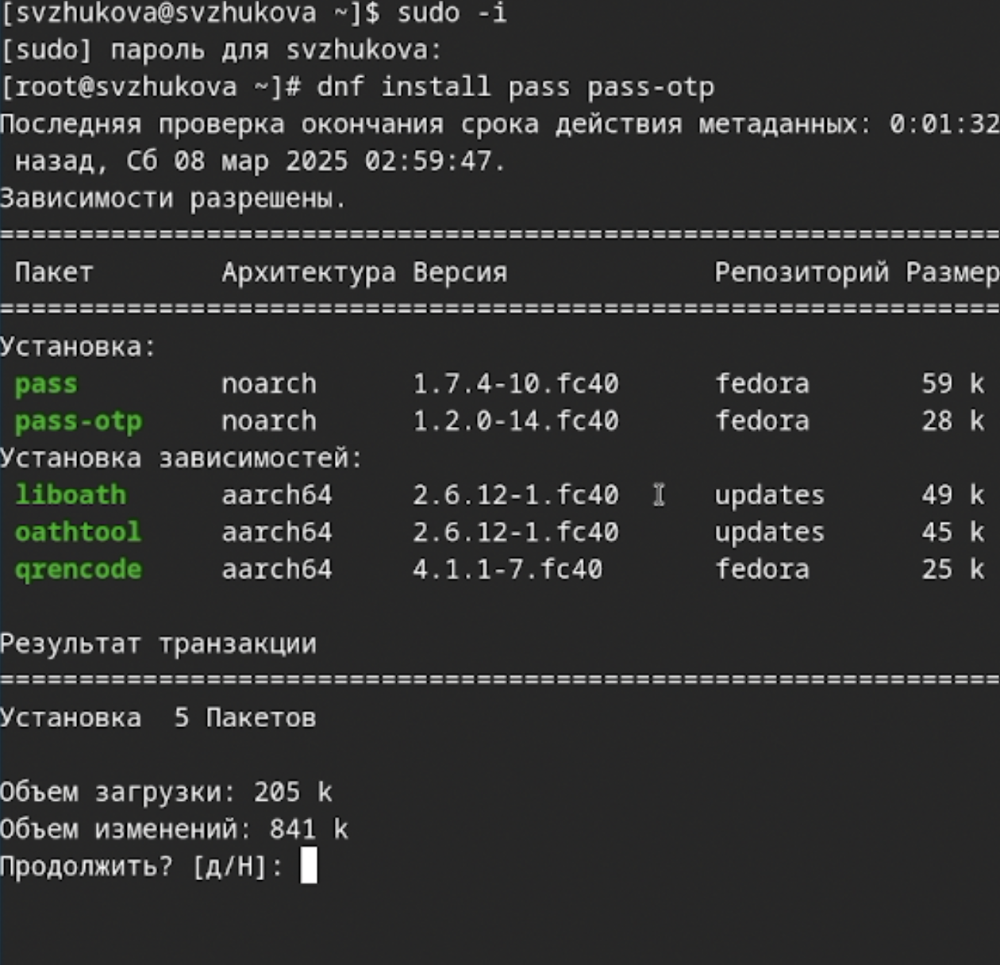{#fig:001 width=70%}

(рис. [-@fig:002]).

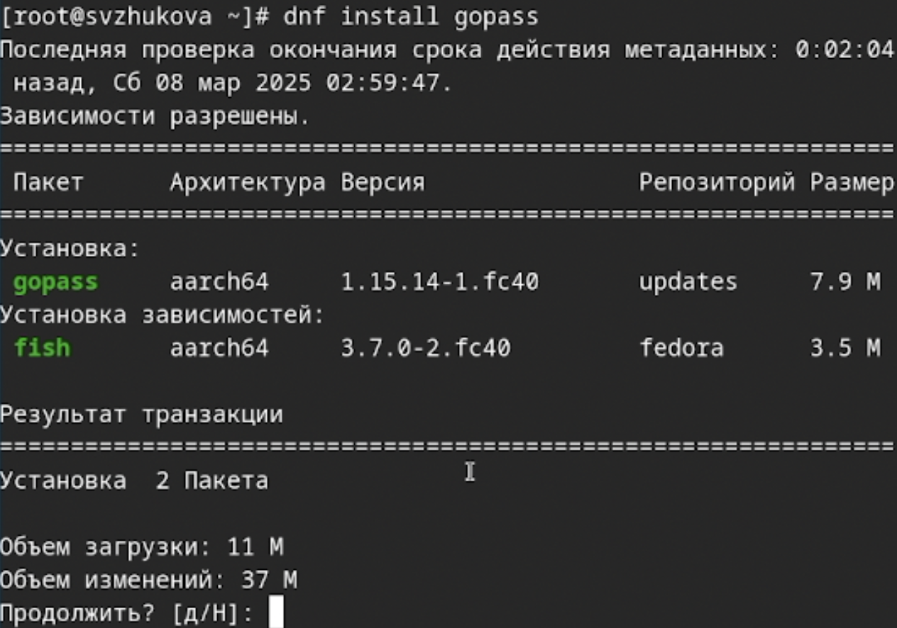{#fig:002 width=70%}

**Настройка**

Ключи GPG, просмотр списка ключей: (рис. [-@fig:003]).

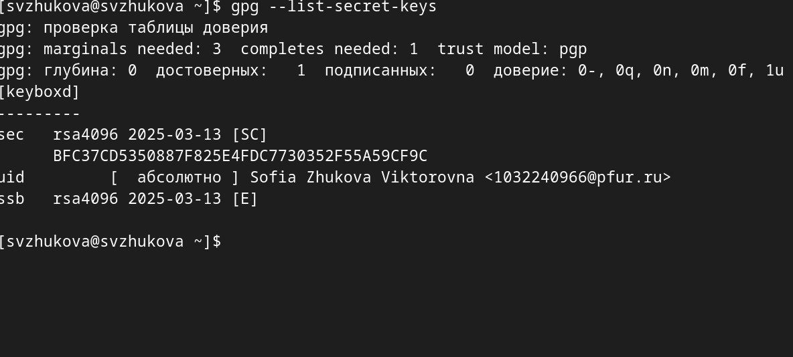{#fig:003 width=70%}

**Инициализация хранилища**

Инициализируем хранилище: (рис. [-@fig:005]).

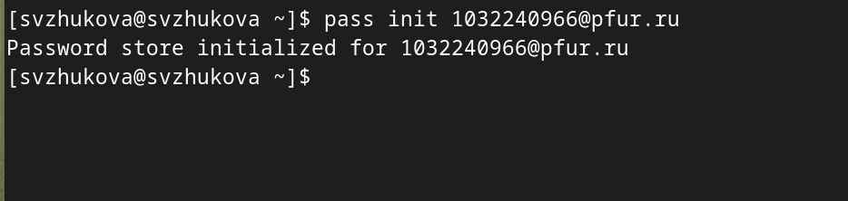{#fig:005 width=70%}

**Синхронизация с git**

Создадим структуру git: (рис. [-@fig:006]).

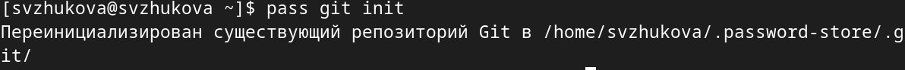{#fig:006 width=70%}

Также можно задать адрес репозитория на хостинге (репозиторий необходимо предварительно создать): (рис. [-@fig:007]).

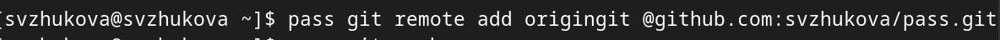{#fig:007 width=70%}

Зададим адрес репозитория на хостинге  (рис. [-@fig:008]).

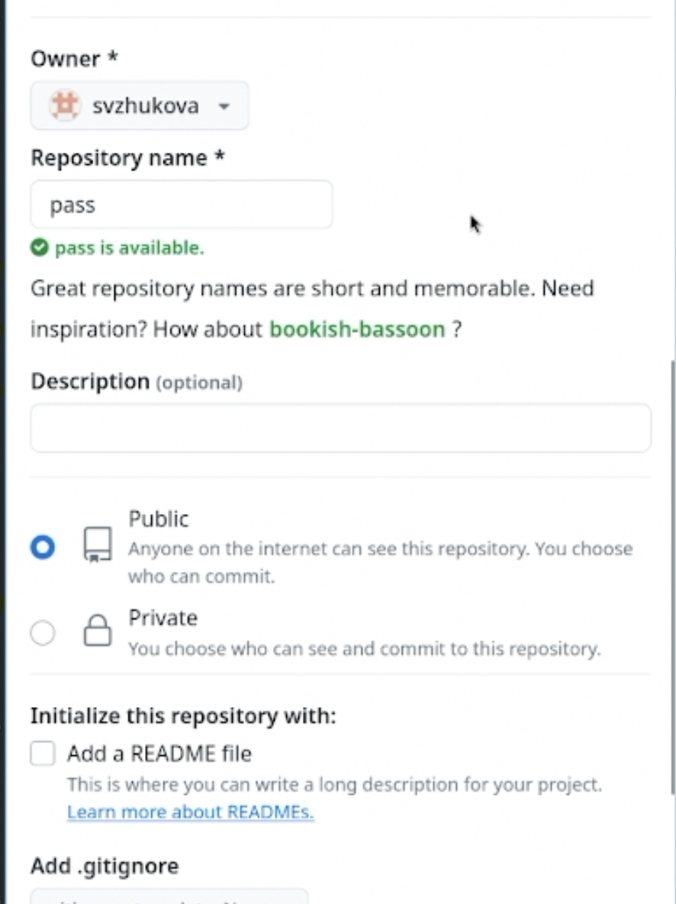{#fig:008 width=70%}

Для синхронизации выполним следующую команду: (рис. [-@fig:009]).

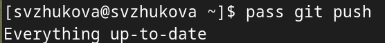{#fig:009 width=70%}

**Прямые изменения**

 (рис. [-@fig:010]).

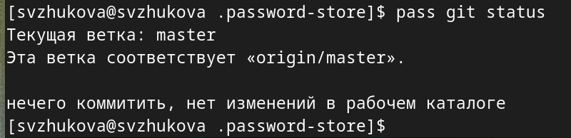{#fig:010 width=70%}

Проверим статус синхронизации можно командой (рис. [-@fig:011]).

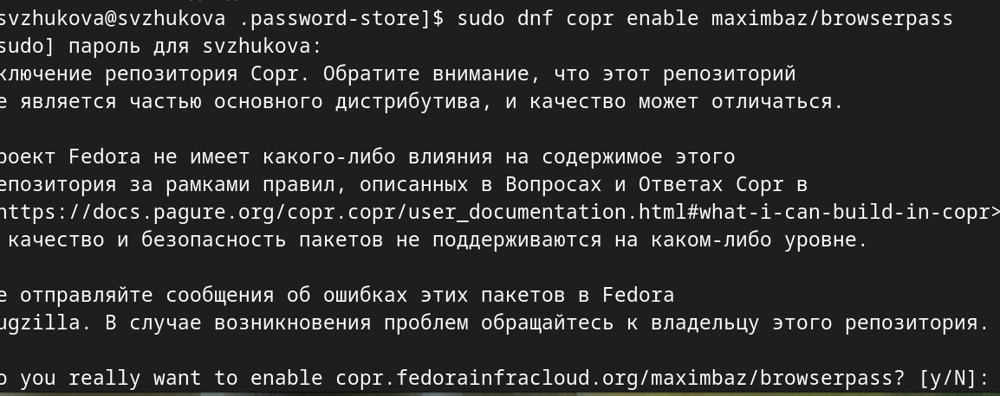{#fig:011 width=70%}

**Настройка интерфейса с браузером**

Для взаимодействия с браузером используем интерфейс native messaging.
Поэтому кроме плагина к броузеру устанавим программу, обеспечивающую интерфейс native messaging.

Плагин browserpass (рис. [-@fig:012]).

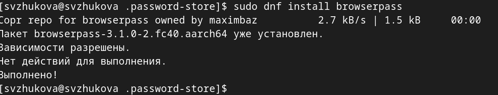{#fig:012 width=70%}

**Сохранение пароля**

Добавим новый пароль

Выполним: (рис. [-@fig:013]).

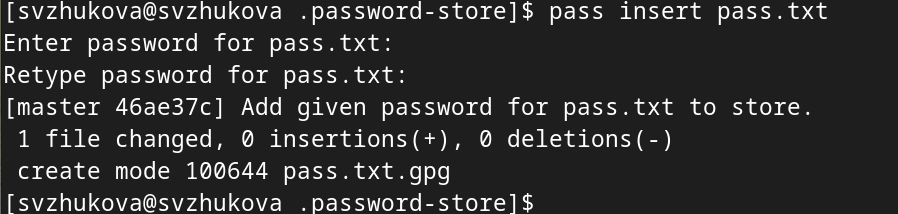{#fig:013 width=70%}

Отобразим пароль для указанного имени файла: (рис. [-@fig:014]).

{#fig:014 width=70%}

Заменим существующий пароль: (рис. [-@fig:015]).

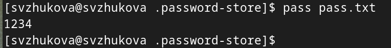{#fig:015 width=70%}

**Управление файлами конфигурации**

**Дополнительное программное обеспечение**

Установим дополнительное программное обеспечение: (рис. [-@fig:016]).

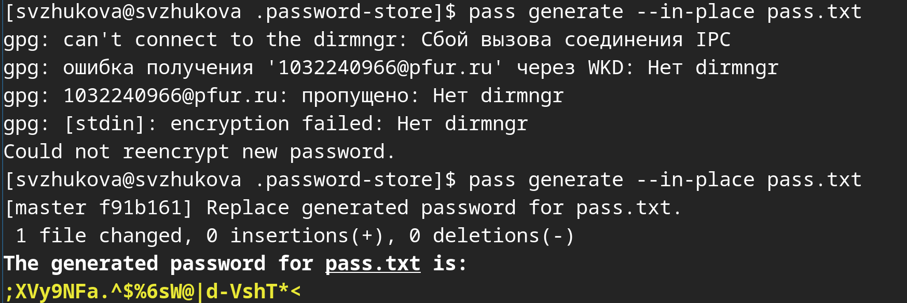{#fig:016 width=70%}

Установим шрифты: (рис. [-@fig:017]).

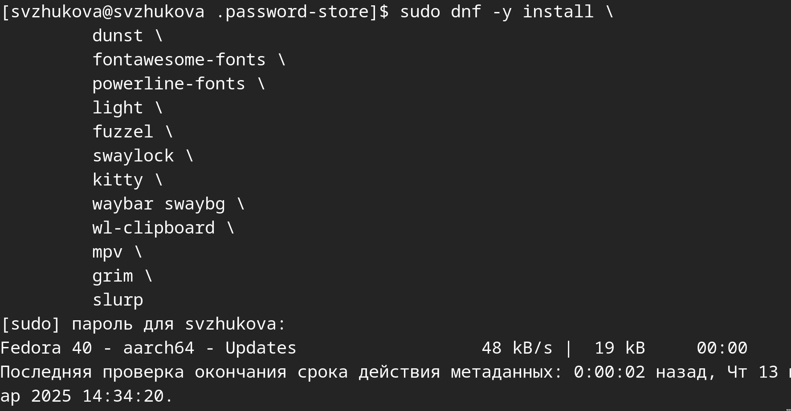{#fig:017 width=70%}

 (рис. [-@fig:018]).

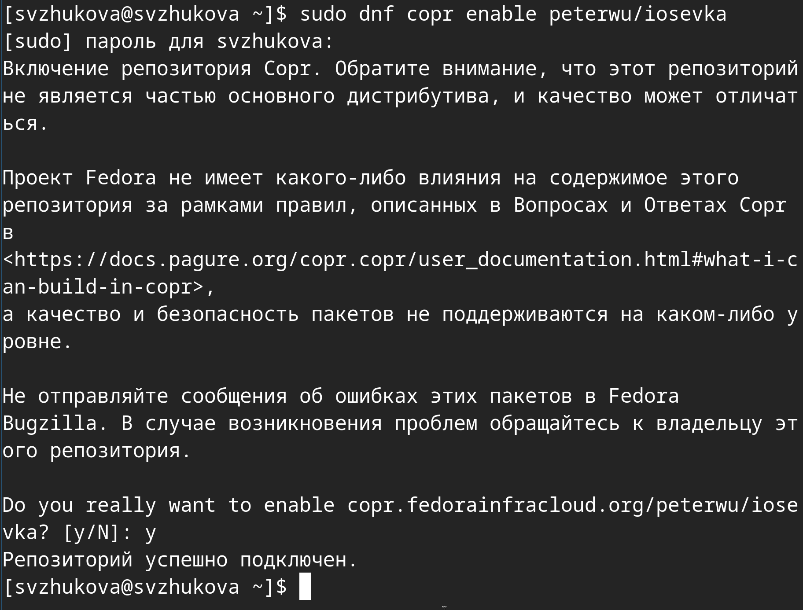{#fig:018 width=70%}

 (рис. [-@fig:019]).

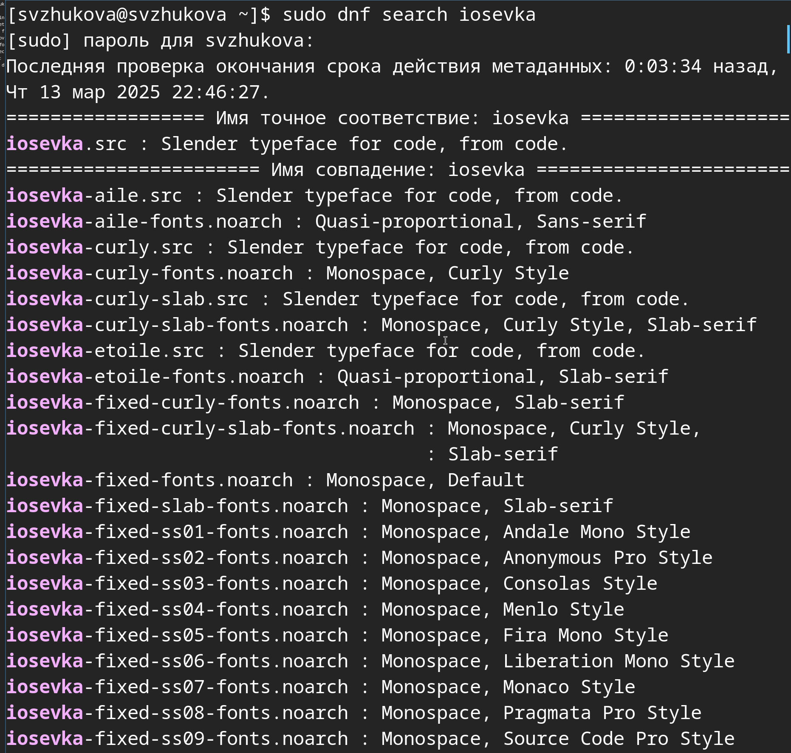{#fig:019 width=70%}

**Установка**

Установка бинарного файла. Скрипт определяет архитектуру процессора и операционную систему и скачивает необходимый файл:

с помощью wget: (рис. [-@fig:020]).

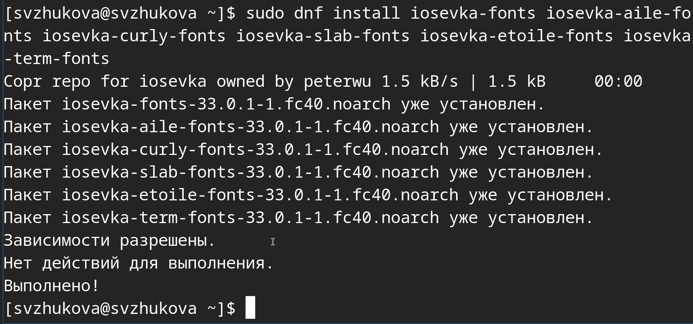{#fig:020 width=70%}

**Создадим собственный репозиторий с помощью утилит**

Создадим свой репозиторий для конфигурационных файлов на основе шаблона: (рис. [-@fig:021]).

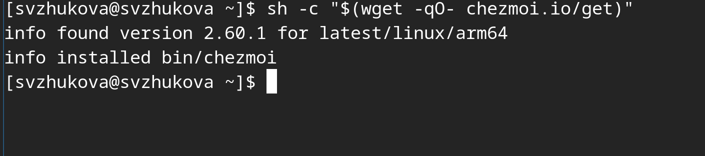{#fig:021 width=70%}

**Подключим репозиторий к своей системе**

Инициализируем chezmoi с нашим репозиторием dotfiles: (рис. [-@fig:022]).

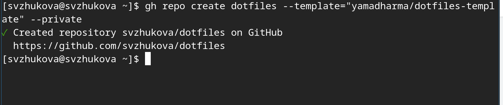{#fig:022 width=70%}

Проверим, какие изменения внесёт chezmoi в домашний каталог, запустив: (рис. [-@fig:023]).

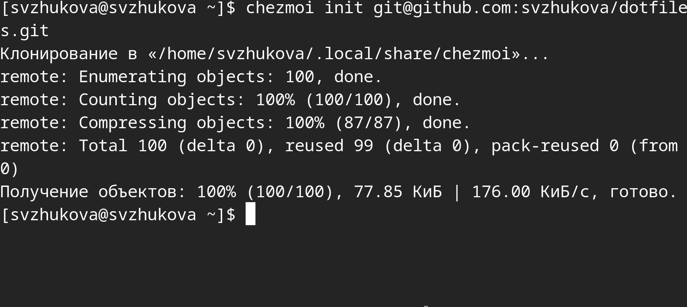{#fig:023 width=70%}

Нас устраивают изменения, внесённые chezmoi, запустим: (рис. [-@fig:024]).

{#fig:024 width=70%}

**Использование chezmoi на нескольких машинах**

На второй машине инициализируем chezmoi с нашим репозиторием dotfiles: (рис. [-@fig:025]).

{#fig:025 width=70%}

Проверим, какие изменения внесёт chezmoi в домашний каталог, запустив: (рис. [-@fig:026]).

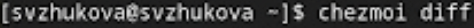{#fig:026 width=70%}

Нас устраивают изменения, внесённые chezmoi, запустим: (рис. [-@fig:027]).

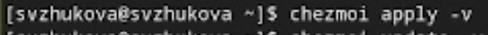{#fig:027 width=70%}

При существующем каталоге chezmoi можно получить и применить последние изменения из нашего репозитория: (рис. [-@fig:029]).

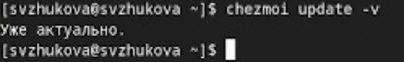{#fig:029 width=70%}

**Настройка новой машины с помощью одной команды**

Можно установить свои dotfiles на новый компьютер с помощью одной команды: (рис. [-@fig:030]).

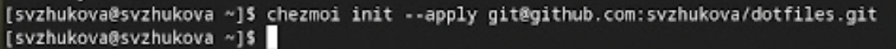{#fig:030 width=70%}

**Ежедневные операции c chezmoi**

Извлечем последние изменения из репозитория и применим их (рис. [-@fig:031]).

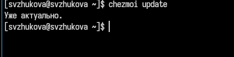{#fig:031 width=70%}

Извлечем последние изменения из своего репозитория и посмотрим, что изменится, фактически не применяя изменения

Выполним: (рис. [-@fig:032]).

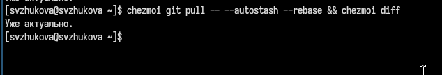{#fig:032 width=70%}

Мы довольны изменениями, применим их: (рис. [-@fig:033]).

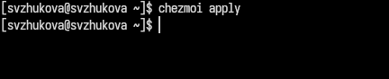{#fig:033 width=70%}

Можно автоматически фиксировать и отправлять изменения в исходный каталог в репозиторий.

Чтобы включить её, добавим в файл конфигурации ~/.config/chezmoi/chezmoi.toml следующее:(рис. [-@fig:034]).

{#fig:034 width=70%}

 (рис. [-@fig:034]).

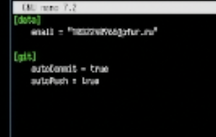{#fig:034 width=70%}

# Выводы

Мы настроили рабочую среду.

