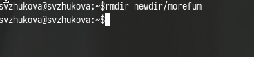

---
## Front matter
title: "Лабораторная работа № 6"
subtitle: "Основы интерфейса взаимодействия пользователя с системой Unix на уровне командной строки"
author: "Жукова София Викторовна"

## Generic otions
lang: ru-RU
toc-title: "Содержание"

## Bibliography
bibliography: bib/cite.bib
csl: pandoc/csl/gost-r-7-0-5-2008-numeric.csl

## Pdf output format
toc: true # Table of contents
toc-depth: 2
lof: true # List of figures
lot: true # List of tables
fontsize: 12pt
linestretch: 1.5
papersize: a4
documentclass: scrreprt
## I18n polyglossia
polyglossia-lang:
  name: russian
  options:
	- spelling=modern
	- babelshorthands=true
polyglossia-otherlangs:
  name: english
## I18n babel
babel-lang: russian
babel-otherlangs: english
## Fonts
mainfont: IBM Plex Serif
romanfont: IBM Plex Serif
sansfont: IBM Plex Sans
monofont: IBM Plex Mono
mathfont: STIX Two Math
mainfontoptions: Ligatures=Common,Ligatures=TeX,Scale=0.94
romanfontoptions: Ligatures=Common,Ligatures=TeX,Scale=0.94
sansfontoptions: Ligatures=Common,Ligatures=TeX,Scale=MatchLowercase,Scale=0.94
monofontoptions: Scale=MatchLowercase,Scale=0.94,FakeStretch=0.9
mathfontoptions:
## Biblatex
biblatex: true
biblio-style: "gost-numeric"
biblatexoptions:
  - parentracker=true
  - backend=biber
  - hyperref=auto
  - language=auto
  - autolang=other*
  - citestyle=gost-numeric
## Pandoc-crossref LaTeX customization
figureTitle: "Рис."
tableTitle: "Таблица"
listingTitle: "Листинг"
lofTitle: "Список иллюстраций"
lotTitle: "Список таблиц"
lolTitle: "Листинги"
## Misc options
indent: true
header-includes:
  - \usepackage{indentfirst}
  - \usepackage{float} # keep figures where there are in the text
  - \floatplacement{figure}{H} # keep figures where there are in the text
---

# Цель работы

Приобретение практических навыков взаимодействия пользователя с системой по-
средством командной строки.

# Задание

1. Определите полное имя вашего домашнего каталога. Далее относительно этого ката-
лога будут выполняться последующие упражнения.
2. Выполните следующие действия:
2.1. Перейдите в каталог /tmp.
2.2. Выведите на экран содержимое каталога /tmp. Для этого используйте команду ls
с различными опциями. Поясните разницу в выводимой на экран информации.
2.3. Определите, есть ли в каталоге /var/spool подкаталог с именем cron?
2.4. Перейдите в Ваш домашний каталог и выведите на экран его содержимое. Опре-
делите, кто является владельцем файлов и подкаталогов?
3. Выполните следующие действия:
3.1. В домашнем каталоге создайте новый каталог с именем newdir.
3.2. В каталоге ~/newdir создайте новый каталог с именем morefun.
3.3. В домашнем каталоге создайте одной командой три новых каталога с именами
letters, memos, misk. Затем удалите эти каталоги одной командой.
3.4. Попробуйте удалить ранее созданный каталог ~/newdir командой rm. Проверьте,
был ли каталог удалён.
3.5. Удалите каталог ~/newdir/morefun из домашнего каталога. Проверьте, был ли
каталог удалён.
4. С помощью команды man определите, какую опцию команды ls нужно использо-
вать для просмотра содержимое не только указанного каталога, но и подкаталогов,
входящих в него.
5. С помощью команды man определите набор опций команды ls, позволяющий отсорти-
ровать по времени последнего изменения выводимый список содержимого каталога
с развёрнутым описанием файлов.
6. Используйте команду man для просмотра описания следующих команд: cd, pwd, mkdir,
rmdir, rm. Поясните основные опции этих команд.
7. Используя информацию, полученную при помощи команды history, выполните мо-
дификацию и исполнение нескольких команд из буфера команд.

# Выполнение лабораторной работы

Определим полное имя нашего домашнего каталога. (рис. [-@fig:001]).

.png){#fig:001 width=70%}

Перейдем в каталог /tmp. (рис. [-@fig:002]).

.png){#fig:002 width=70%}

Выведите на экран содержимое каталога /tmp. Для этого используйте команду ls
с различными опциями.

Команда ls используется для просмотра содержимого каталога (рис. [-@fig:003]).

.png){#fig:003 width=70%}

Для того, чтобы отобразить имена скрытых файлов, необходимо использовать команду ls с опцией a (рис. [-@fig:004]).

.png){#fig:004 width=70%}

Чтобы вывести на экран подробную информацию о файлах и каталогах, необходимо использовать опцию l (рис. [-@fig:005]).

.png){#fig:005 width=70%}

Можно также получить информацию о типах файлов (каталог, исполняемый файл, ссылка), для чего используется опция F  (рис. [-@fig:006]).

.png){#fig:006 width=70%}

Оптимизированная команда ls с различными опциями (рис. [-@fig:007]).

.png){#fig:007 width=70%}

 
Определим, есть ли в каталоге /var/spool подкаталог с именем cron? (рис. [-@fig:008]).

.png){#fig:008 width=70%}

Перейдем в наш домашний каталог и выведем на экран его содержимое. (рис. [-@fig:009]).

.png){#fig:009 width=70%} 

**Выполните следующие действия**

В домашнем каталоге создадим новый каталог с именем newdir. (рис. [-@fig:010]).

.png){#fig:010 width=70%} 

В каталоге ~/newdir создадим новый каталог с именем morefun. (рис. [-@fig:011]).

.png){#fig:011 width=70%} 

В домашнем каталоге создадим одной командой три новых каталога с именами
letters, memos, misk.  (рис. [-@fig:012]).

.png){#fig:012 width=70%} 

Затем удалим эти каталоги одной командой.  (рис. [-@fig:013]).

.png){#fig:013 width=70%} 

Попробуем удалить ранее созданный каталог ~/newdir командой rm.
Удалим каталог ~/newdir/morefun из домашнего каталога.  (рис. [-@fig:014]).

{#fig:014 width=70%}

С помощью команды man определитм, какую опцию команды ls нужно использо-
вать для просмотра содержимое не только указанного каталога, но и подкаталогов,
входящих в него.

-R (рис. [-@fig:015]).

.png){ #fig:015 width=100% }

С помощью команды man ls определяем набор опций команды, позволяющий отсортировать по времени последнего изменения выводимый список содержимого каталога. Таким набором опций являются: -c (рис. [-@fig:016]).

.png){ #fig:016 width=100% }

 -lt (рис. [-@fig:017]).

.png){ #fig:017 width=100% }

Проверим работу команды (рис. [-@fig:018]).

.png){ #fig:018 width=100% }

Используем команду man для просмотра описания следующих команд: cd, pwd, mkdir,
rmdir, rm. 
(рис. [-@fig:019]).

.png){ #fig:019 width=100% }

(рис. [-@fig:020]).

.png){ #fig:020 width=100% }

(рис. [-@fig:021]).

.png){ #fig:021 width=100% }

(рис. [-@fig:022]).

.png){ #fig:022 width=100% }

(рис. [-@fig:023]).

.png){ #fig:023 width=100% }

(рис. [-@fig:024]).

.png){ #fig:024 width=100% }

(рис. [-@fig:025]).

.png){ #fig:025 width=100% }

(рис. [-@fig:026]).

.png){ #fig:026 width=100% }

(рис. [-@fig:027]).

.png){ #fig:027 width=100% }

(рис. [-@fig:028]).

.png){ #fig:028 width=100% }

Используя информацию, полученную при помощи команды history, выполним мо-
дификацию и исполнение нескольких команд из буфера команд.

Вводим команду history (рис. [-@fig:029]).

.png){ #fig:029 width=100% }

(рис. [-@fig:030]).

.png){ #fig:030 width=100% }

# Выводы

Мы приобрели практическик навыки взаимодействия пользователя с системой по-
средством командной строки.

