---
## Front matter
title: "Лабораторная работа № 5"
subtitle: "Анализ файловой системы Linux. Команды для работы с файлами и каталогами"
author: "Жукова София Викторовна"

## Generic otions
lang: ru-RU
toc-title: "Содержание"

## Bibliography
bibliography: bib/cite.bib
csl: pandoc/csl/gost-r-7-0-5-2008-numeric.csl

## Pdf output format
toc: true # Table of contents
toc-depth: 2
lof: true # List of figures
lot: true # List of tables
fontsize: 12pt
linestretch: 1.5
papersize: a4
documentclass: scrreprt
## I18n polyglossia
polyglossia-lang:
  name: russian
  options:
	- spelling=modern
	- babelshorthands=true
polyglossia-otherlangs:
  name: english
## I18n babel
babel-lang: russian
babel-otherlangs: english
## Fonts
mainfont: IBM Plex Serif
romanfont: IBM Plex Serif
sansfont: IBM Plex Sans
monofont: IBM Plex Mono
mathfont: STIX Two Math
mainfontoptions: Ligatures=Common,Ligatures=TeX,Scale=0.94
romanfontoptions: Ligatures=Common,Ligatures=TeX,Scale=0.94
sansfontoptions: Ligatures=Common,Ligatures=TeX,Scale=MatchLowercase,Scale=0.94
monofontoptions: Scale=MatchLowercase,Scale=0.94,FakeStretch=0.9
mathfontoptions:
## Biblatex
biblatex: true
biblio-style: "gost-numeric"
biblatexoptions:
  - parentracker=true
  - backend=biber
  - hyperref=auto
  - language=auto
  - autolang=other*
  - citestyle=gost-numeric
## Pandoc-crossref LaTeX customization
figureTitle: "Рис."
tableTitle: "Таблица"
listingTitle: "Листинг"
lofTitle: "Список иллюстраций"
lotTitle: "Список таблиц"
lolTitle: "Листинги"
## Misc options
indent: true
header-includes:
  - \usepackage{indentfirst}
  - \usepackage{float} # keep figures where there are in the text
  - \floatplacement{figure}{H} # keep figures where there are in the text
---

# Цель работы

Ознакомление с файловой системой Linux, её структурой, именами и содержанием
каталогов. Приобретение практических навыков по применению команд для работы
с файлами и каталогами, по управлению процессами (и работами), по проверке исполь-
зования диска и обслуживанию файловой системы.

# Задание

1. Выполните все примеры, приведённые в первой части описания лабораторной работы.
2. Выполните следующие действия, зафиксировав в отчёте по лабораторной работе
используемые при этом команды и результаты их выполнения:
2.1. Скопируйте файл /usr/include/sys/io.h в домашний каталог и назовите его
equipment. Если файла io.h нет, то используйте любой другой файл в каталоге
/usr/include/sys/ вместо него.
2.2. В домашнем каталоге создайте директорию ~/ski.plases.
2.3. Переместите файл equipment в каталог ~/ski.plases.
2.4. Переименуйте файл ~/ski.plases/equipment в ~/ski.plases/equiplist.
2.5. Создайте в домашнем каталоге файл abc1 и скопируйте его в каталог
~/ski.plases, назовите его equiplist2.
2.6. Создайте каталог с именем equipment в каталоге ~/ski.plases.
2.7. Переместите файлы ~/ski.plases/equiplist и equiplist2 в каталог
~/ski.plases/equipment.
2.8. Создайте и переместите каталог ~/newdir в каталог ~/ski.plases и назовите
его plans.
Кулябов Д. С. и др. Операционные системы 53
3. Определите опции команды chmod, необходимые для того, чтобы присвоить перечис-
ленным ниже файлам выделенные права доступа, считая, что в начале таких прав
нет:
3.1. drwxr--r-- ... australia
3.2. drwx--x--x ... play
3.3. -r-xr--r-- ... my_os
3.4. -rw-rw-r-- ... feathers
При необходимости создайте нужные файлы.
4. Проделайте приведённые ниже упражнения, записывая в отчёт по лабораторной
работе используемые при этом команды:
4.1. Просмотрите содержимое файла /etc/password.
4.2. Скопируйте файл ~/feathers в файл ~/file.old.
4.3. Переместите файл ~/file.old в каталог ~/play.
4.4. Скопируйте каталог ~/play в каталог ~/fun.
4.5. Переместите каталог ~/fun в каталог ~/play и назовите его games.
4.6. Лишите владельца файла ~/feathers права на чтение.
4.7. Что произойдёт, если вы попытаетесь просмотреть файл ~/feathers командой
cat?
4.8. Что произойдёт, если вы попытаетесь скопировать файл ~/feathers?
4.9. Дайте владельцу файла ~/feathers право на чтение.
4.10. Лишите владельца каталога ~/play права на выполнение.
4.11. Перейдите в каталог ~/play. Что произошло?
4.12. Дайте владельцу каталога ~/play право на выполнение.
5. Прочитайте man по командам mount, fsck, mkfs, kill и кратко их охарактеризуйте,
приведя примеры.

# Выполнение лабораторной работы

1. Выполним все примеры, приведённые в первой части описания лабораторной работы.

**Примеры:**
1. Копирование файла в текущем каталоге. Скопируем файл ~/abc1 в файл april
и в файл may: (рис. [-@fig:001]).

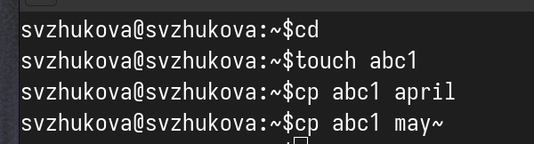{#fig:001 width=70%}

2. Копирование нескольких файлов в каталог. Скопировать файлы april и may в каталог
monthly: (рис. [-@fig:002]).

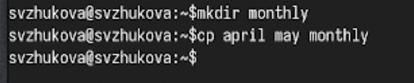{#fig:002 width=70%}

3. Копирование файлов в произвольном каталоге. Скопировать файл monthly/may в файл
с именем june: (рис. [-@fig:003]).

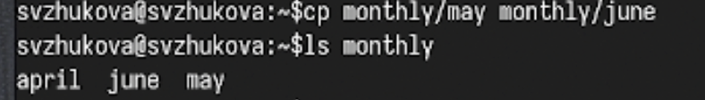{#fig:003 width=70%}

Опция i в команде cp выведет на экран запрос подтверждения о перезаписи файла.
Для рекурсивного копирования каталогов, содержащих файлы, используем команда
cp с опцией r.

**Примеры:**
1. Копирование каталогов в текущем каталоге. Скопируем каталог monthly в каталог
monthly.00: (рис. [-@fig:004]).

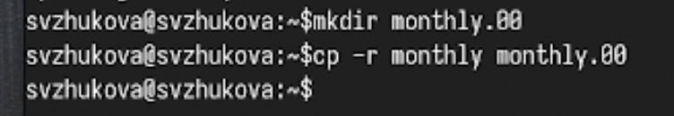{#fig:004 width=70%}

2. Копирование каталогов в произвольном каталоге. Скопируем каталог monthly.00
в каталог /tmp (рис. [-@fig:005]).

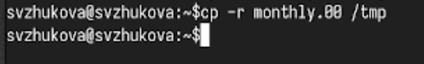{#fig:005 width=70%}

**Перемещение и переименование файлов и каталогов**

**Примеры:**
1. Переименование файлов в текущем каталоге. Изменим название файла april на
july в домашнем каталоге: (рис. [-@fig:006]).

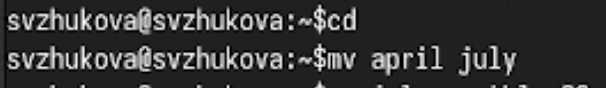{#fig:006 width=70%}

2. Перемещение файлов в другой каталог. Переместим файл july в каталог monthly.00:
 (рис. [-@fig:007]).

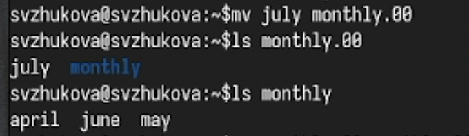{#fig:007 width=70%}

3. Переименование каталогов в текущем каталоге. Переименовать каталог monthly.00
в monthly.01 (рис. [-@fig:008]).

{#fig:008 width=70%}

**Перемещение файлов в другой каталог**

4. Перемещение каталога в другой каталог. Переместить каталог monthly.01в каталог
reports: (рис. [-@fig:009]).

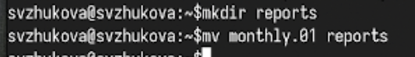{#fig:009 width=70%}

5. Переименование каталога, не являющегося текущим. Переименовать каталог
reports/monthly.01 в reports/monthly: (рис. [-@fig:010]).

{#fig:010 width=70%}

**Примеры:**

Требуется создать файл ~/may с правом выполнения для владельца: (рис. [-@fig:011]).

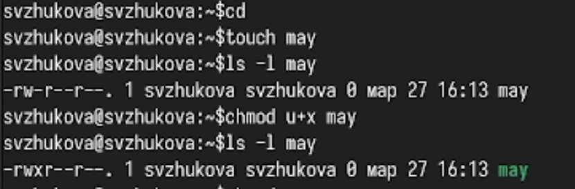{#fig:011 width=70%}

2. Требуется лишить владельца файла ~/may права на выполнение: (рис. [-@fig:012]).

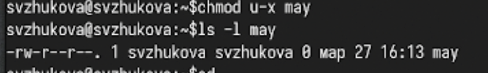{#fig:012 width=70%}

3. Требуется создать каталог monthly с запретом на чтение для членов группы и всех
остальных пользователей: (рис. [-@fig:013]).

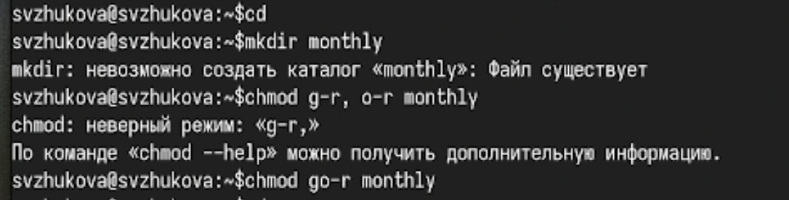{#fig:013 width=70%}

4. Требуется создать файл ~/abc1 с правом записи для членов группы: (рис. [-@fig:014]).

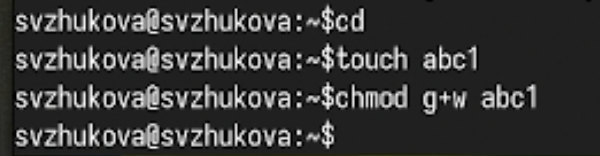{#fig:014 width=70%}

2. Выполним следующие действия, зафиксировав в отчёте по лабораторной работе
используемые при этом команды и результаты их выполнения

Скопируем файл /usr/include/sys/io.h в домашний каталог и назовем его
equipment. Если файла io.h нет, то используйте любой другой файл в каталоге
/usr/include/sys/ вместо него. (рис. [-@fig:015]).

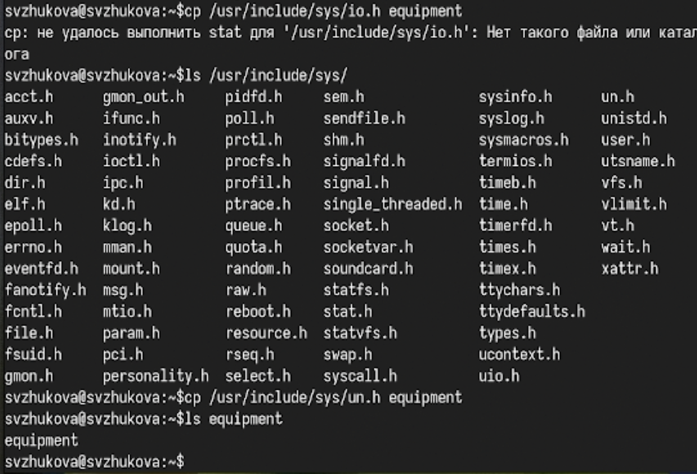{#fig:015 width=70%}

2.2. В домашнем каталоге создадим директорию ~/ski.plases. (рис. [-@fig:016]).

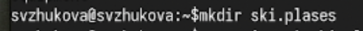{#fig:016 width=70%}

2.3. Переместим файл equipment в каталог ~/ski.plases. (рис. [-@fig:017]).

{#fig:017 width=70%}

2.4. Переименуйте файл ~/ski.plases/equipment в ~/ski.plases/equiplist. (рис. [-@fig:018]).

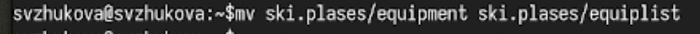{#fig:018 width=70%}
2.5. Создадим в домашнем каталоге файл abc1 и скопируем его в каталог
~/ski.plases, назовем его equiplist2. (рис. [-@fig:019]).

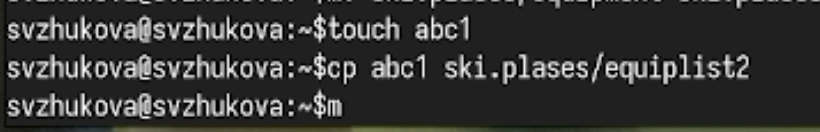{#fig:019 width=70%}

2.6. Создадим каталог с именем equipment в каталоге ~/ski.plases. (рис. [-@fig:020]).

{#fig:020 width=70%}

2.7. Переместите файлы ~/ski.plases/equiplist и equiplist2 в каталог
~/ski.plases/equipment. (рис. [-@fig:021]).

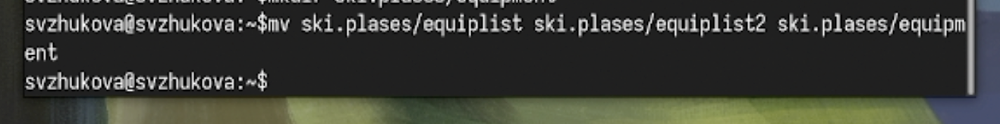{#fig:021 width=70%}

2.8. Создайте и переместите каталог ~/newdir в каталог ~/ski.plases и назовите
его plans (рис. [-@fig:022]).

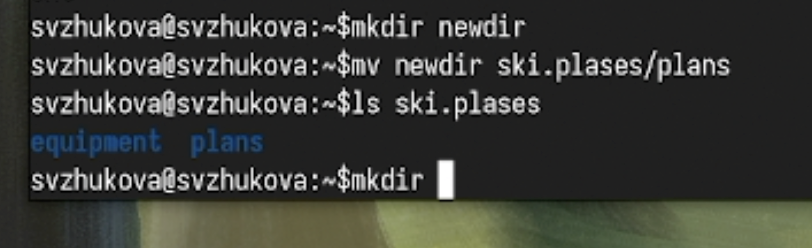{#fig:022 width=70%}

3. Определим опции команды chmod, необходимые для того, чтобы присвоить перечис-
ленным ниже файлам выделенные права доступа, считая, что в начале таких прав
нет:

Создадим файлы и каталоги (рис. [-@fig:023]).

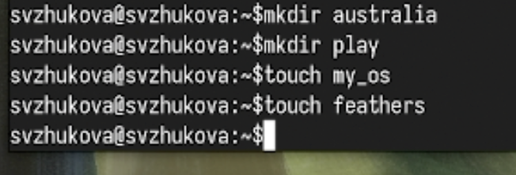{#fig:023 width=70%}

Присвоим права доступа (рис. [-@fig:024]).

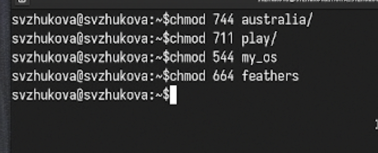{#fig:024 width=70%}

Проверим права доступа (рис. [-@fig:025]).

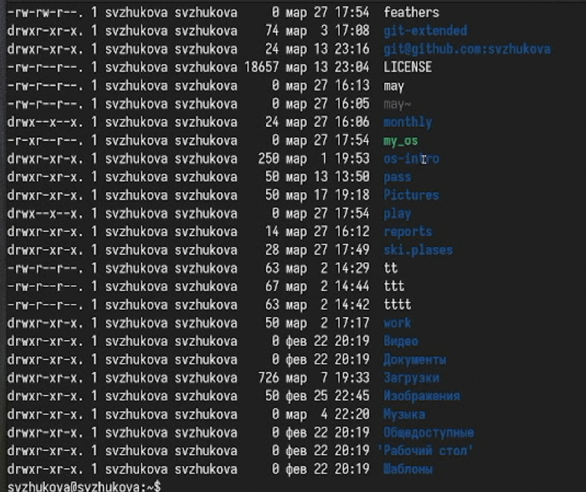{#fig:025 width=70%}

4. Проделаем приведённые ниже упражнения, записывая в отчёт по лабораторной
работе используемые при этом команды:
4.1. Просмотрим содержимое файла /etc/password. (рис. [-@fig:026]).

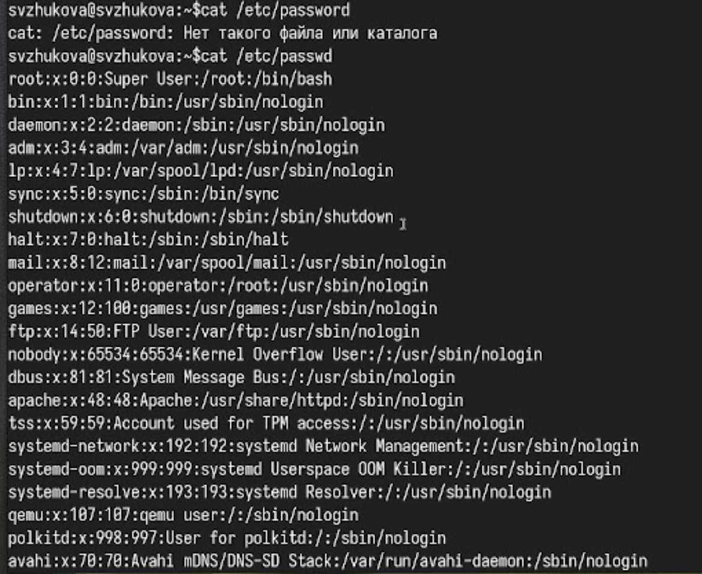{#fig:026 width=70%}

4.2. Скопируем файл ~/feathers в файл ~/file.old. (рис. [-@fig:027]).

{#fig:027 width=70%}

4.3. Переместим файл ~/file.old в каталог ~/play. (рис. [-@fig:028]).

{#fig:028 width=70%}

4.4. Скопируем каталог ~/play в каталог ~/fun. (рис. [-@fig:029]).

{#fig:029 width=70%}

4.5. Переместим каталог ~/fun в каталог ~/play и назовите его games. (рис. [-@fig:030]).

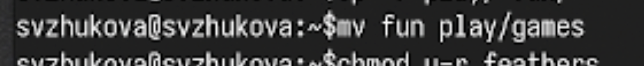{#fig:030 width=70%}

4.6. Лишите владельца файла ~/feathers права на чтение. (рис. [-@fig:031]).

{#fig:031 width=70%}

4.7. Что произойдёт, если вы попытаетесь просмотреть файл ~/feathers командой
cat? (рис. [-@fig:032]).

{#fig:032 width=70%}

4.8. Что произойдёт, если вы попытаетесь скопировать файл ~/feathers? (рис. [-@fig:033]).

{#fig:033 width=70%}

4.9. Дайте владельцу файла ~/feathers право на чтение. (рис. [-@fig:034]).

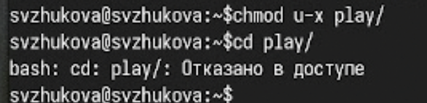{#fig:034 width=70%}

4.10. Лишите владельца каталога ~/play права на выполнение. (рис. [-@fig:035]).

{#fig:035 width=70%}

4.11. Перейдите в каталог ~/play. Что произошло? (рис. [-@fig:036]).

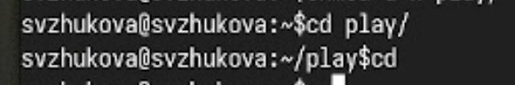{#fig:036 width=70%}

4.12. Дайте владельцу каталога ~/play право на выполнение. (рис. [-@fig:037]).

{#fig:037 width=70%}

5. Прочитаем man по командам mount, fsck, mkfs, kill и кратко их охарактеризуйте,
приведя примеры.

Введем man mount (рис. [-@fig:045]).

{#fig:045 width=70%}

Проанализируем man mount (рис. [-@fig:038]).

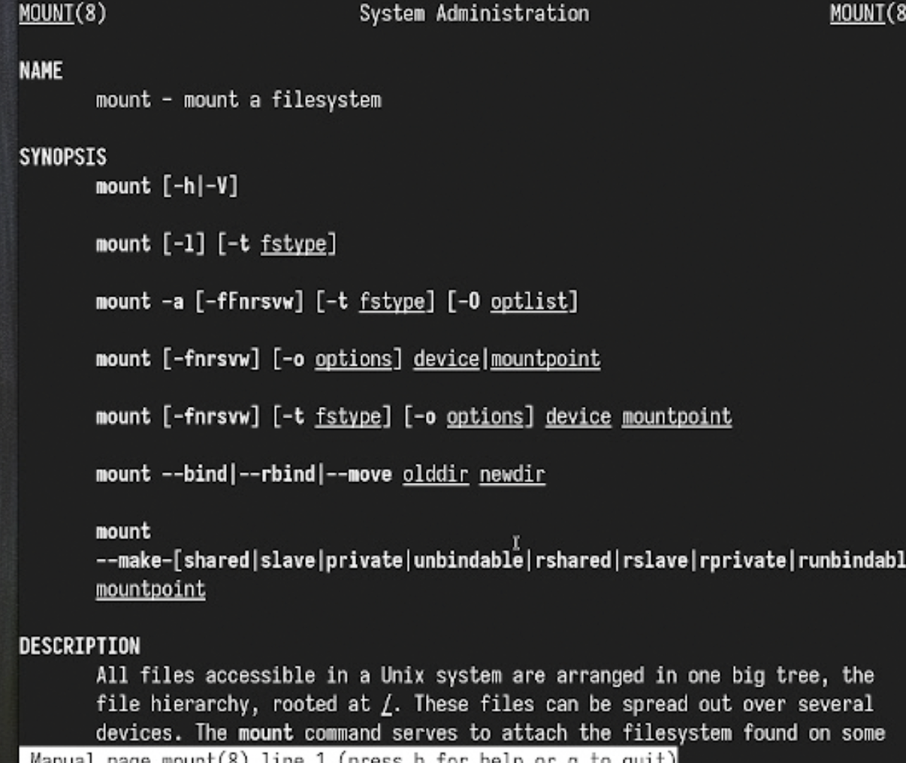{#fig:038 width=70%}

Введем man fsck  (рис. [-@fig:039]).

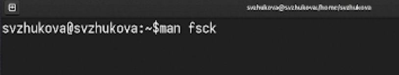{#fig:039 width=70%}

Проанализируем man fsck (рис. [-@fig:040]).

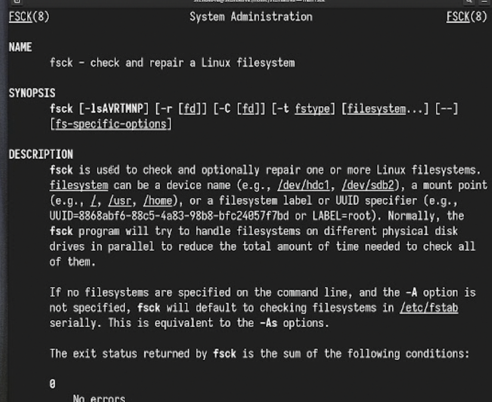{#fig:040 width=70%}

Введем man mkfs  (рис. [-@fig:041]).

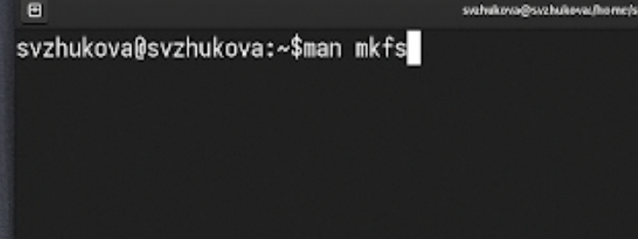{#fig:041 width=70%}

Проанализируем man mkfs (рис. [-@fig:042]).

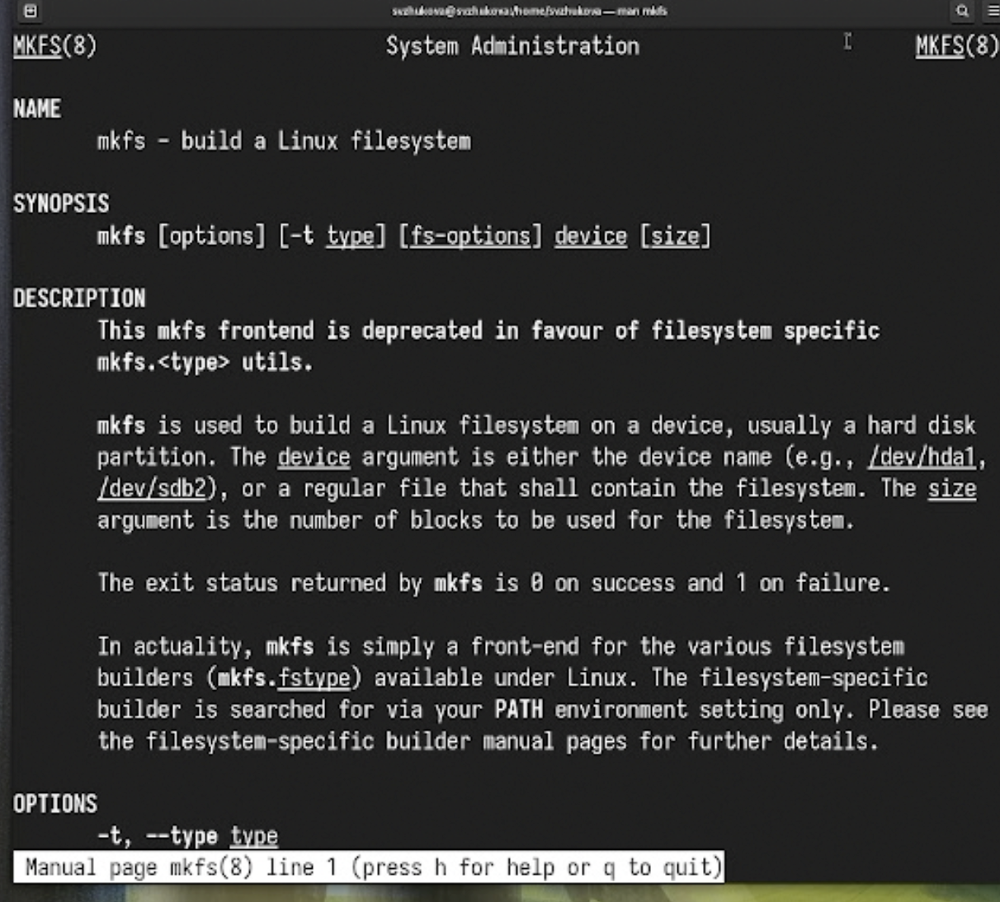{#fig:042 width=70%}

Введем man kill  (рис. [-@fig:043]).

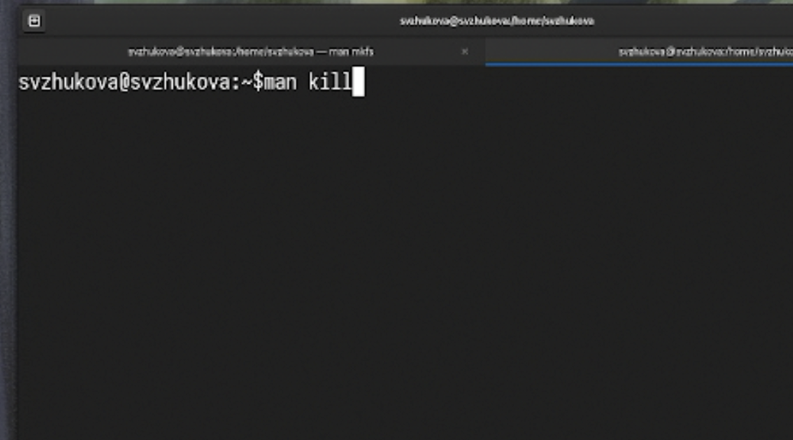{#fig:043 width=70%}

Проанализируем man kill (рис. [-@fig:044]).

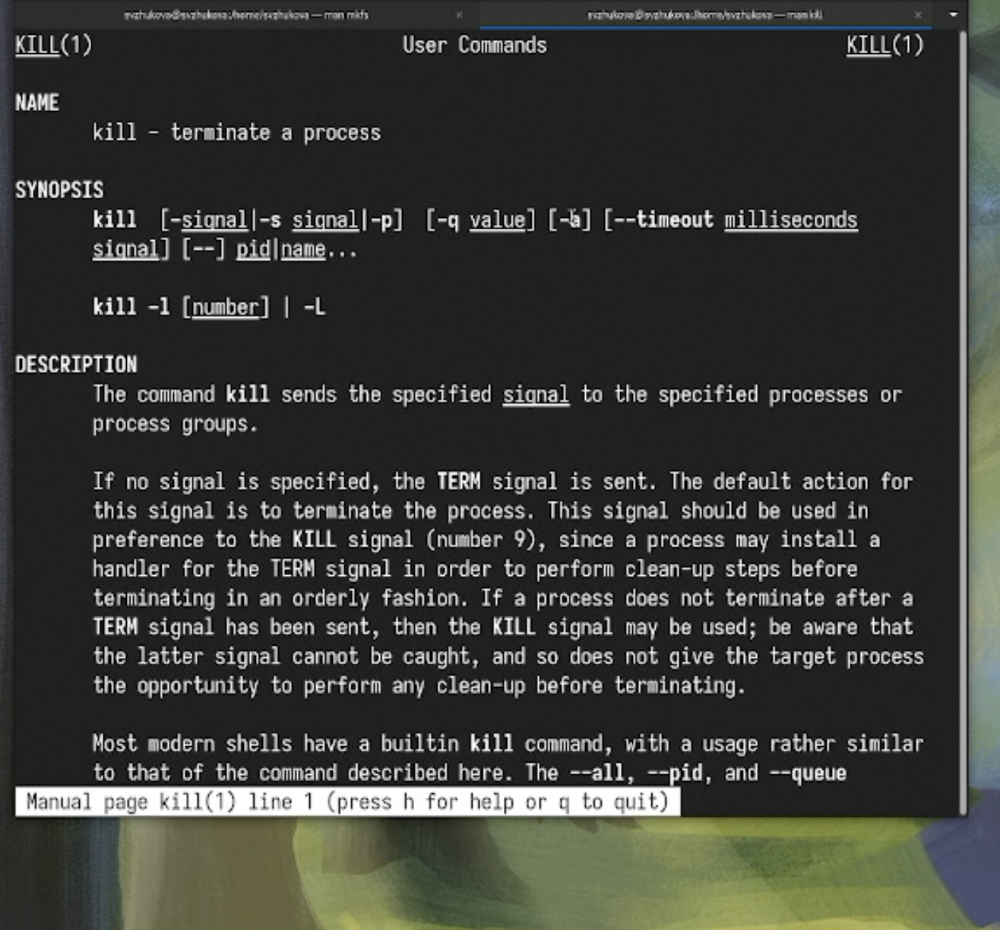{#fig:044 width=70%}

# Выводы

Мы ознакомлись с файловой системой Linux, её структурой, именами и содержанием
каталогов, приобрели практические навыки по применению команд для работы
с файлами и каталогами, по управлению процессами (и работами), по проверке исполь-
зования диска и обслуживанию файловой системы.

