---
## Front matter
title: Лабораторная работа № 8
subtitle: Поиск файлов. Перенаправление ввода-вывода. Просмотр запущенных процессов
author:
  - Жукова С. В. НПИбд-01-24
institute:
  - Российский университет дружбы народов, Москва, Россия
date: 4 апреля 2025

## Formatting
toc: false
slide_level: 2
theme: metropolis
header-includes: 
 - \metroset{progressbar=frametitle,sectionpage=progressbar,numbering=fraction}
 - '\makeatletter'
 - '\beamer@ignorenonframefalse'
 - '\makeatother'
aspectratio: 43
section-titles: true
---

## Докладчик

:::::::::::::: {.columns align=center}
::: {.column width="70%"}

  * Жукова София Викторовна
  * студентка
  * направления прикладной информатика
  * Российский университет дружбы народов
  * [1032240966@pfur.ru](mailto:1032240966@pfur.ru)
  * <https://svzhukova.github.io/ru/>

:::
::: {.column width="30%"}

:::
::::::::::::::

# Вводная часть

# Цель работы

Ознакомление с инструментами поиска файлов и фильтрации текстовых данных.
Приобретение практических навыков: по управлению процессами (и заданиями), по
проверке использования диска и обслуживанию файловых систем.

# Выполнение лабораторной работы

Запишем в файл file.txt названия файлов, содержащихся в каталоге /etc. Допи-
шем в этот же файл названия файлов, содержащихся в вашем домашнем каталоге.

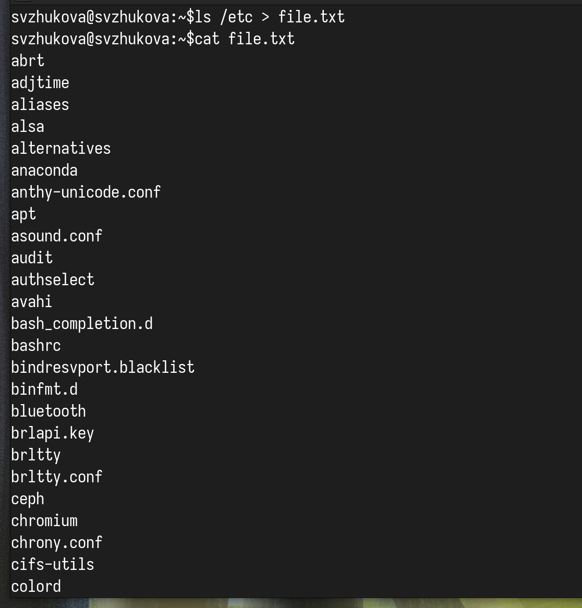{#fig:001 width=60%}

## Допишем названия файлов, содержащихся в вашем домашнем каталоге.
{#fig:002 width=70%}

## Проверим

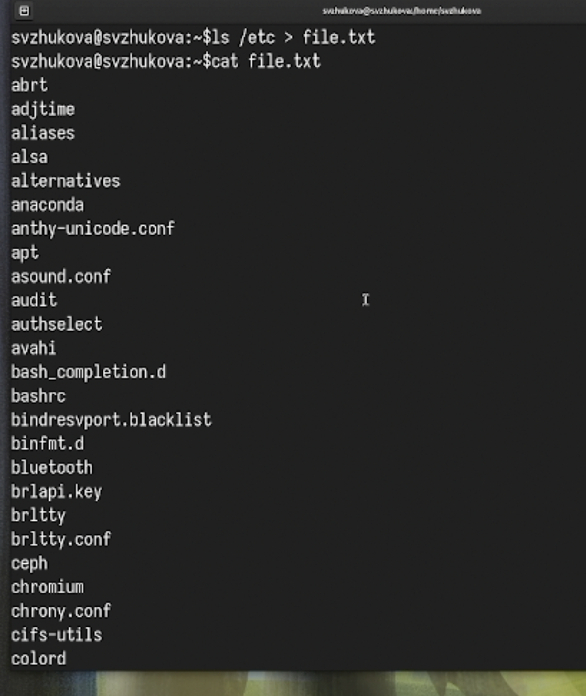{#fig:003 width=70%}

## Выведем имена всех файлов из file.txt, имеющих расширение .conf 

{#fig:004 width=70%}

## После чего запишем их в новый текстовой файл conf.txt.

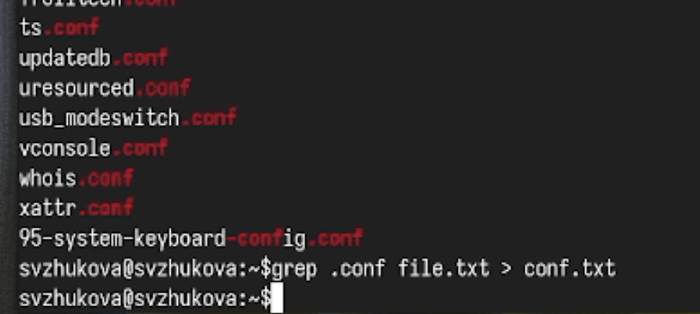{#fig:005 width=70%}

## Вариант 1

Определим, какие файлы в вашем домашнем каталоге имеют имена, начинавшиеся
с символа c. Предложим несколько вариантов, как это сделать. 

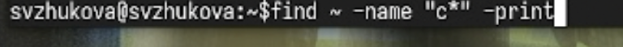{#fig:006 width=70%}

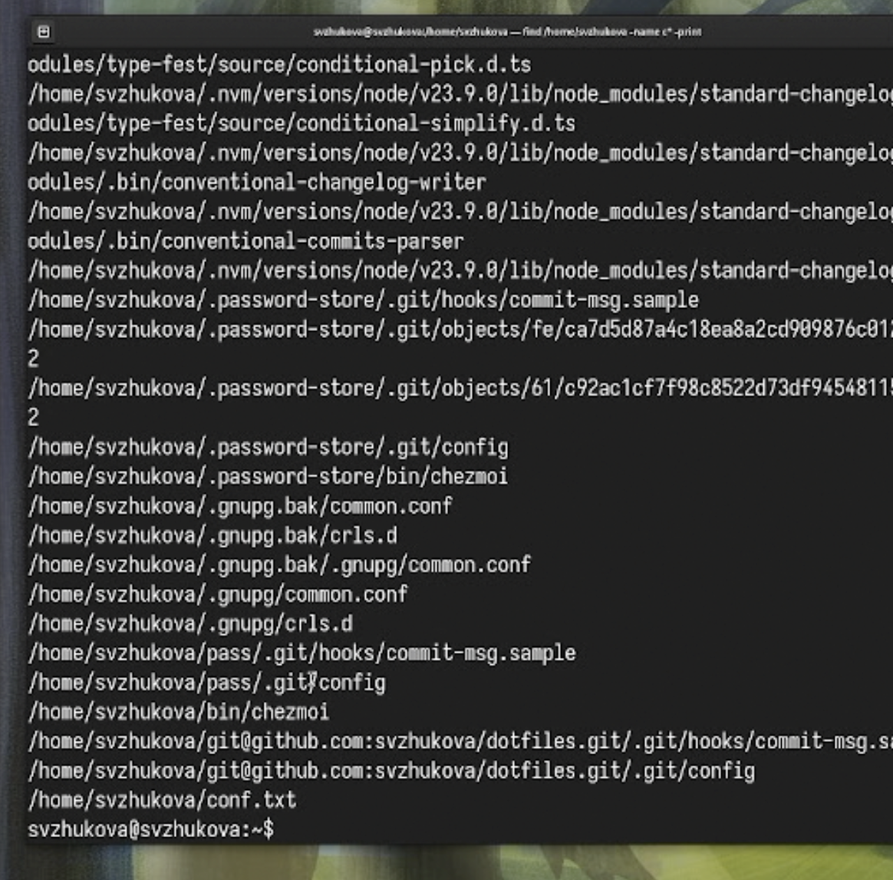{#fig:007 width=70%}

## Вариант 2

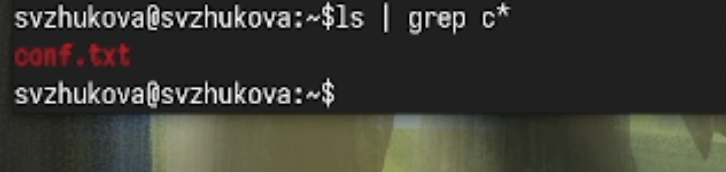{#fig:008 width=70%}

## Вариант 3

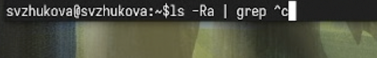{#fig:009 width=70%}

## Выведем на экран (по странично) имена файлов из каталога /etc, начинающиеся с символа h.

{#fig:010 width=70%}

{#fig:011 width=70%}

## Запустим в фоновом режиме процесс

который будет записывать в файл ~/logfile файлы, имена которых начинаются с log. 

{#fig:012 width=70%}

## Удалим файл ~/logfile. 

{#fig:013 width=70%}

## Запустим из консоли в фоновом режиме редактор gedit. 

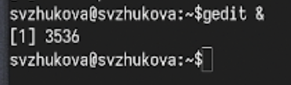{#fig:014 width=70%}

{#fig:015 width=70%}

## Определим идентификатор процесса gedit, используя команду ps, конвейер и фильтр
grep. 

{#fig:016 width=70%}

{#fig:017 width=70%}

## Прочтем справку (man) команды kill, после чего используем её для завершения процесса gedit. 

{#fig:018 width=40%}

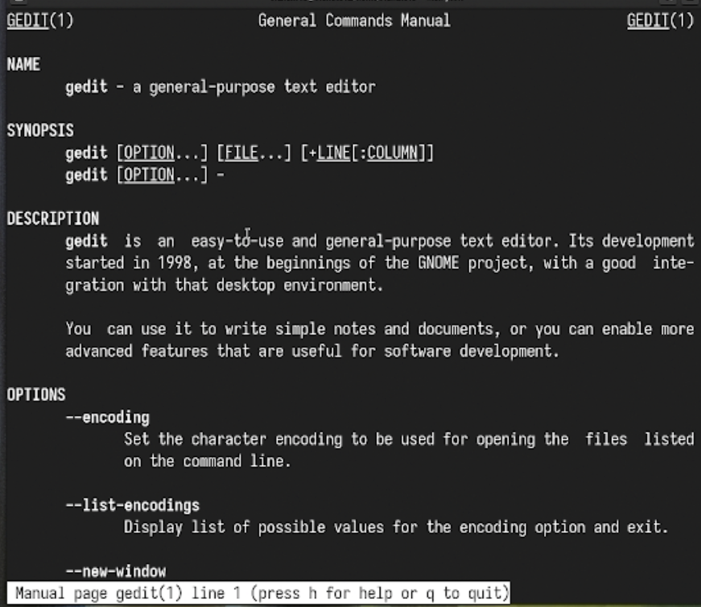{#fig:019 width=60%}

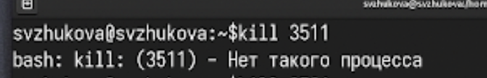{#fig:020 width=40%}

## Выполним команды df и du, предварительно получив более подробную информацию об этих командах, с помощью команды man. 

{#fig:021 width=70%}

{#fig:022 width=70%}

## df

{#fig:023 width=70%}

{#fig:024 width=70%}

## Прочтем справку

{#fig:025 width=70%}

## Воспользовавшись справкой команды find, выведем имена всех директорий, имеющихся в вашем домашнем каталоге.

{#fig:026 width=70%}

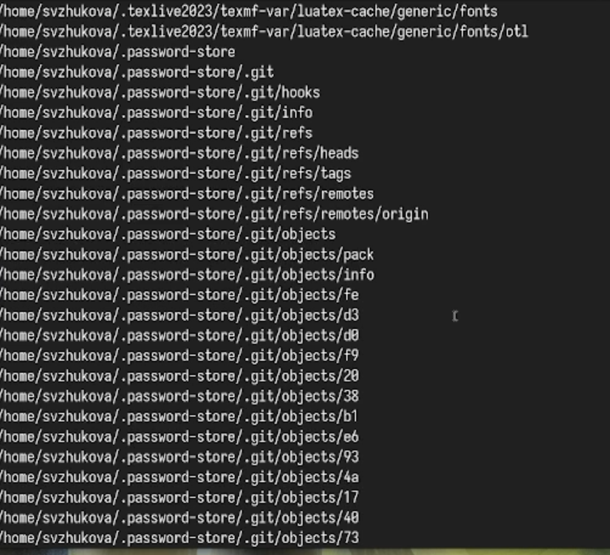{#fig:027 width=70%}

# Заключение

Мы ознакомлись с инструментами поиска файлов и фильтрации текстовых данных, приобрели практические навыки: по управлению процессами (и заданиями), по проверке использования диска и обслуживанию файловых систем.

