---
## Front matter
title: "Лабораторная работа № 6"
subtitle: "Поиск файлов. Перенаправление ввода-вывода. Просмотр запущенных процессов"
author: "Жукова София Викторона"

## Generic otions
lang: ru-RU
toc-title: "Содержание"

## Bibliography
bibliography: bib/cite.bib
csl: pandoc/csl/gost-r-7-0-5-2008-numeric.csl

## Pdf output format
toc: true # Table of contents
toc-depth: 2
lof: true # List of figures
lot: true # List of tables
fontsize: 12pt
linestretch: 1.5
papersize: a4
documentclass: scrreprt
## I18n polyglossia
polyglossia-lang:
  name: russian
  options:
	- spelling=modern
	- babelshorthands=true
polyglossia-otherlangs:
  name: english
## I18n babel
babel-lang: russian
babel-otherlangs: english
## Fonts
mainfont: IBM Plex Serif
romanfont: IBM Plex Serif
sansfont: IBM Plex Sans
monofont: IBM Plex Mono
mathfont: STIX Two Math
mainfontoptions: Ligatures=Common,Ligatures=TeX,Scale=0.94
romanfontoptions: Ligatures=Common,Ligatures=TeX,Scale=0.94
sansfontoptions: Ligatures=Common,Ligatures=TeX,Scale=MatchLowercase,Scale=0.94
monofontoptions: Scale=MatchLowercase,Scale=0.94,FakeStretch=0.9
mathfontoptions:
## Biblatex
biblatex: true
biblio-style: "gost-numeric"
biblatexoptions:
  - parentracker=true
  - backend=biber
  - hyperref=auto
  - language=auto
  - autolang=other*
  - citestyle=gost-numeric
## Pandoc-crossref LaTeX customization
figureTitle: "Рис."
tableTitle: "Таблица"
listingTitle: "Листинг"
lofTitle: "Список иллюстраций"
lotTitle: "Список таблиц"
lolTitle: "Листинги"
## Misc options
indent: true
header-includes:
  - \usepackage{indentfirst}
  - \usepackage{float} # keep figures where there are in the text
  - \floatplacement{figure}{H} # keep figures where there are in the text
---

# Цель работы

Ознакомление с инструментами поиска файлов и фильтрации текстовых данных.
Приобретение практических навыков: по управлению процессами (и заданиями), по
проверке использования диска и обслуживанию файловых систем.

# Задание

1. Осуществите вход в систему, используя соответствующее имя пользователя.
2. Запишите в файл file.txt названия файлов, содержащихся в каталоге /etc. Допи-
шите в этот же файл названия файлов, содержащихся в вашем домашнем каталоге.
3. Выведите имена всех файлов из file.txt, имеющих расширение .conf, после чего
запишите их в новый текстовой файл conf.txt.
4. Определите, какие файлы в вашем домашнем каталоге имеют имена, начинавшиеся
с символа c? Предложите несколько вариантов, как это сделать.
5. Выведите на экран (по странично) имена файлов из каталога /etc, начинающиеся
с символа h.
6. Запустите в фоновом режиме процесс, который будет записывать в файл ~/logfile
файлы, имена которых начинаются с log.
7. Удалите файл ~/logfile.
8. Запустите из консоли в фоновом режиме редактор gedit.
9. Определите идентификатор процесса gedit, используя команду ps, конвейер и фильтр
grep. Как ещё можно определить идентификатор процесса?
10. Прочтите справку (man) команды kill, после чего используйте её для завершения
процесса gedit.
11. Выполните команды df и du, предварительно получив более подробную информацию
об этих командах, с помощью команды man.
12. Воспользовавшись справкой команды find, выведите имена всех директорий, имею-
щихся в вашем домашнем каталоге

# Выполнение лабораторной работы

Запишем в файл file.txt названия файлов, содержащихся в каталоге /etc. Допи-
шем в этот же файл названия файлов, содержащихся в вашем домашнем каталоге. (рис. [-@fig:001]).

{#fig:001 width=70%}

(рис. [-@fig:002]).

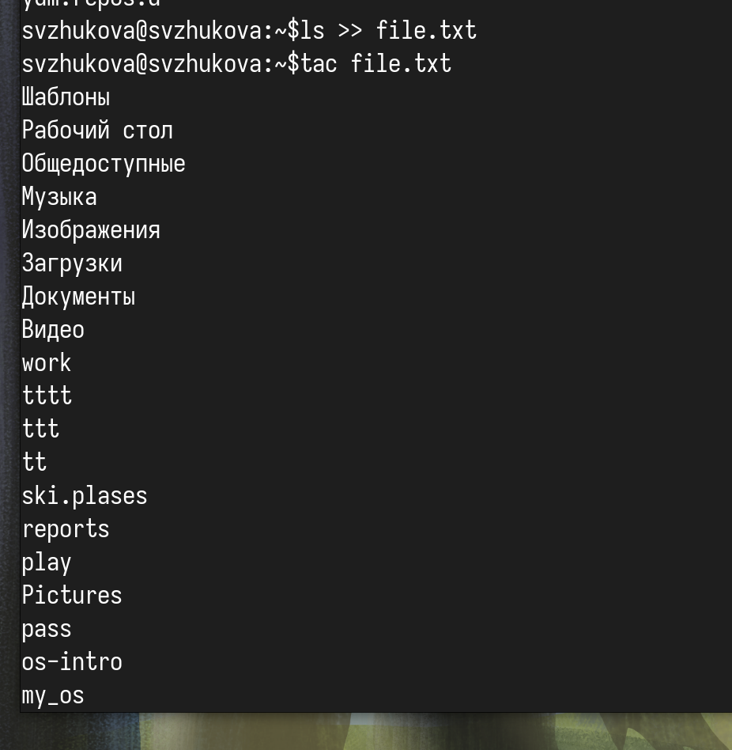{#fig:002 width=70%}

(рис. [-@fig:003]).

{#fig:003 width=70%}

Выведем имена всех файлов из file.txt, имеющих расширение .conf (рис. [-@fig:004]).

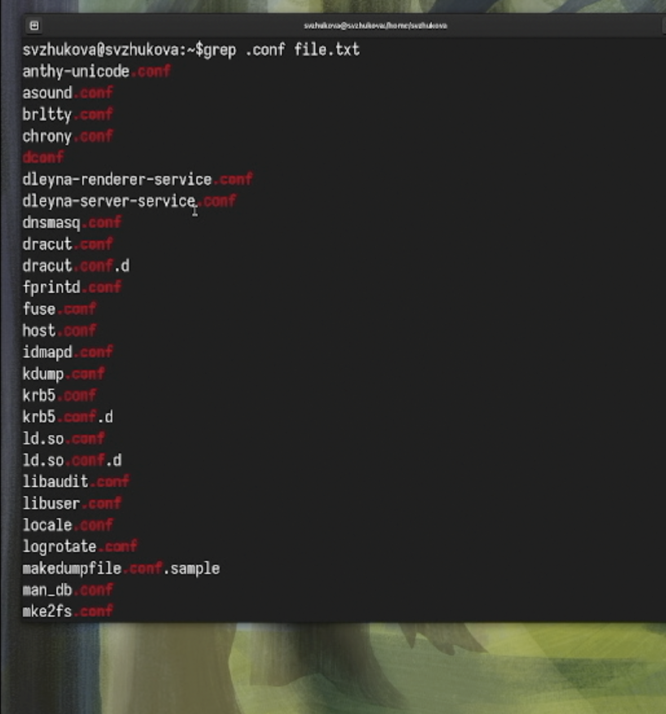{#fig:004 width=70%}

После чего запишем их в новый текстовой файл conf.txt. (рис. [-@fig:005]).

{#fig:005 width=70%}

Определим, какие файлы в вашем домашнем каталоге имеют имена, начинавшиеся
с символа c. Предложим несколько вариантов, как это сделать. (рис. [-@fig:006]).

{#fig:006 width=70%}

(рис. [-@fig:007]).

{#fig:007 width=70%}

(рис. [-@fig:008]).

{#fig:008 width=70%}

(рис. [-@fig:009]).

{#fig:009 width=70%}

Выведем на экран (по странично) имена файлов из каталога /etc, начинающиеся
с символа h. (рис. [-@fig:010]).

{#fig:010 width=70%}

(рис. [-@fig:011]).

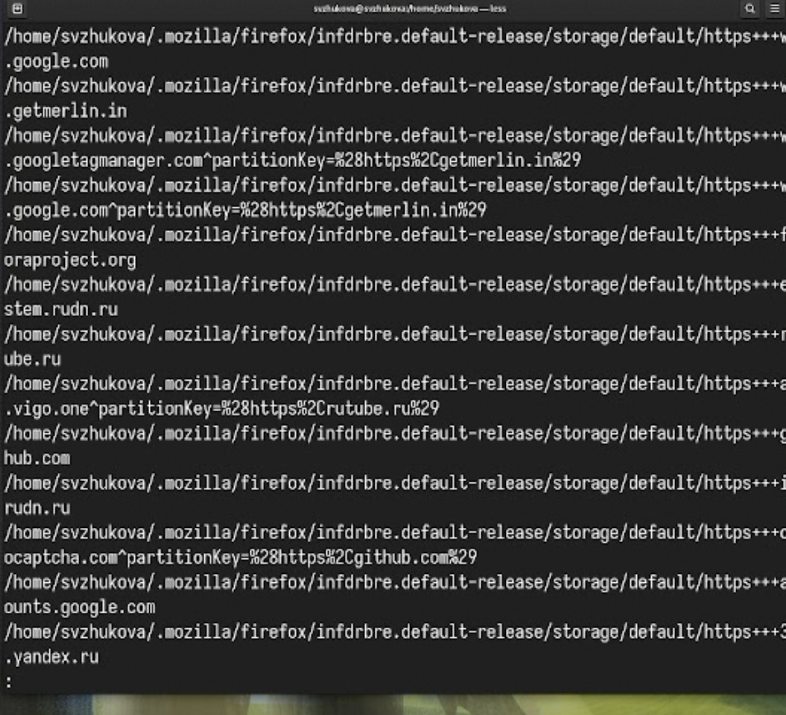{#fig:011 width=70%}

Запустим в фоновом режиме процесс, который будет записывать в файл ~/logfile
файлы, имена которых начинаются с log. (рис. [-@fig:012]).

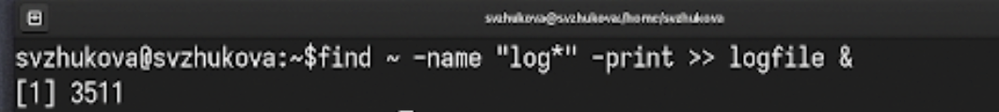{#fig:012 width=70%}

Удалим файл ~/logfile. (рис. [-@fig:013]).

{#fig:013 width=70%}

Запустим из консоли в фоновом режиме редактор gedit. (рис. [-@fig:014]).

{#fig:014 width=70%}

(рис. [-@fig:015]).

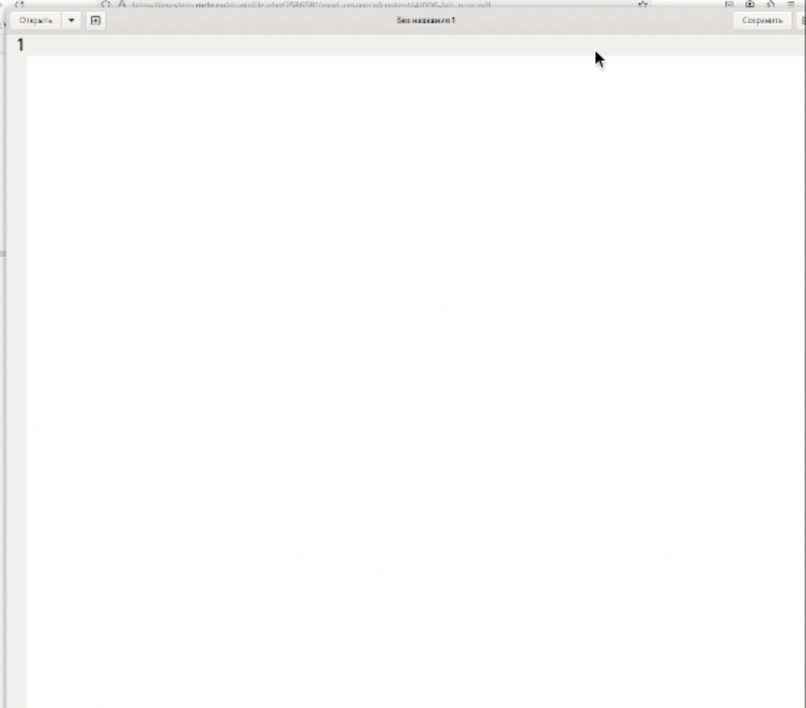{#fig:015 width=70%}

Определим идентификатор процесса gedit, используя команду ps, конвейер и фильтр
grep. (рис. [-@fig:016]).

{#fig:016 width=70%}

(рис. [-@fig:017]).

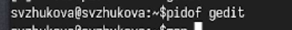{#fig:017 width=70%}

Прочтем справку (man) команды kill, после чего используем её для завершения процесса gedit. (рис. [-@fig:018]).

{#fig:018 width=70%}

(рис. [-@fig:019]).

{#fig:019 width=70%}

(рис. [-@fig:020]).

{#fig:020 width=70%}

Выполним команды df и du, предварительно получив более подробную информацию об этих командах, с помощью команды man. (рис. [-@fig:021]).

{#fig:021 width=70%}

(рис. [-@fig:022]).

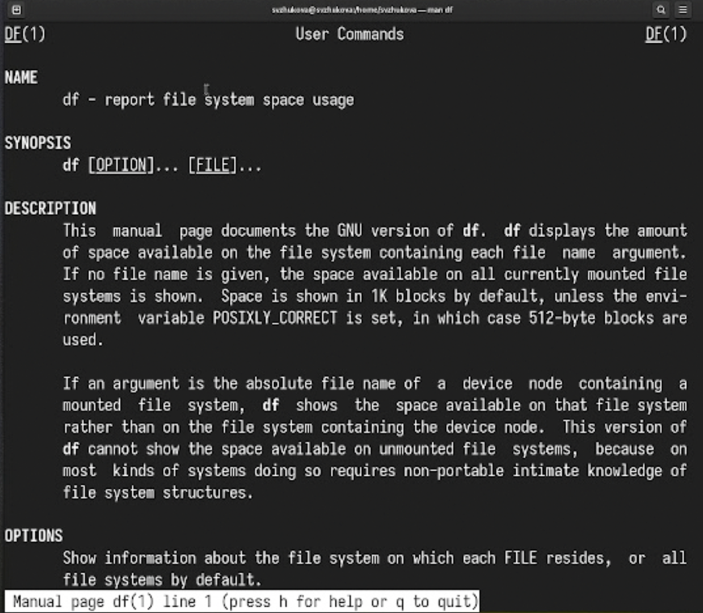{#fig:022 width=70%}

(рис. [-@fig:023]).

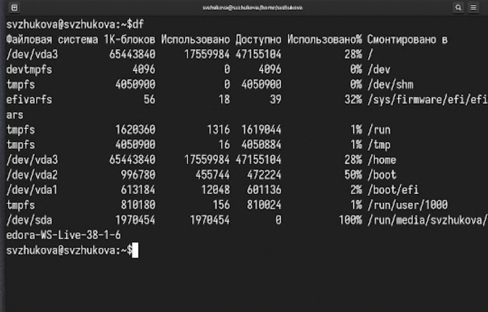{#fig:023 width=70%}

(рис. [-@fig:024]).

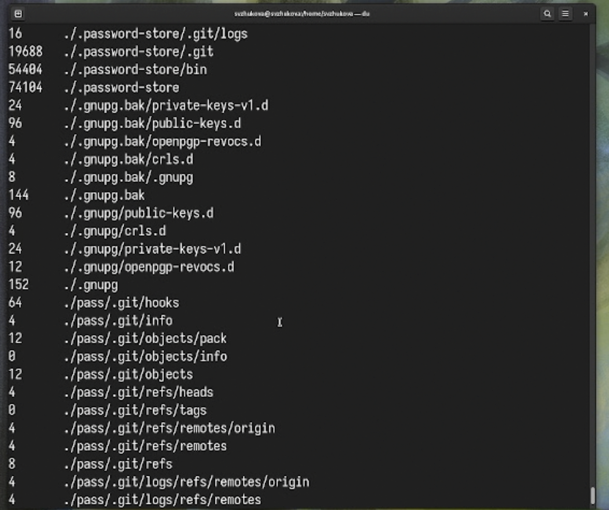{#fig:024 width=70%}

(рис. [-@fig:025]).

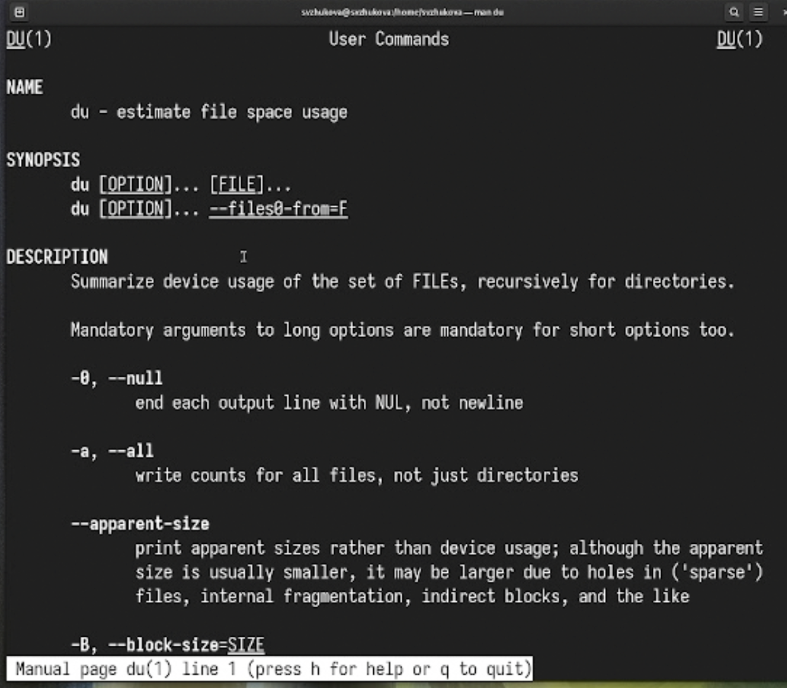{#fig:025 width=70%}

Воспользовавшись справкой команды find, выведем имена всех директорий, имеющихся в вашем домашнем каталоге.(рис. [-@fig:026]).

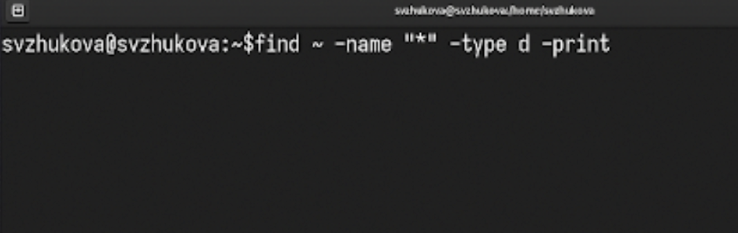{#fig:026 width=70%}

(рис. [-@fig:027]).

{#fig:027 width=70%}

# Выводы

Мы ознакомлись с инструментами поиска файлов и фильтрации текстовых данных, приобрели практические навыки: по управлению процессами (и заданиями), по проверке использования диска и обслуживанию файловых систем.

