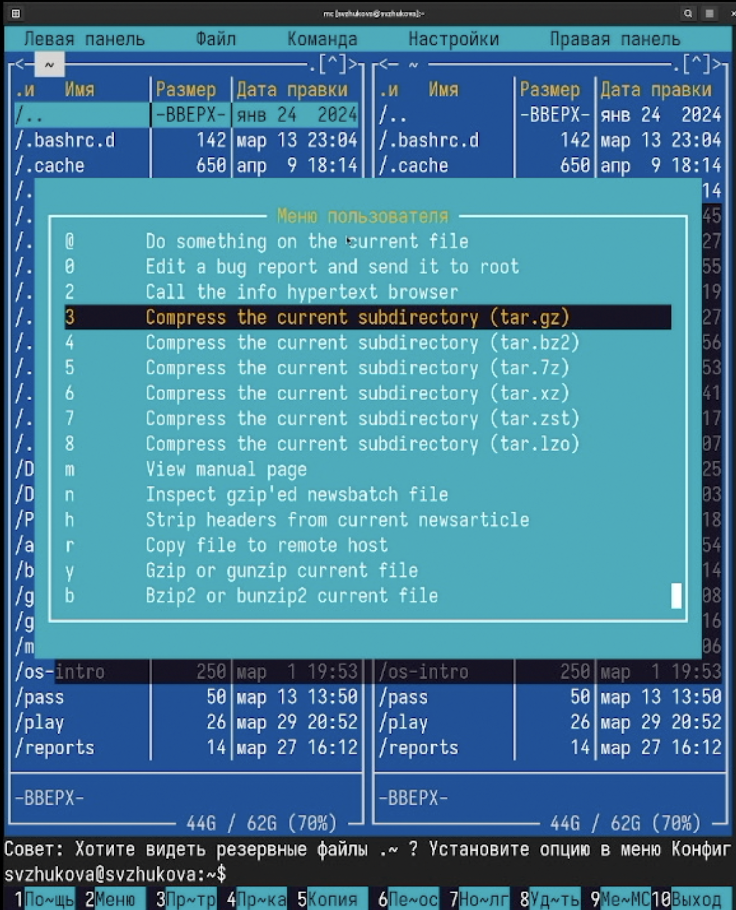
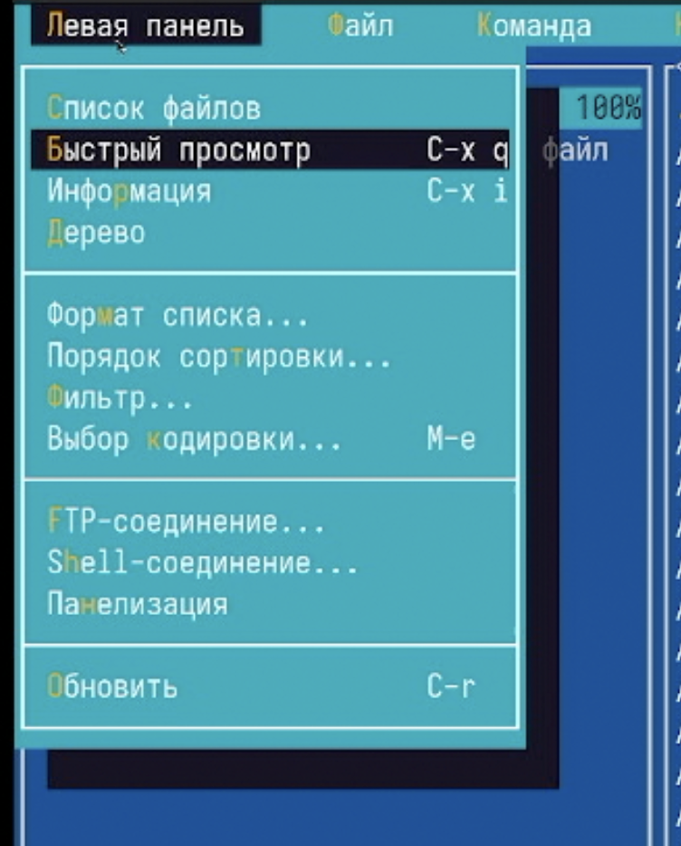
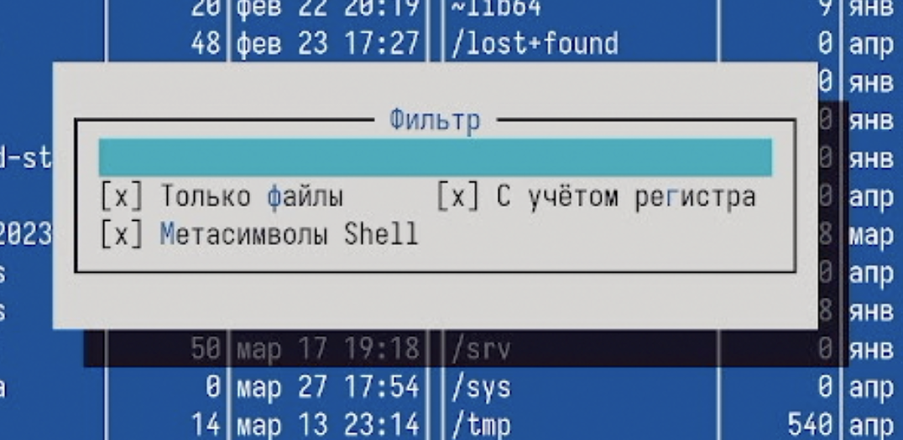
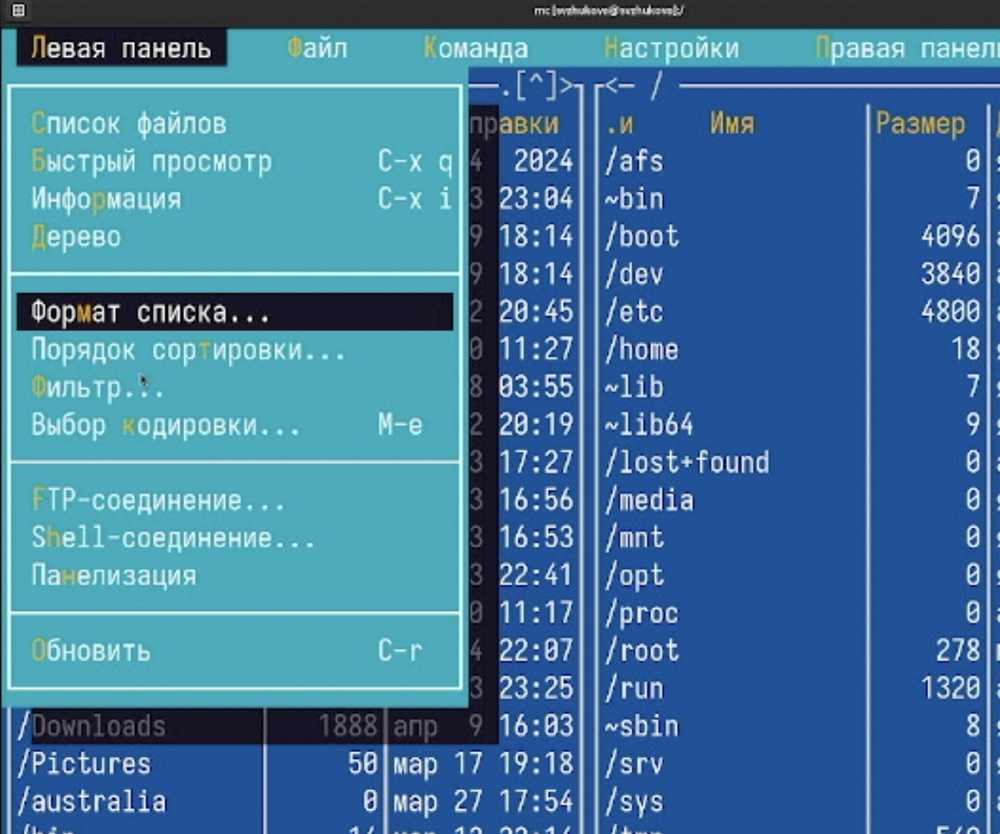
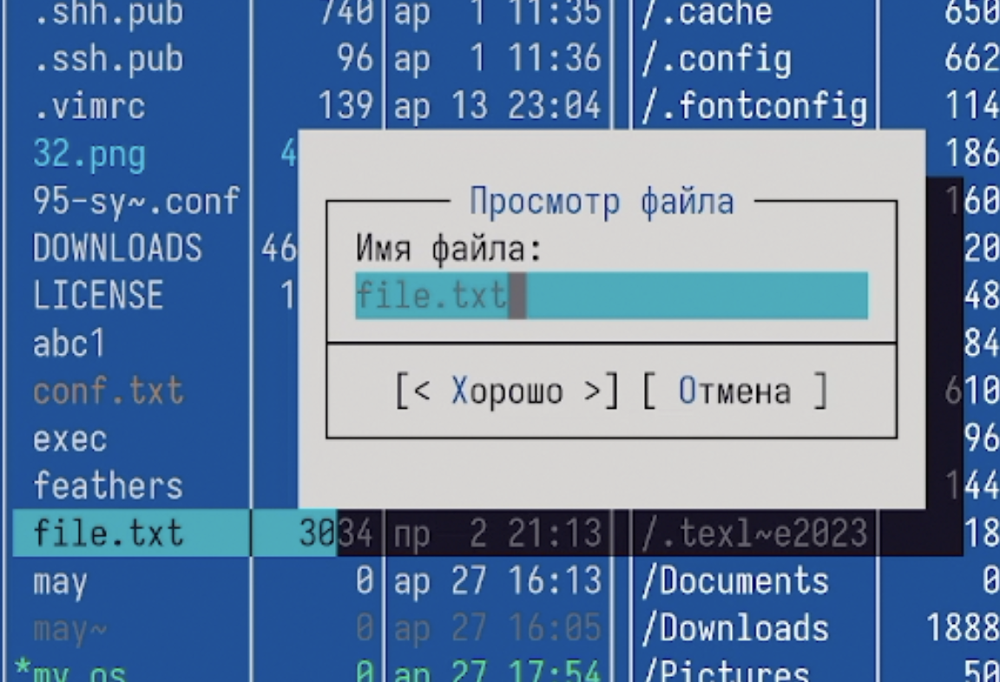
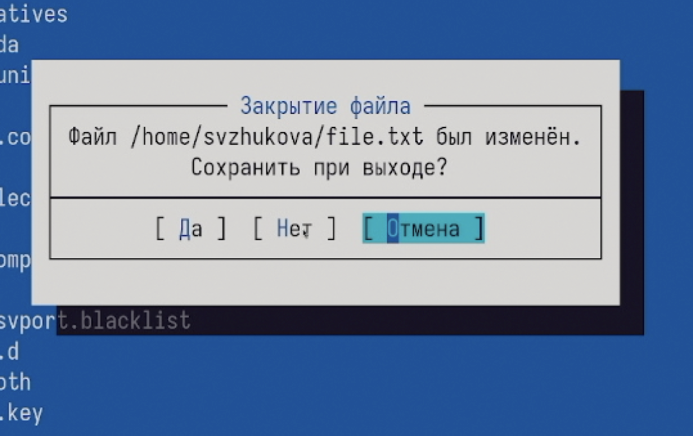
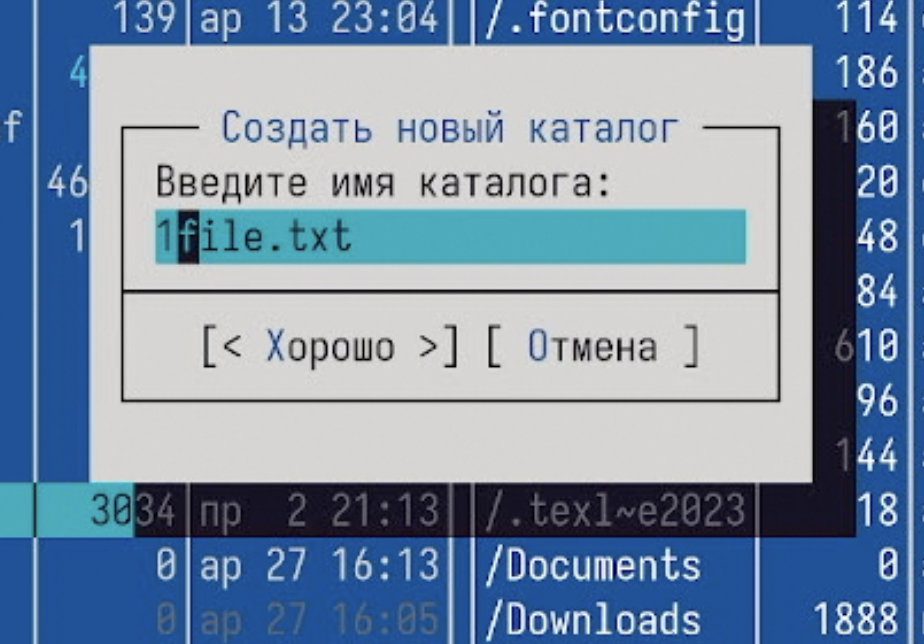
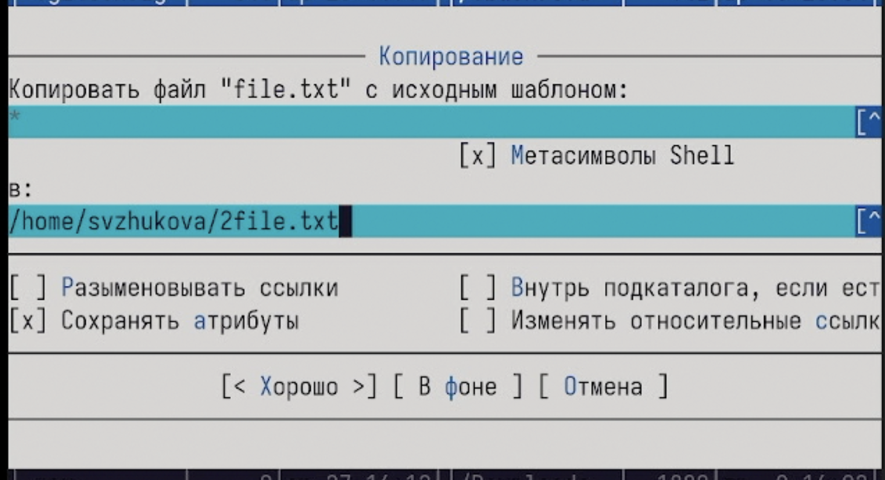

---
## Front matter
title: Лабораторная работа № 9
subtitle: Командная оболочка Midnight Commander
author:
  - Жукова С. В. НПИбд-01-24
institute:
  - Российский университет дружбы народов, Москва, Россия
date: 9 апреля 2025

## Formatting
toc: false
slide_level: 2
theme: metropolis
header-includes: 
 - \metroset{progressbar=frametitle,sectionpage=progressbar,numbering=fraction}
 - '\makeatletter'
 - '\beamer@ignorenonframefalse'
 - '\makeatother'
aspectratio: 43
section-titles: true
---

## Докладчик

:::::::::::::: {.columns align=center}
::: {.column width="70%"}

  * Жукова София Викторовна
  * студентка
  * направления прикладной информатика
  * Российский университет дружбы народов
  * [1032240966@pfur.ru](mailto:1032240966@pfur.ru)
  * <https://svzhukova.github.io/ru/>

:::
::: {.column width="30%"}

:::
::::::::::::::

# Вводная часть

# Цель работы

Освоение основных возможностей командной оболочки Midnight Commander. Приоб-
ретение навыков практической работы по просмотру каталогов и файлов; манипуляций
с ними.

# Выполнение лабораторной работы

## Изучим информацию о mc, вызвав в командной строке man mc 

{#fig:001 width=70%}

## Запустим из командной строки mc, изучим его структуру и меню.

{#fig:002 width=70%}

## Выполним несколько операций в mc, используя управляющие клавиши 

{#fig:003 width=70%}

## Выполним основные команды меню левой панели. 

Оценим степень подробности вывода информации о файлах 

{#fig:004 width=70%}

## Быстрый просмотр

{#fig:005 width=70%}

## Список файлов

{#fig:006 width=70%}

## Фильтр

{#fig:007 width=70%}

## Порядок сортировки

{#fig:008 width=70%}

## Формат списка

{#fig:009 width=70%}

## Используя возможности подменю Файл , выполним 

{#fig:010 width=70%}

## Просмотр содержимого текстового файла 

{#fig:011 width=70%}

## Редактирование содержимого текстового файла 

(без сохранения результатов редактирования) 

{#fig:012 width=70%}

## Создание каталога

{#fig:013 width=70%}

## Копирование в файлов в созданный каталог

{#fig:014 width=70%}

## С помощью соответствующих средств подменю 'Команда' осуществим 

{#fig:015 width=70%}

## Поиск

.png){#fig:016 width=70%}

## Результат

.png){#fig:017 width=70%}

## Переход в домашний катало

{#fig:018 width=70%}

## Выбор и повторение одной из предыдущих команд 

{#fig:019 width=70%}

## Анализ файла меню и файла расширений 

.png){#fig:020 width=70%}

## Редактирование файла меню

.png){#fig:021 width=70%}

.png){#fig:022 width=70%}

## Внешний вид

.png){#fig:023 width=70%}

## Внешний вид

.png){#fig:024 width=70%}

## Создадим текстовой файл text.txt

.png){#fig:025 width=70%}

## Откройте этот файл с помощью встроенного в mc редактора.

 Вставьте в открытый файл небольшой фрагмент текста, скопированный из любого другого файла или Интернета.

.png){#fig:026 width=70%}

## Проделайте с текстом следующие манипуляции, используя горячие клавиши 

.png){#fig:027 width=70%}

.png){#fig:028 width=70%}

## Выделим фрагмент текста и перенесите его на новую строку.

.png){#fig:029 width=70%}

 
## Сохраним и закроем файл 

.png){#fig:030 width=70%}

# Заключение

Мы освоили основные возможности командной оболочки Midnight Commander. Приоб-
рели навыки практической работы по просмотру каталогов и файлов; манипуляций
с ними.

