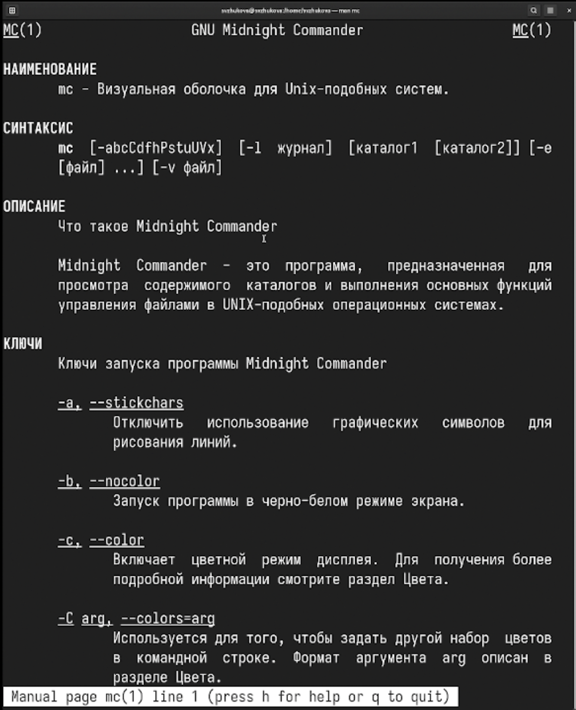
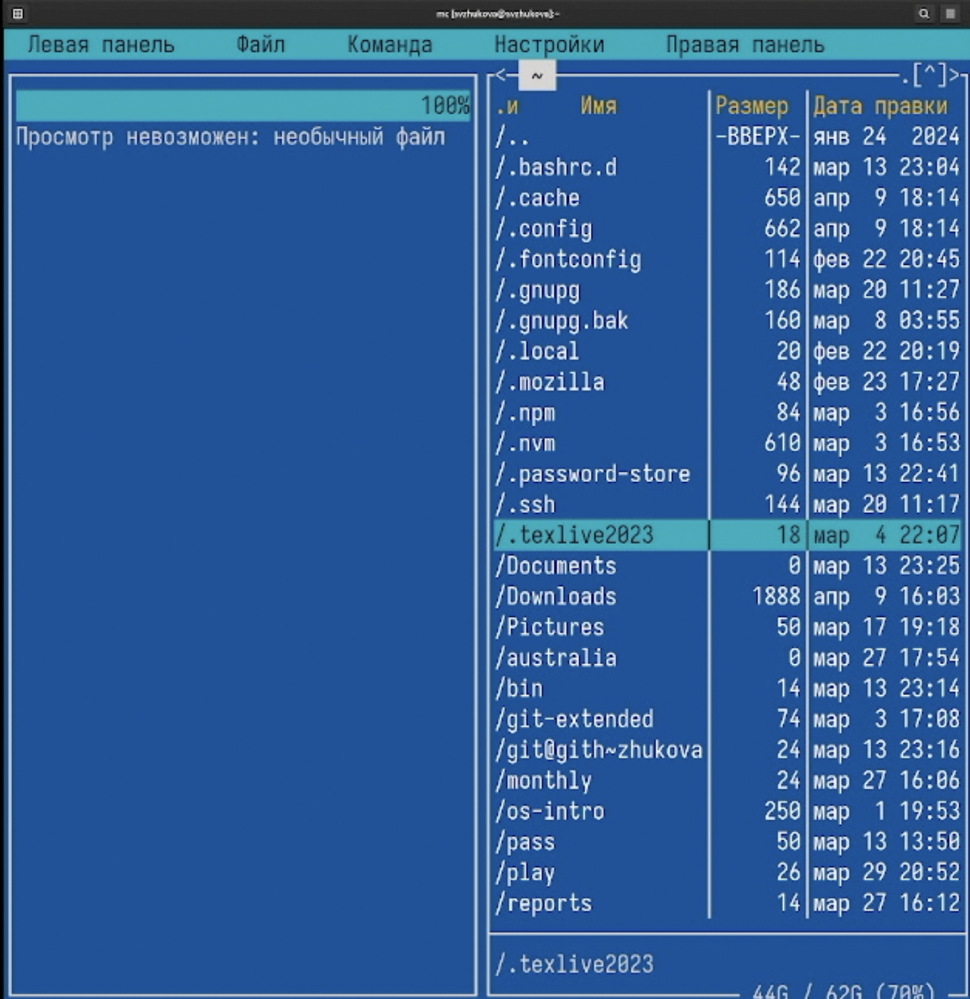
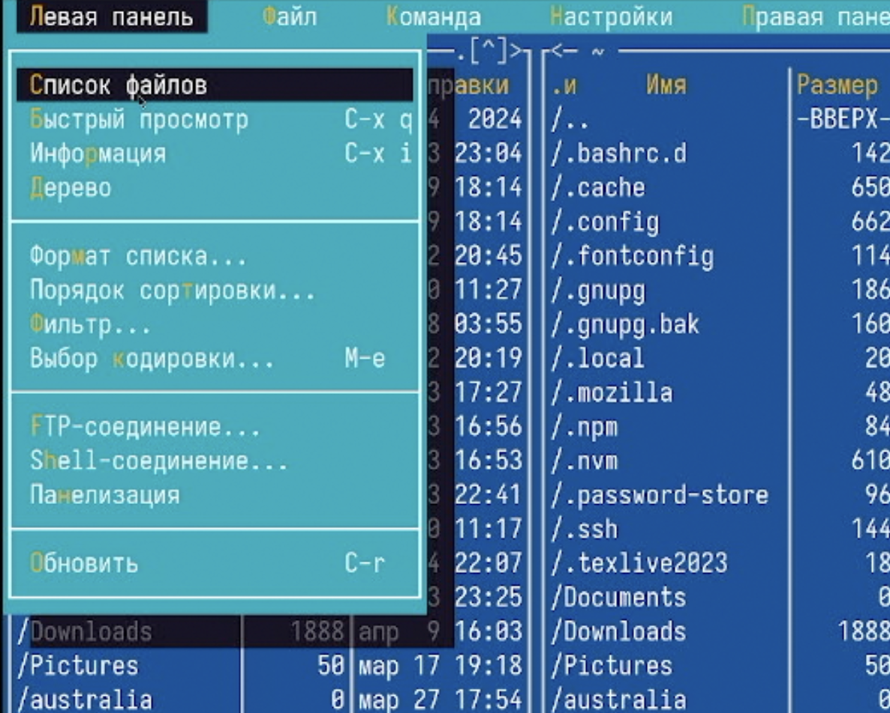
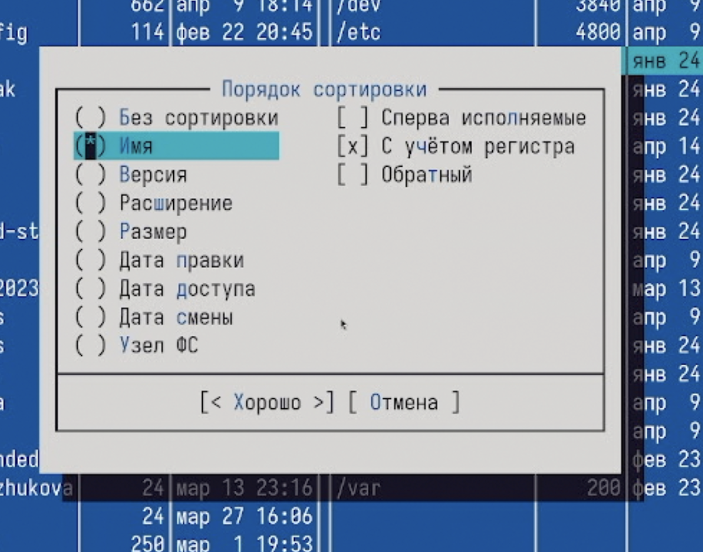
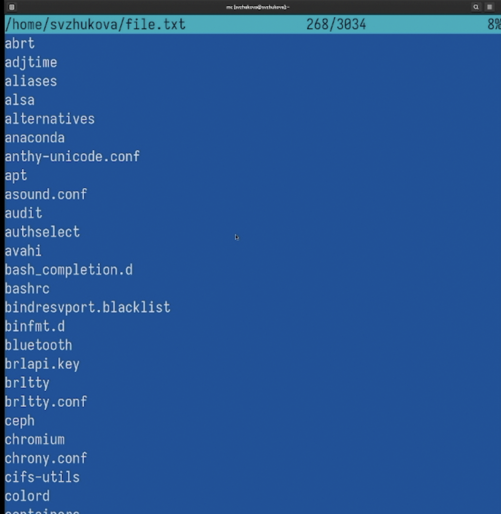
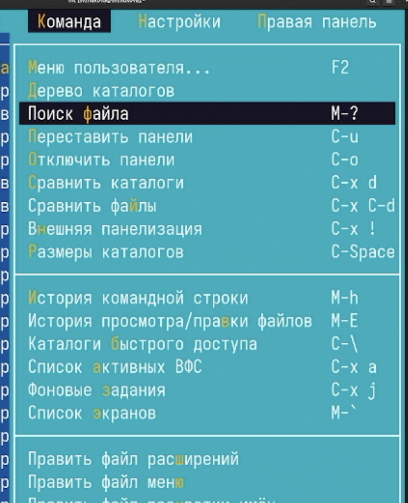
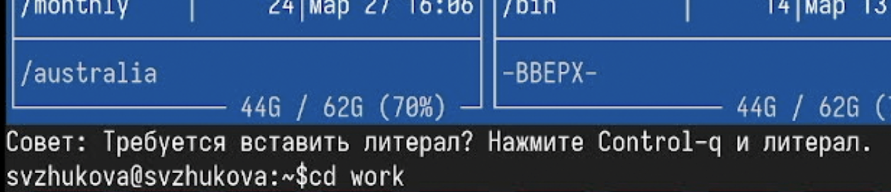
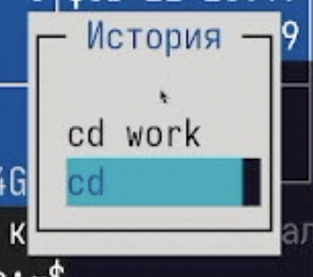

---
## Front matter
title: "Лабораторная работа № 9"
subtitle: "Командная оболочка Midnight Commander"
author: "Жукова София Виктровна"

## Generic otions
lang: ru-RU
toc-title: "Содержание"

## Bibliography
bibliography: bib/cite.bib
csl: pandoc/csl/gost-r-7-0-5-2008-numeric.csl

## Pdf output format
toc: true # Table of contents
toc-depth: 2
lof: true # List of figures
lot: true # List of tables
fontsize: 12pt
linestretch: 1.5
papersize: a4
documentclass: scrreprt
## I18n polyglossia
polyglossia-lang:
  name: russian
  options:
	- spelling=modern
	- babelshorthands=true
polyglossia-otherlangs:
  name: english
## I18n babel
babel-lang: russian
babel-otherlangs: english
## Fonts
mainfont: IBM Plex Serif
romanfont: IBM Plex Serif
sansfont: IBM Plex Sans
monofont: IBM Plex Mono
mathfont: STIX Two Math
mainfontoptions: Ligatures=Common,Ligatures=TeX,Scale=0.94
romanfontoptions: Ligatures=Common,Ligatures=TeX,Scale=0.94
sansfontoptions: Ligatures=Common,Ligatures=TeX,Scale=MatchLowercase,Scale=0.94
monofontoptions: Scale=MatchLowercase,Scale=0.94,FakeStretch=0.9
mathfontoptions:
## Biblatex
biblatex: true
biblio-style: "gost-numeric"
biblatexoptions:
  - parentracker=true
  - backend=biber
  - hyperref=auto
  - language=auto
  - autolang=other*
  - citestyle=gost-numeric
## Pandoc-crossref LaTeX customization
figureTitle: "Рис."
tableTitle: "Таблица"
listingTitle: "Листинг"
lofTitle: "Список иллюстраций"
lotTitle: "Список таблиц"
lolTitle: "Листинги"
## Misc options
indent: true
header-includes:
  - \usepackage{indentfirst}
  - \usepackage{float} # keep figures where there are in the text
  - \floatplacement{figure}{H} # keep figures where there are in the text
---

# Цель работы

Освоение основных возможностей командной оболочки Midnight Commander. Приоб-
ретение навыков практической работы по просмотру каталогов и файлов; манипуляций
с ними.

# Задание

1. Изучите информацию о mc, вызвав в командной строке man mc.
2. Запустите из командной строки mc, изучите его структуру и меню.
3. Выполните несколько операций в mc, используя управляющие клавиши (операции
с панелями; выделение/отмена выделения файлов, копирование/перемещение фай-
лов, получение информации о размере и правах доступа на файлы и/или каталоги
и т.п.)
4. Выполните основные команды меню левой (или правой) панели. Оцените степень
подробности вывода информации о файлах.
5. Используя возможности подменю Файл , выполните:
– просмотр содержимого текстового файла;
– редактирование содержимого текстового файла (без сохранения результатов
редактирования);
– создание каталога;
– копирование в файлов в созданный каталог.
6. С помощью соответствующих средств подменю Команда осуществите:
– поиск в файловой системе файла с заданными условиями (например, файла
с расширением .c или .cpp, содержащего строку main);
– выбор и повторение одной из предыдущих команд;
– переход в домашний каталог;
– анализ файла меню и файла расширений.
7. Вызовите подменю Настройки . Освойте операции, определяющие структуру экрана mc
(Full screen, Double Width, Show Hidden Files и т.д.)

**7.3.2. Задание по встроенному редактору mc**

1. Создайте текстовой файл text.txt.
2. Откройте этот файл с помощью встроенного в mc редактора.
3. Вставьте в открытый файл небольшой фрагмент текста, скопированный из любого
другого файла или Интернета.
4. Проделайте с текстом следующие манипуляции, используя горячие клавиши:
4.1. Удалите строку текста.
4.2. Выделите фрагмент текста и скопируйте его на новую строку.
4.3. Выделите фрагмент текста и перенесите его на новую строку.
4.4. Сохраните файл.
4.5. Отмените последнее действие.
4.6. Перейдите в конец файла (нажав комбинацию клавиш) и напишите некоторый
текст.
4.7. Перейдите в начало файла (нажав комбинацию клавиш) и напишите некоторый
текст.
4.8. Сохраните и закройте файл.
5. Откройте файл с исходным текстом на некотором языке программирования (напри-
мер C или Java)
6. Используя меню редактора, включите подсветку синтаксиса, если она не включена,
или выключите, если она включена.

# Выполнение лабораторной работы

Изучим информацию о mc, вызвав в командной строке man mc (рис. [-@fig:001]).

{#fig:001 width=70%}

Запустим из командной строки mc, изучим его структуру и меню. (рис. [-@fig:002]).

{#fig:002 width=70%}

Выполним несколько операций в mc, используя управляющие клавиши (рис. [-@fig:003]).

{#fig:003 width=70%}

Выполним основные команды меню левой панели. Оценим степень подробности вывода информации о файлах (рис. [-@fig:004]).

{#fig:004 width=70%}

(рис. [-@fig:005]).

{#fig:005 width=70%}

(рис. [-@fig:006]).

{#fig:006 width=70%}

(рис. [-@fig:007]).

{#fig:007 width=70%}

(рис. [-@fig:008]).

{#fig:008 width=70%}

(рис. [-@fig:009]).

{#fig:009 width=70%}

Используя возможности подменю Файл , выполним (рис. [-@fig:010]).

{#fig:010 width=70%}

Просмотр содержимого текстового файла (рис. [-@fig:011]).

{#fig:011 width=70%}

Редактирование содержимого текстового файла (без сохранения результатов
редактирования) (рис. [-@fig:012]).

{#fig:012 width=70%}

(рис. [-@fig:013]).

{#fig:013 width=70%}

(рис. [-@fig:014]).

{#fig:014 width=70%}

С помощью соответствующих средств подменю 'Команда' осуществим (рис. [-@fig:015]).

{#fig:015 width=70%}

 (рис. [-@fig:016]).

.png){#fig:016 width=70%}

 (рис. [-@fig:017]).

.png){#fig:017 width=70%}

 (рис. [-@fig:018]).

{#fig:018 width=70%}

Выбор и повторение одной из предыдущих команд (рис. [-@fig:019]).

{#fig:019 width=70%}

Анализ файла меню и файла расширений (рис. [-@fig:020]).

.png){#fig:020 width=70%}

 (рис. [-@fig:021]).

.png){#fig:021 width=70%}

 (рис. [-@fig:022]).

.png){#fig:022 width=70%}

 (рис. [-@fig:023]).

.png){#fig:023 width=70%}

 (рис. [-@fig:024]).

.png){#fig:024 width=70%}

Создадим текстовой файл text.txt (рис. [-@fig:025]).

.png){#fig:025 width=70%}

Откройте этот файл с помощью встроенного в mc редактора. Вставьте в открытый файл небольшой фрагмент текста, скопированный из любого другого файла или Интернета.(рис. [-@fig:026]).

.png){#fig:026 width=70%}

Проделайте с текстом следующие манипуляции, используя горячие клавиши (рис. [-@fig:027]).

.png){#fig:027 width=70%}

 (рис. [-@fig:028]).

.png){#fig:028 width=70%}

 (рис. [-@fig:029]).

.png){#fig:029 width=70%}

 
Сохраним и закроем файл (рис. [-@fig:030]).

.png){#fig:030 width=70%}

# Выводы

Мы освоили основные возможности командной оболочки Midnight Commander. Приоб-
рели навыки практической работы по просмотру каталогов и файлов; манипуляций
с ними.

