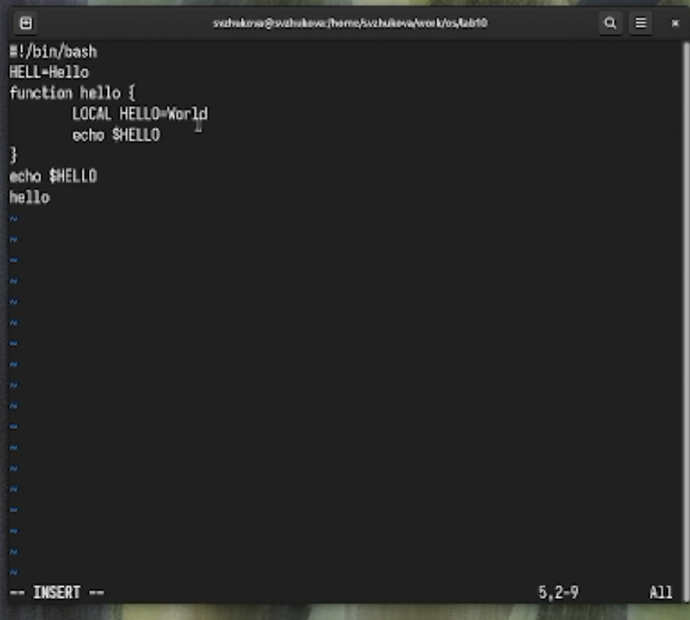
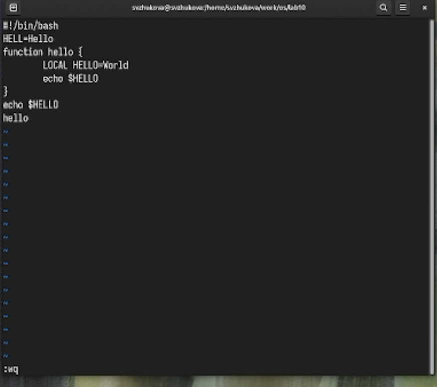
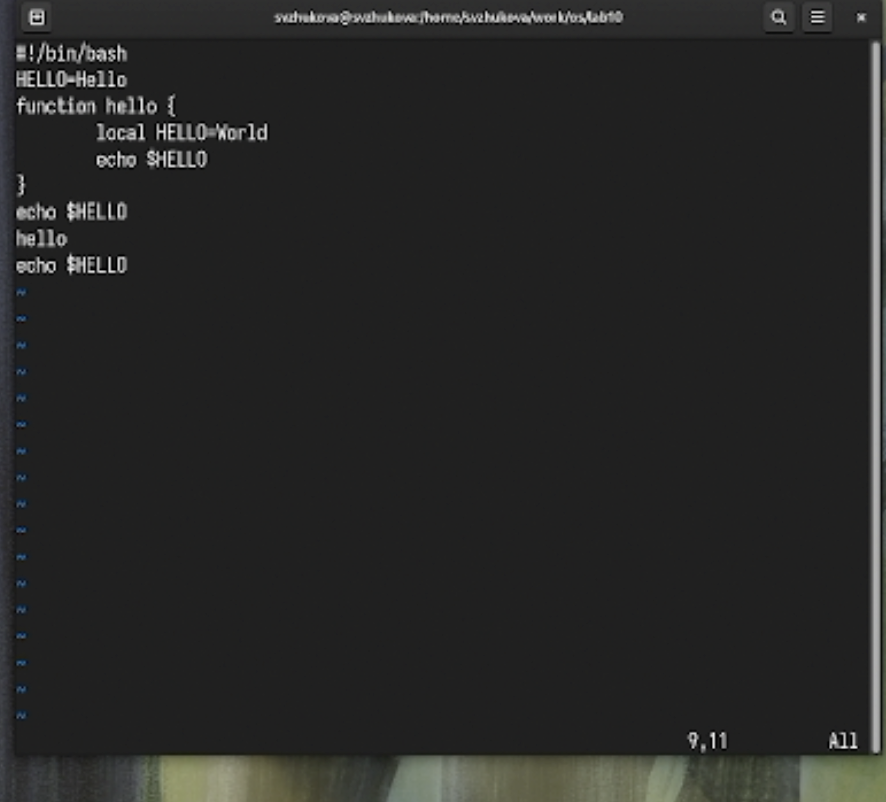
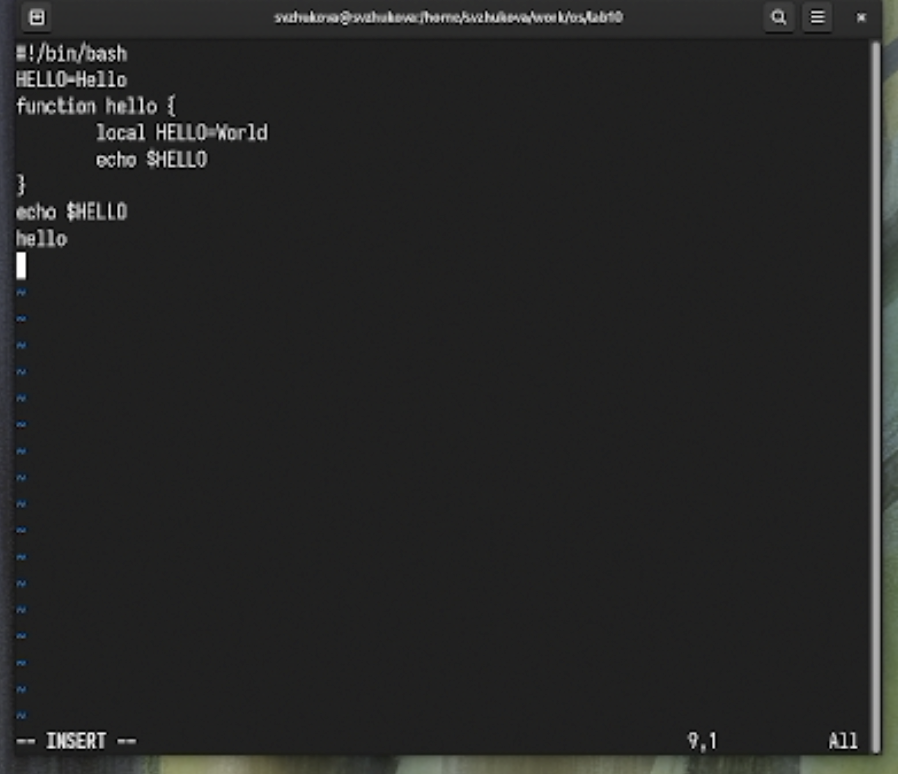

---
## Front matter
title: Лабораторная работа № 10
subtitle: Текстовой редактор vi
author:
  - Жукова С. В. НПИбд-01-24
institute:
  - Российский университет дружбы народов, Москва, Россия
date: 18 апреля 2025

## Formatting
toc: false
slide_level: 2
theme: metropolis
header-includes: 
 - \metroset{progressbar=frametitle,sectionpage=progressbar,numbering=fraction}
 - '\makeatletter'
 - '\beamer@ignorenonframefalse'
 - '\makeatother'
aspectratio: 43
section-titles: true
---

## Докладчик

:::::::::::::: {.columns align=center}
::: {.column width="70%"}

  * Жукова София Викторовна
  * студентка
  * направления прикладной информатика
  * Российский университет дружбы народов
  * [1032240966@pfur.ru](mailto:1032240966@pfur.ru)
  * <https://svzhukova.github.io/ru/>

:::
::: {.column width="30%"}

:::
::::::::::::::

# Вводная часть

# Цель работы

Познакомиться с операционной системой Linux. Получить практические навыки работы с редактором vi, установленным по умолчанию практически во всех дистрибутивах.

# Выполнение лабораторной работы

## Создадим каталог с именем ~/work/os/lab06. 

{#fig:001 width=70%}

## Перейдем во вновь созданный каталог. 

{#fig:002 width=70%}

## Вызовем vi и создалим файл hello.sh 

{#fig:003 width=70%}

## Нажмем клавишу i и введем следующий текст. 

{#fig:004 width=70%}

## Нажмем ':' для перехода в режим последней строки

 нажмем w (записать) и q (выйти), а затем нажмем клавишу Enter для сохранения нашего текста и завершения работы. 

{#fig:005 width=70%}

## Сделаем файл исполняемым 

{#fig:006 width=70%}

## Вызовем vi на редактирование файла 

{#fig:007 width=70%}

## Установите курсор в конец слова HELL второй строки

 Перейдем в режим вставки и заменим на HELLO. Нажмем Esc для возврата в командный режим. Установим курсор на четвертую строку и сотрем слово LOCAL. Перейдем в режим вставки и наберем следующий текст: local, нажмем Esc для
возврата в командный режим. Установим курсор на последней строке файла. Вставим после неё строку, содержащую следующий текст: echo $HELLO. Нажмем Esc для перехода в командный режим. 

{#fig:008 width=50%}

## Удалим последнюю строку. 

{#fig:009 width=70%}

##  Введем команду отмены изменений u для отмены последней команды. 

{#fig:010 width=70%}

# Заключение

Мы познакомились с операционной системой Linux и получили практические навыки работы с редактором vi, установленным по умолчанию практически во всех дистрибутивах

