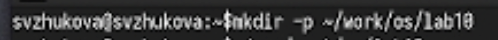
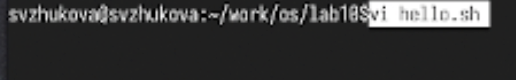
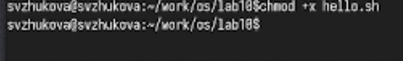
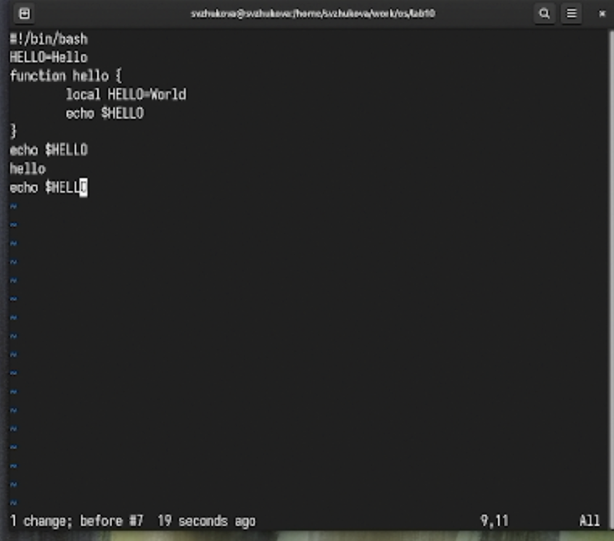

---
## Front matter
title: "Лабораторная работа № 10"
subtitle: "Текстовой редактор vi"
author: "Жукова София Викторовна"

## Generic otions
lang: ru-RU
toc-title: "Содержание"

## Bibliography
bibliography: bib/cite.bib
csl: pandoc/csl/gost-r-7-0-5-2008-numeric.csl

## Pdf output format
toc: true # Table of contents
toc-depth: 2
lof: true # List of figures
lot: true # List of tables
fontsize: 12pt
linestretch: 1.5
papersize: a4
documentclass: scrreprt
## I18n polyglossia
polyglossia-lang:
  name: russian
  options:
	- spelling=modern
	- babelshorthands=true
polyglossia-otherlangs:
  name: english
## I18n babel
babel-lang: russian
babel-otherlangs: english
## Fonts
mainfont: IBM Plex Serif
romanfont: IBM Plex Serif
sansfont: IBM Plex Sans
monofont: IBM Plex Mono
mathfont: STIX Two Math
mainfontoptions: Ligatures=Common,Ligatures=TeX,Scale=0.94
romanfontoptions: Ligatures=Common,Ligatures=TeX,Scale=0.94
sansfontoptions: Ligatures=Common,Ligatures=TeX,Scale=MatchLowercase,Scale=0.94
monofontoptions: Scale=MatchLowercase,Scale=0.94,FakeStretch=0.9
mathfontoptions:
## Biblatex
biblatex: true
biblio-style: "gost-numeric"
biblatexoptions:
  - parentracker=true
  - backend=biber
  - hyperref=auto
  - language=auto
  - autolang=other*
  - citestyle=gost-numeric
## Pandoc-crossref LaTeX customization
figureTitle: "Рис."
tableTitle: "Таблица"
listingTitle: "Листинг"
lofTitle: "Список иллюстраций"
lotTitle: "Список таблиц"
lolTitle: "Листинги"
## Misc options
indent: true
header-includes:
  - \usepackage{indentfirst}
  - \usepackage{float} # keep figures where there are in the text
  - \floatplacement{figure}{H} # keep figures where there are in the text
---

# Цель работы

Здесь приводится формулировка цели лабораторной работы. Формулировки
цели для каждой лабораторной работы приведены в методических
указаниях.

Цель данного шаблона --- максимально упростить подготовку отчётов по
лабораторным работам.  Модифицируя данный шаблон, студенты смогут без
труда подготовить отчёт по лабораторным работам, а также познакомиться
с основными возможностями разметки Markdown.

# Задание

Познакомиться с операционной системой Linux. Получить практические навыки рабо-
ты с редактором vi, установленным по умолчанию практически во всех дистрибутивах.

# Выполнение лабораторной работы

1. Создадим каталог с именем ~/work/os/lab06. (рис. [-@fig:001]).

{#fig:001 width=70%}

2. Перейдем во вновь созданный каталог. (рис. [-@fig:002]).

{#fig:002 width=70%}

3. Вызовем vi и создалим файл hello.sh (рис. [-@fig:003]).

{#fig:003 width=70%}

4. Нажмем клавишу i и введем следующий текст. (рис. [-@fig:004]).

{#fig:004 width=70%}

5. Нажмем ':' для перехода в режим последней строки, нажмем w (записать) и q (выйти), а затем нажмем клавишу Enter для сохранения нашего текста и завершения работы. (рис. [-@fig:005]).

{#fig:005 width=70%}

6. Сделаем файл исполняемым (рис. [-@fig:006]).

{#fig:006 width=70%}

7. Вызовем vi на редактирование файла (рис. [-@fig:007]).

{#fig:007 width=70%}

8. Установите курсор в конец слова HELL второй строки, Перейдем в режим вставки и заменим на HELLO. Нажмем Esc для возврата в командный режим. Установим курсор на четвертую строку и сотрем слово LOCAL. Перейдем в режим вставки и наберем следующий текст: local, нажмем Esc для
возврата в командный режим. Установим курсор на последней строке файла. Вставим после неё строку, содержащую следующий текст: echo $HELLO. Нажмем Esc для перехода в командный режим. (рис. [-@fig:008]).

{#fig:008 width=70%}

9. Удалим последнюю строку. (рис. [-@fig:009]).

{#fig:009 width=70%}

9. Введем команду отмены изменений u для отмены последней команды. (рис. [-@fig:010]).

{#fig:010 width=70%}

# Выводы

Мы познакомились с операционной системой Linux и получили практические навыки рабо-
ты с редактором vi, установленным по умолчанию практически во всех дистрибутивах

