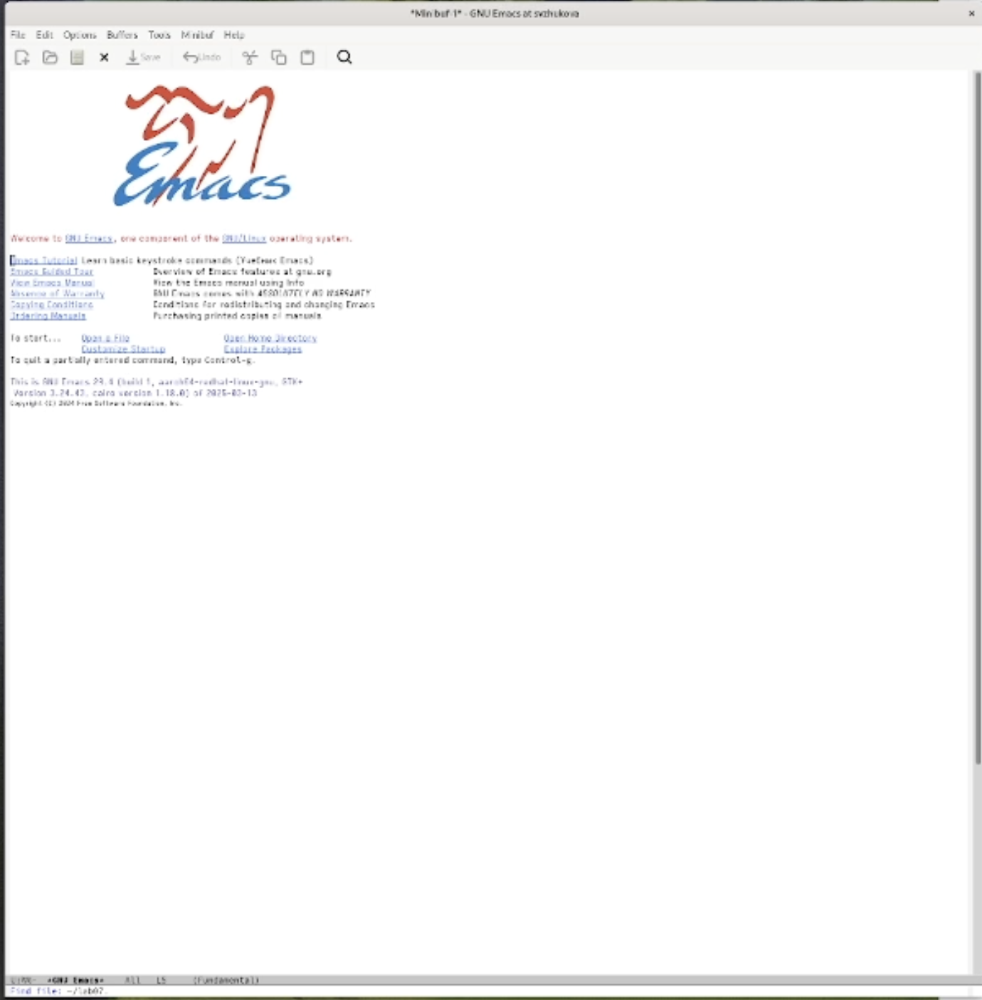
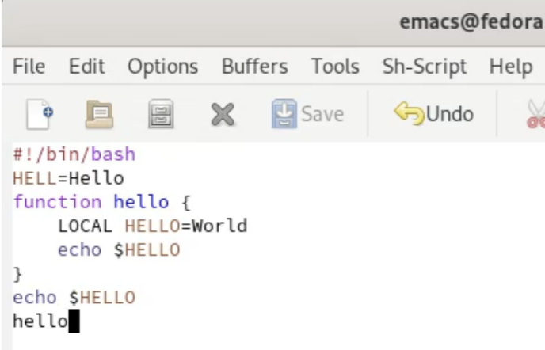
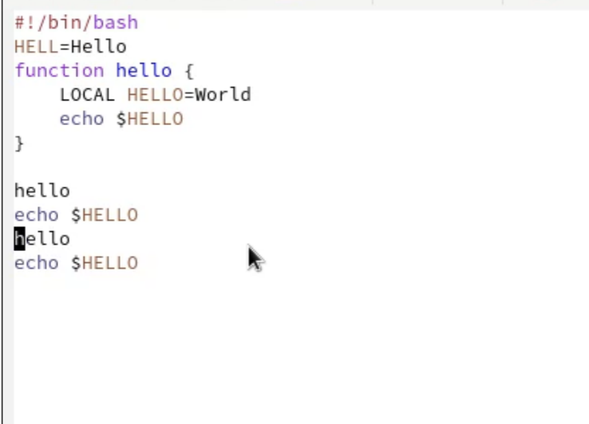
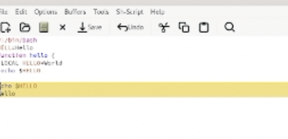
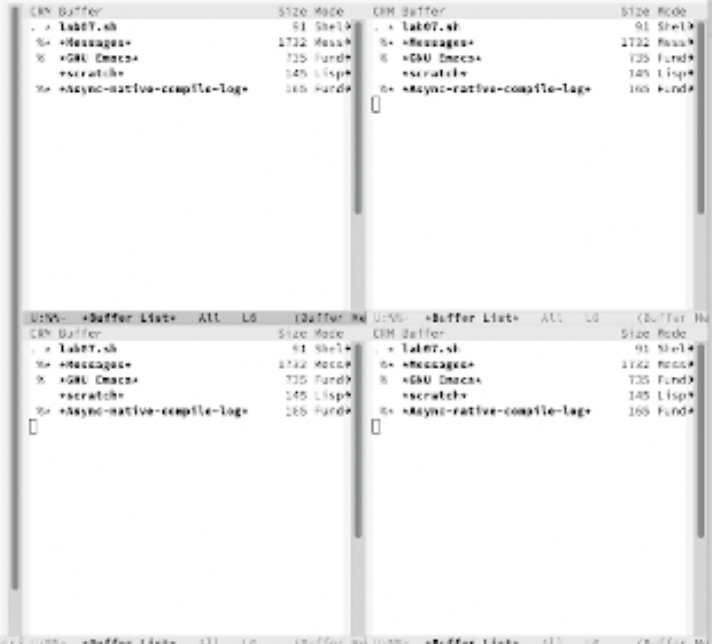
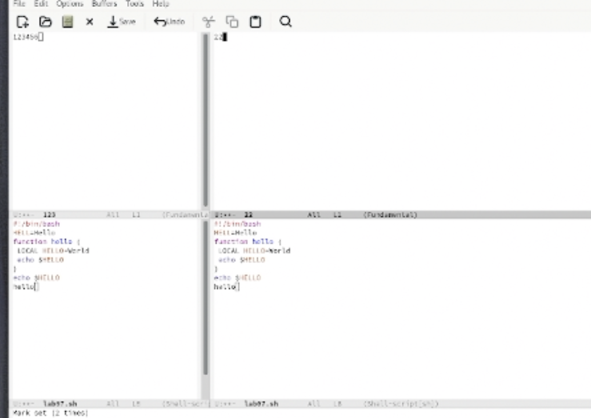
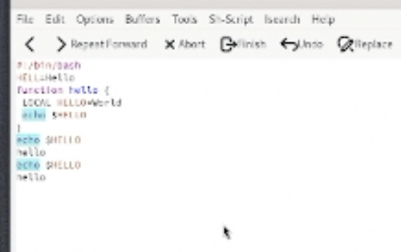

---
## Front matter
title: Лабораторная работа № 11
subtitle: Текстовой редактор emacs
author:
  - Жукова С. В. НПИбд-01-24
institute:
  - Российский университет дружбы народов, Москва, Россия
date: 26 апреля 2025

## Formatting
toc: false
slide_level: 2
theme: metropolis
header-includes: 
 - \metroset{progressbar=frametitle,sectionpage=progressbar,numbering=fraction}
 - '\makeatletter'
 - '\beamer@ignorenonframefalse'
 - '\makeatother'
aspectratio: 43
section-titles: true
---

## Докладчик

:::::::::::::: {.columns align=center}
::: {.column width="70%"}

  * Жукова София Викторовна
  * студентка
  * направления прикладной информатика
  * Российский университет дружбы народов
  * [1032240966@pfur.ru](mailto:1032240966@pfur.ru)
  * <https://svzhukova.github.io/ru/>

:::
::: {.column width="30%"}

:::
::::::::::::::

# Вводная часть

# Цель работы

Познакомиться с операционной системой Linux. Получить практические навыки рабо-
ты с редактором Emacs.

# Выполнение лабораторной работы

## Откроем терминал и пропишем в нём команду emacs

 После чего с помощью комбинаций Ctrl-x Ctrl-f создадим файл lab07.sh

{ #fig:001 width=70% }

## В открывшемся файле набираем текст и сохраняем этот файл с помощью комбинаций Ctrl-x Ctrl-s 

{ #fig:002 width=100% }

## Теперь нам нужно проделать с текстом стандартные процедуры редактирования. 
Для начала вырежем одной комбинацией Ctrl-k целую строку, после чего вставим эту строку в конец файла (Ctrl-y). Выделяем область текста комбинацией Ctrl-space и копируем в буфер обмена (Alt-w), вставляем область в конец файла (Ctrl-y). Теперь вновь выделяем эту область (Ctrl-space) и вырезаем ее (Ctrl-w). Отменяем последнее действие комбинацией Ctrl-/ 

{ #fig:003 width=100% }

## Научимся использовать команды по перемещению. 
Для перемещения курсора в начало строки Ctrl-a, в конец строки Ctrl-e. Чтобы переместить курсор в начало буфера Alt-<, в конец буфера Alt-> 

{ #fig:004 width=100% }

## Выведем список активных буферов на экран
 (Ctrl-x Ctrl-b) и переместимся во вновь открытое окно (Ctrl-x) со списком открытых буферов и переключимся на другой буфер. Закроем это окно (Ctrl-x 0). 

{ #fig:005 width=100% }

## Поделим фрейм на 4 части:
 разделим фрейм на два окна по вертикали (Ctrl-x 3), а затем каждое из этих окон на две части по горизонтали (Ctrl-x 2). В каждом из 4 созданных окон откроем новый файл и введем несколько строк текста 

{ #fig:006 width=100% }

## Переключимся в режим поиска (Ctrl-s) 

Hайдём несколько слов, присутствующих в тексте. Теперь будем переключаться между результатами поиска, нажимая Ctrl-s. Выйдем из режима поиска, нажав Ctrl-g. 

{ #fig:007 width=100% }

# Залючение

МЫ познакомились с операционной системой Linux. Получить практические навыки рабо-
ты с редактором Emacs.
