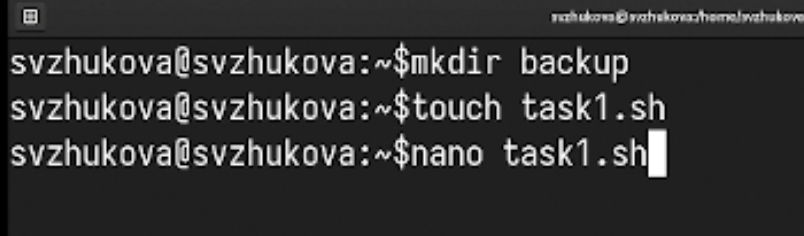
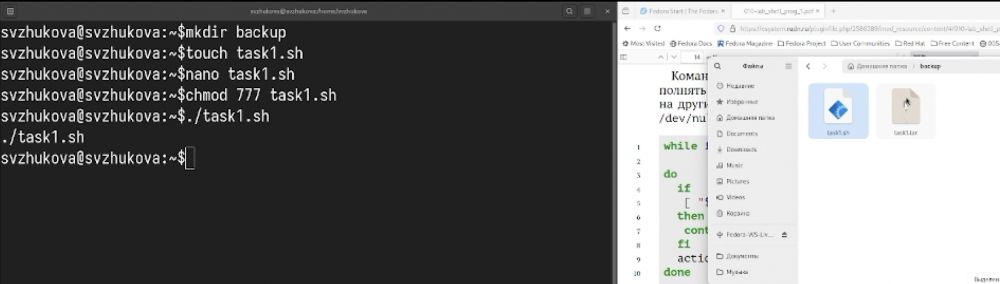
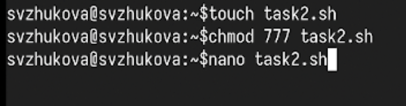
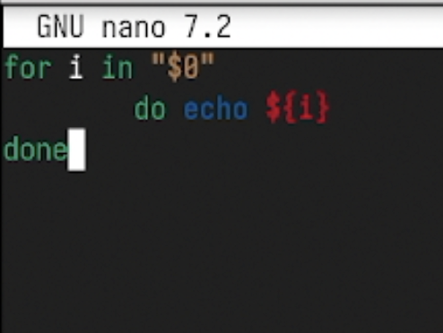
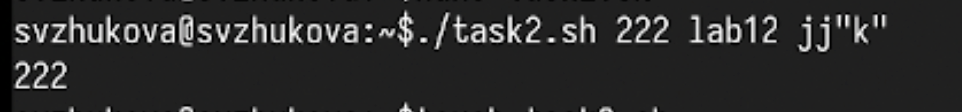

---
## Front matter
title: Лабораторная работа № 12
subtitle: Программирование в командном процессоре ОС UNIX. Командные файлы
author:
  - Жукова С. В. НПИбд-01-24
institute:
  - Российский университет дружбы народов, Москва, Россия
date: 1 мая 2025

## Formatting
toc: false
slide_level: 2
theme: metropolis
header-includes: 
 - \metroset{progressbar=frametitle,sectionpage=progressbar,numbering=fraction}
 - '\makeatletter'
 - '\beamer@ignorenonframefalse'
 - '\makeatother'
aspectratio: 43
section-titles: true
---

## Докладчик

:::::::::::::: {.columns align=center}
::: {.column width="70%"}

  * Жукова София Викторовна
  * студентка
  * направления прикладной информатика
  * Российский университет дружбы народов
  * [1032240966@pfur.ru](mailto:1032240966@pfur.ru)
  * <https://svzhukova.github.io/ru/>

:::
::: {.column width="30%"}

:::
::::::::::::::

# Вводная часть

## Цели

Изучить основы программирования в оболочке ОС UNIX/Linux. Научиться писать
небольшие командные файлы.

# Выполнение лабораторной работы

№№ Откроем терминал и создадим в домашнем каталоге папку backup.

 После чего создадим файл lab1.sh для написания скрипта.

{ #fig:001 width=100% }

## Откроем созданный файл lab1.sh и приступим к написанию скрипта
Который при запуске будет делать резервную копию самого себя  в другую директорию backup в домашнем каталоге. При этом файл должен архивироваться tar.

{ #fig:002 width=100% }

## После того как скрипт написан мы сохраняем файл. 
В терминале мы даём этому файлу право на выполнение. Теперь запустим этот файл и перейдём в каталог backup для проверки командой ls 

{ #fig:003 width=100% }

## Возвращаемся в домашний каталог и создаём второй файл для скрипта lab2.sh. 

{ #fig:004 width=100% }

## Открываем файл lab2.sh и начинаем писать пример командного файла

Oбрабатывающего любое произвольное число аргументов командной строки, в том числе превышающее десять. Скрипт может последовательно распечатывать значения всех переданных аргументов.

{ #fig:005 width=100% }

## Сохраняем файл и также даём в терминале право на выполнение. Запускаем файл lab2.sh 

{ #fig:006 width=100% }

## Снова переходим в домашний каталог и создаём третий файл.

{ #fig:007 width=100% }

## После открытия файла lab3.sh напишем командный файл — аналог команды ls (без использования самой этой команды и команды dir).

 В котором требуется, чтобы он выдавал информацию о нужном каталоге и выводил информацию о возможностях доступа к файлам этого каталога. 
	
{ #fig:008 width=100% }

## Сохраняем наш скрипт и даём право на выполнение. Запускаем файл для каталога backup 

{ #fig:009 width=100% }

## Переходим в домашний каталог и создаём последний файл для четвёртого скрипта. 

{ #fig:010 width=100% }

## В четвёртом файле напишем командный файл

который получает в качестве аргумента командной строки формат файла (.txt, .doc, .jpg, .pdf и т.д.) и вычисляет количество таких файлов в указанной директории. Путь к директории также передаётся в виде аргумента командной строки. 

{ #fig:011 width=100% }

## Сохраним файл. Как делали ранее, дадим файлу право на выполнение и запустим его для  формата .txt 

{ #fig:012 width=100% }

## Заключение

Мы изучили основы программирования в оболочке ОС UNIX/Linux и научились писать
небольшие командные файлы.

