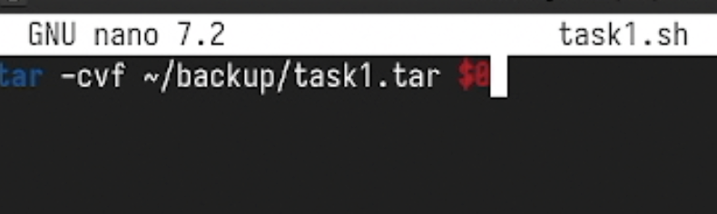
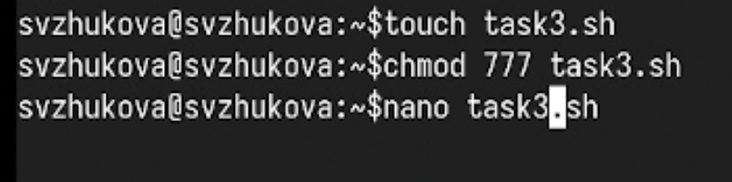
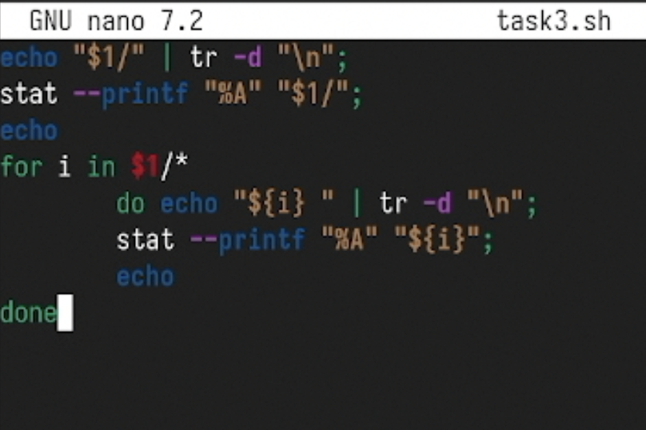
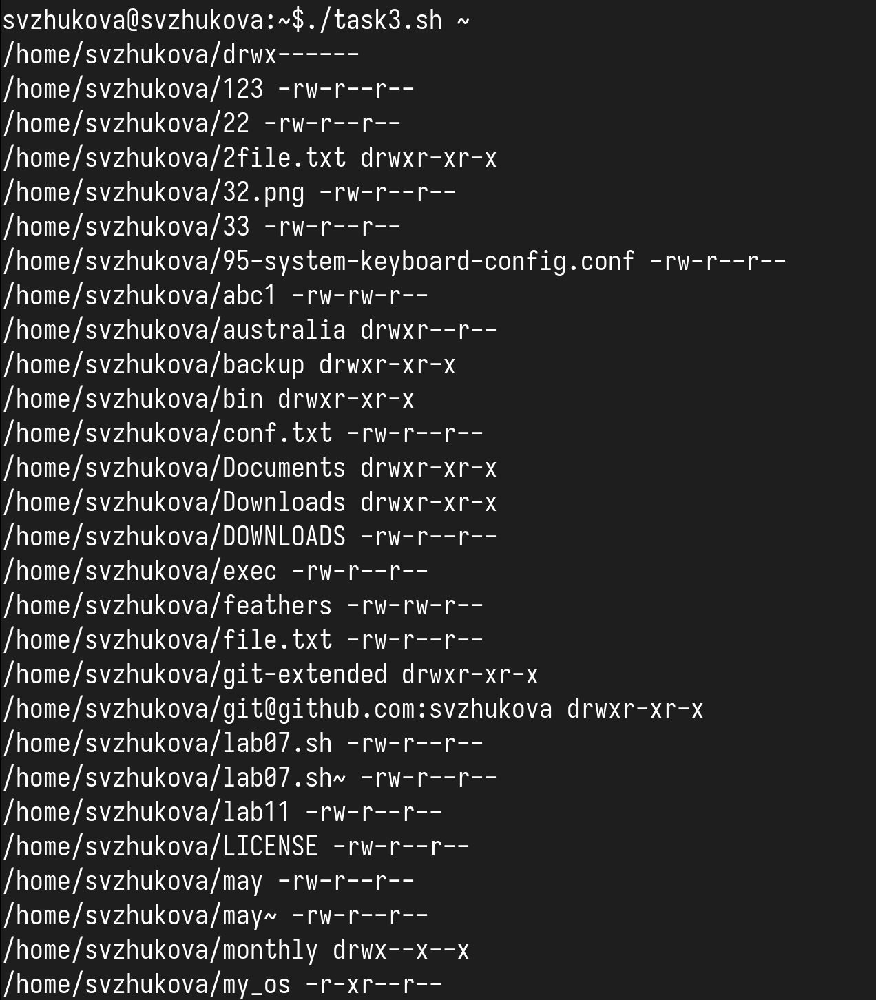
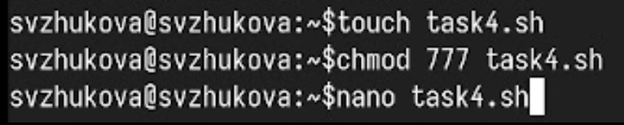
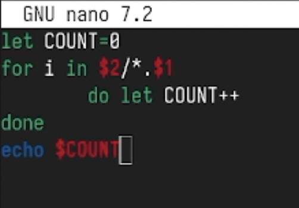
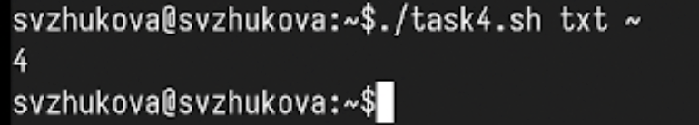

---
## Front matter
title: "Лабораторная работа № 10"
subtitle: "Программирование в командном процессоре ОС UNIX. Командные файлы"
author: "Жукова София Викторовна"

## Generic otions
lang: ru-RU
toc-title: "Содержание"

## Bibliography
bibliography: bib/cite.bib
csl: pandoc/csl/gost-r-7-0-5-2008-numeric.csl

## Pdf output format
toc: true # Table of contents
toc-depth: 2
lof: true # List of figures
lot: true # List of tables
fontsize: 12pt
linestretch: 1.5
papersize: a4
documentclass: scrreprt
## I18n polyglossia
polyglossia-lang:
  name: russian
  options:
	- spelling=modern
	- babelshorthands=true
polyglossia-otherlangs:
  name: english
## I18n babel
babel-lang: russian
babel-otherlangs: english
## Fonts
mainfont: IBM Plex Serif
romanfont: IBM Plex Serif
sansfont: IBM Plex Sans
monofont: IBM Plex Mono
mathfont: STIX Two Math
mainfontoptions: Ligatures=Common,Ligatures=TeX,Scale=0.94
romanfontoptions: Ligatures=Common,Ligatures=TeX,Scale=0.94
sansfontoptions: Ligatures=Common,Ligatures=TeX,Scale=MatchLowercase,Scale=0.94
monofontoptions: Scale=MatchLowercase,Scale=0.94,FakeStretch=0.9
mathfontoptions:
## Biblatex
biblatex: true
biblio-style: "gost-numeric"
biblatexoptions:
  - parentracker=true
  - backend=biber
  - hyperref=auto
  - language=auto
  - autolang=other*
  - citestyle=gost-numeric
## Pandoc-crossref LaTeX customization
figureTitle: "Рис."
tableTitle: "Таблица"
listingTitle: "Листинг"
lofTitle: "Список иллюстраций"
lotTitle: "Список таблиц"
lolTitle: "Листинги"
## Misc options
indent: true
header-includes:
  - \usepackage{indentfirst}
  - \usepackage{float} # keep figures where there are in the text
  - \floatplacement{figure}{H} # keep figures where there are in the text
---

# Цель работы

Изучить основы программирования в оболочке ОС UNIX/Linux. Научиться писать
небольшие командные файлы.

# Задание

1. Написать скрипт, который при запуске будет делать резервную копию самого себя (то
есть файла, в котором содержится его исходный код) в другую директорию backup
в вашем домашнем каталоге. При этом файл должен архивироваться одним из ар-
хиваторов на выбор zip, bzip2 или tar. Способ использования команд архивации
необходимо узнать, изучив справку.
2. Написать пример командного файла, обрабатывающего любое произвольное число
аргументов командной строки, в том числе превышающее десять. Например, скрипт
может последовательно распечатывать значения всех переданных аргументов.
3. Написать командный файл — аналог команды ls (без использования самой этой ко-
манды и команды dir). Требуется, чтобы он выдавал информацию о нужном каталоге
и выводил информацию о возможностях доступа к файлам этого каталога.
4. Написать командный файл, который получает в качестве аргумента командной строки
формат файла (.txt, .doc, .jpg, .pdf и т.д.) и вычисляет количество таких файлов
в указанной директории. Путь к директории также передаётся в виде аргумента ко-
мандной строки.


# Выполнение лабораторной работы

Откроем терминал и создадим в домашнем каталоге папку backup. После чего создадим файл lab1.sh для написания скрипта. (рис. [-@fig:001]).

{ #fig:001 width=100% }

В  откроем созданный файл lab1.sh и приступим к написанию скрипта, который при запуске будет делать резервную копию самого себя  в другую директорию backup в домашнем каталоге. При этом файл должен архивироваться tar. (рис. [-@fig:002]).

{ #fig:002 width=100% }

После того как скрипт написан мы сохраняем файл. В терминале мы даём этому файлу право на выполнение. Теперь запустим этот файл и перейдём в каталог backup для проверки командой ls  (рис. [-@fig:003]).

{ #fig:003 width=100% }

Возвращаемся в домашний каталог и создаём второй файл для скрипта lab2.sh. (рис. [-@fig:004]).

{ #fig:004 width=100% }

Открываем файл lab2.sh и начинаем писать пример командного файла, обрабатывающего любое произвольное число аргументов командной строки, в том числе превышающее десять. Скрипт может последовательно распечатывать значения всех переданных аргументов.(рис. [-@fig:005]).

{ #fig:005 width=100% }

Сохраняем файл и также даём в терминале право на выполнение. Запускаем файл lab2.sh (рис. [-@fig:006]).

{ #fig:006 width=100% }

Снова переходим в домашний каталог и создаём третий файл. (рис. [-@fig:007]). 

{ #fig:007 width=100% }

После открытия файла lab3.sh напишем командный файл — аналог команды ls (без использования самой этой команды и команды dir). В котором требуется, чтобы он выдавал информацию о нужном каталоге и выводил информацию о возможностях доступа к файлам этого каталога. (рис. [-@fig:008]).
	
{ #fig:008 width=100% }

Сохраняем наш скрипт и даём право на выполнение. Запускаем файл для каталога backup (рис. [-@fig:009]). 

{ #fig:009 width=100% }

Переходим в домашний каталог и создаём последний файл для четвёртого скрипта. (рис. [-@fig:010]).

{ #fig:010 width=100% }

В четвёртом файле напишем командный файл, который получает в качестве аргумента командной строки формат файла (.txt, .doc, .jpg, .pdf и т.д.) и вычисляет количество таких файлов в указанной директории. Путь к директории также передаётся в виде аргумента командной строки. (рис. [-@fig:011]).

{ #fig:011 width=100% }

Сохраним файл. Как делали ранее, дадим файлу право на выполнение и запустим его для  формата .txt (рис. [-@fig:012]).

{ #fig:012 width=100% }

# Выводы

Мы изучили основы программирования в оболочке ОС UNIX/Linux и научились писать
небольшие командные файлы.

**Контрольные вопросы**
1. Понятие командной оболочки

**Командная оболочка** — это программа, которая предоставляет интерфейс для взаимодействия пользователя с операционной системой через командную строку. Она позволяет выполнять команды, управлять файлами, запускать программы и выполнять скрипты.

**Примеры командных оболочек:**
- **Bash** (Bourne Again SHell)
- **Zsh** (Z Shell)
- **Csh** (C Shell)
- **Tcsh** (an enhanced version of C Shell)
- **Ksh** (Korn Shell)

**Основные отличия:**
- **Bash** — наиболее распространенная оболочка. Поддерживает массивы и функции.
- **Zsh** — расширенные функции интерактивности, работа с плагинами и тема оформления.
- **Csh** — синтаксис, схожий с языком C; менее популярна, но имеет свои особенности, такие как управление историями.
- **Ksh** — комбинация возможностей Bash и Csh.

---

2. Что такое POSIX?

**POSIX** (Portable Operating System Interface) — это стандарт, определяющий интерфейсы и утилиты для операционных систем на основе UNIX. Этот стандарт обеспечивает переносимость приложений между различными системами, что позволяет разработать программное обеспечение, которое будет работать на любой POSIX-совместимой системе.

3. Переменные и массивы в Bash

**Переменные** в Bash определяются следующим образом:
```bash
переменная=значение
```
Для доступа к значению переменной используется знак `$`:
```bash
echo $переменная
```

**Массивы** определяются следующим образом:
```bash
массив=(значение1 значение2 значение3)
```
Доступ к элементам массива осуществляется с помощью индекса:
```bash
echo ${массив[0]}
```

4. Операторы let и read

**`let`** — это оператор для выполнения арифметических операций:
```bash
let "переменная = 5 + 3"
```

**`read`** — используется для ввода данных от пользователя:
```bash
read переменная
```

 5. Арифметические операции в Bash

В Bash можно использовать следующие арифметические операции:
- Сложение: `+`
- Вычитание: `-`
- Умножение: `*`
- Деление: `/`
- Остаток от деления: `%`

Эти операции могут быть использованы с помощью команд `let`, `expr` или в арифметических выражениях.

6. Операция (( ))

Операция `(( ))` используется для арифметических выражений и позволяет выполнять расчеты без необходимости использования дополнительных команд, например:
```bash
(( переменная = 5 + 3 ))
```
При этом результат операции будет автоматически присвоен переменной.

7. Стандартные имена переменных

Некоторые стандартные имена переменных в Bash:
- `$HOME` — домашний каталог пользователя.
- `$USER` — имя текущего пользователя.
- `$PATH` — список директорий, где ищутся исполняемые файлы.
- `$PWD` — текущий рабочий каталог.
- `$SHELL` — интерпретатор командной строки, который используется.

8. Что такое метасимволы?

**Метасимволы** — это специальные символы, используемые в оболочке для управления вводом и выводом, а также для работы с файлами и каталогами. К ним относятся:
- `*` — соответствует любому количеству символов.
- `?` — соответствует одному любому символу.
- `[]` — используется для задания диапазона символов.

9. Экранирование метасимволов

Чтобы экранировать метасимволы, используется обратная косая черта (`\`). Например:
```bash
echo "Это символы: \* и \?"
```
Также можно использовать одинарные или двойные кавычки для предотвращения интерпретации метасимволов.


10. Создание и запуск командных файлов

1. Создать файл с расширением `.sh`:
   ```bash
   nano myscript.sh
   ```

2. В начале файла указать интерпретатор:
   ```bash
   #!/bin/bash
   ```

3. Сделать файл исполняемым:
   ```bash
   chmod +x myscript.sh
   ```

4. Запустить файл:
   ```bash
   ./myscript.sh
   ```

11. Определение функций в Bash

Функции определяются следующим образом:
```bash
имя_функции() {
    команда1
    команда2
}
```
Для вызова функции используется просто ее имя:
```bash
имя_функции
```

12. Как выяснить, является файл каталогом или обычным файлом?

Используйте команду `test` или встроенный `[`:
```bash
if [ -d имя_файла ]; then
    echo "Это каталог"
elif [ -f имя_файла ]; then
    echo "Это обычный файл"
fi
```

13. Назначение команд set, typeset и unset

- **`set`** — используется для установки или сброса параметров оболочки и переменных.
- **`typeset`** — позволяет объявлять локальные переменные в функциях, а также задавать тип переменной (например, массив).
- **`unset`** — используется для удаления переменной или функции.

14. Передача параметров в командные файлы

Параметры передаются в командные файлы при их вызове:
```bash
myscript.sh параметр1 параметр2
```
Внутри скрипта доступ к параметрам осуществляется через `$1`, `$2`, и так далее. `$@` и `$*` используются для обращения ко всем параметрам.

15. Специальные переменные языка Bash

Некоторые специальные переменные Bash:
- **`$?`** — код возврата последней выполненной команды.
- **`$#`** — количество переданных параметров.
- **`$*` и `$@`** — все переданные параметры: `$@` сохраняет отдельные параметры, а `$*` объединяет их в одну строку.
- **`$$`** — процесс ID текущего скрипта.

