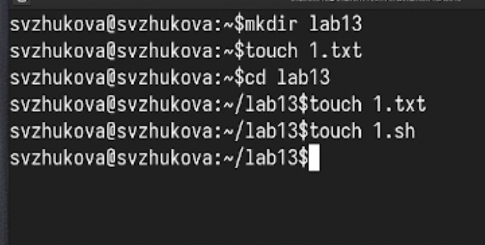
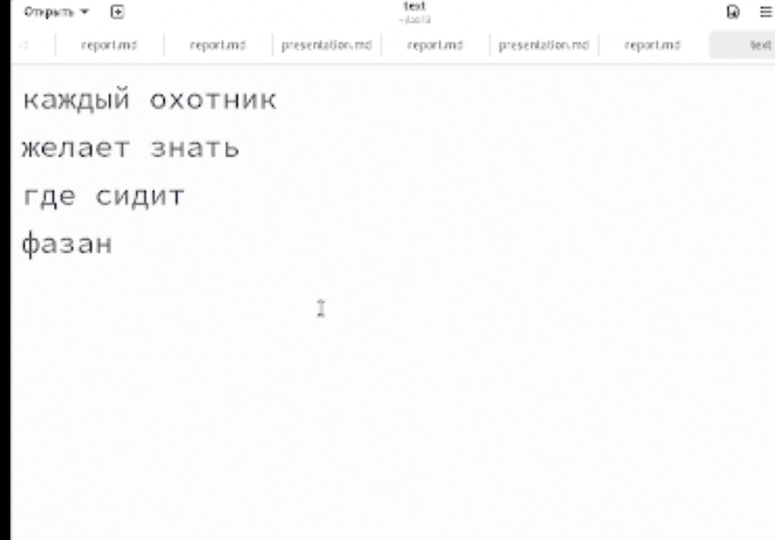
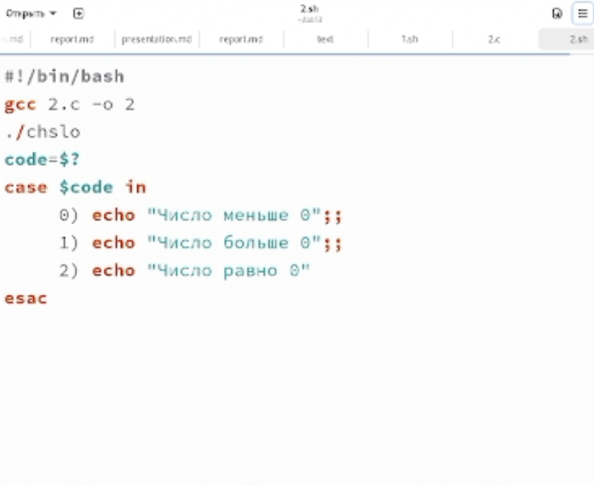
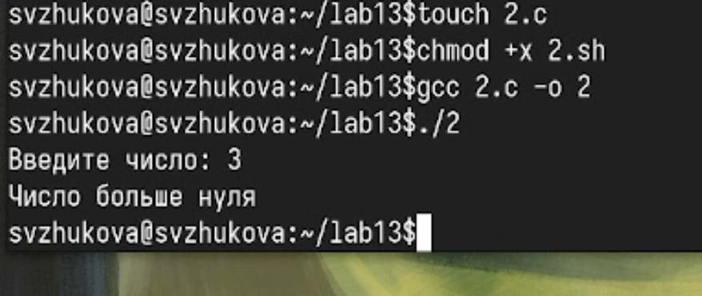
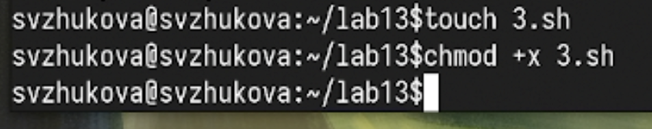
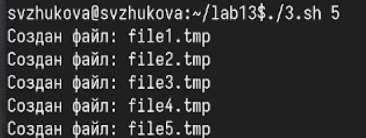
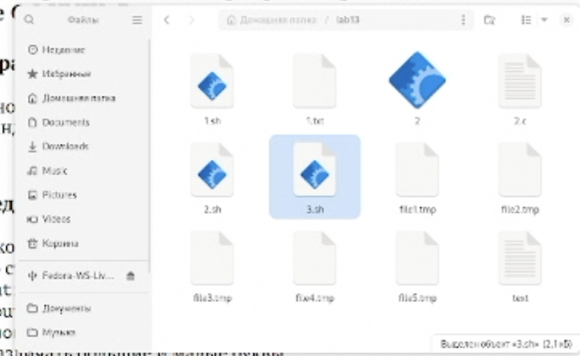
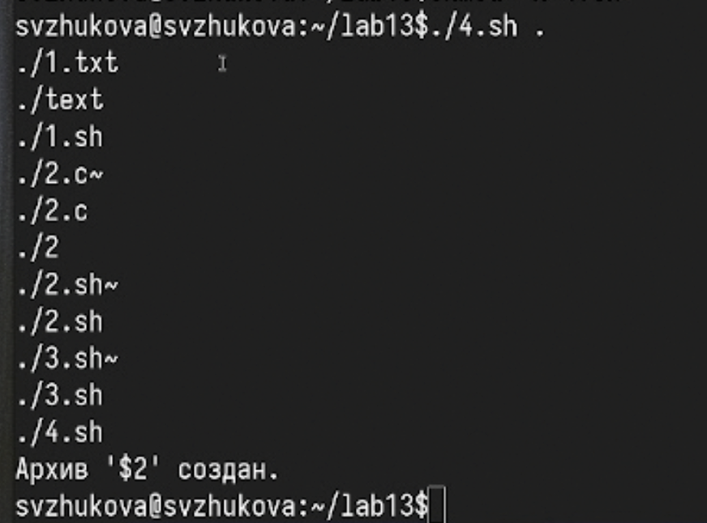
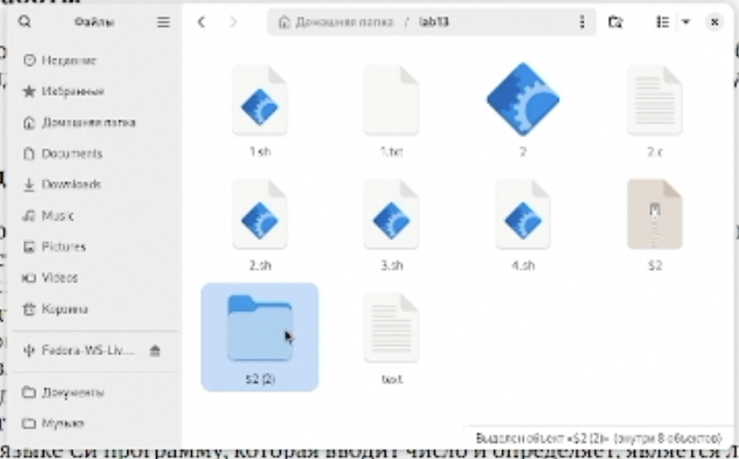

---
## Front matter
title: Лабораторная работа № 13
subtitle: Программирование в командном процессоре ОС UNIX. Ветвления и циклы
author:
  - Жукова С. В. НПИбд-01-24
institute:
  - Российский университет дружбы народов, Москва, Россия
date: 8 мая 2025

## Formatting
toc: false
slide_level: 2
theme: metropolis
header-includes: 
 - \metroset{progressbar=frametitle,sectionpage=progressbar,numbering=fraction}
 - '\makeatletter'
 - '\beamer@ignorenonframefalse'
 - '\makeatother'
aspectratio: 43
section-titles: true
---

## Докладчик

:::::::::::::: {.columns align=center}
::: {.column width="70%"}

  * Жукова София Викторовна
  * студентка
  * направления прикладной информатика
  * Российский университет дружбы народов
  * [1032240966@pfur.ru](mailto:1032240966@pfur.ru)
  * <https://svzhukova.github.io/ru/>

:::
::: {.column width="30%"}

:::
::::::::::::::

# Вводная часть

# Цель работы

Изучить основы программирования в оболочке ОС UNIX. Научится писать более
сложные командные файлы с использованием логических управляющих конструкций
и циклов.

# Выполнение лабораторной работы

## Создадим файл с расширением sh и текстовый файл 

{#fig:001 width=70%}

## Заполняем текстовый файл 

{#fig:002 width=70%}

## Пишем код, который анализирует командную строку с ключами 

{#fig:003 width=70%}

## Проверяем как работает код и находится нужная строка 

{#fig:004 width=70%}

## Создадим файлы с расширениями sh и c 

{#fig:005 width=70%}

## Пишем код, который вводит число и определяет, является ли оно больше нуля, меньше нуля или равно нулю. 

{#fig:006 width=70%}

## Затем программа завершается с помощью функции exit(n), передавая информацию в о коде завершения в оболочку

{#fig:007 width=70%}

## Проверяем как работает код 

{#fig:008 width=70%}

## Cоздадим файл с расширением sh и присвоим права для запуска кода 

{#fig:009 width=70%}

## Пишем код, создающий указанное число файлов, пронумерованных последовательно от 1 до 𝑁 

{#fig:010 width=70%}

## Запускаем код и создаем 5 файлов

{#fig:011 width=70%}

## Проверяем как работает код 

{#fig:012 width=70%}

## Запускаем код и удаляем 5 файлов

{#fig:013 width=70%}

## Проверяем, что файлы удалились 

{#fig:014 width=70%}

## Создадим файл с расширением sh и присвоим права для запуска кода 

{#fig:015 width=70%}

## Пишем код, который с помощью команды tar запаковывает в архив все файлы в указанной директории. 

{#fig:016 width=70%}

## Запускаем код 

{#fig:017 width=70%}

## Проверяем как создался архив 

{#fig:018 width=70%}

## Распаковываем папку  

{#fig:019 width=70%}

## Проверяем содержимое распакованной папки  

{#fig:020 width=70%}

# Заключение

Мы изучили основы программирования в оболочке ОС UNIX, научились писать более
сложные командные файлы с использованием логических управляющих конструкций
и циклов.

