---
## Front matter
title: "Лабораторная работа № 13"
subtitle: "Программирование в командном процессоре ОС UNIX. Ветвления и циклы"
author: "Жукова София Викторовна"

## Generic otions
lang: ru-RU
toc-title: "Содержание"

## Bibliography
bibliography: bib/cite.bib
csl: pandoc/csl/gost-r-7-0-5-2008-numeric.csl

## Pdf output format
toc: true # Table of contents
toc-depth: 2
lof: true # List of figures
lot: true # List of tables
fontsize: 12pt
linestretch: 1.5
papersize: a4
documentclass: scrreprt
## I18n polyglossia
polyglossia-lang:
  name: russian
  options:
	- spelling=modern
	- babelshorthands=true
polyglossia-otherlangs:
  name: english
## I18n babel
babel-lang: russian
babel-otherlangs: english
## Fonts
mainfont: IBM Plex Serif
romanfont: IBM Plex Serif
sansfont: IBM Plex Sans
monofont: IBM Plex Mono
mathfont: STIX Two Math
mainfontoptions: Ligatures=Common,Ligatures=TeX,Scale=0.94
romanfontoptions: Ligatures=Common,Ligatures=TeX,Scale=0.94
sansfontoptions: Ligatures=Common,Ligatures=TeX,Scale=MatchLowercase,Scale=0.94
monofontoptions: Scale=MatchLowercase,Scale=0.94,FakeStretch=0.9
mathfontoptions:
## Biblatex
biblatex: true
biblio-style: "gost-numeric"
biblatexoptions:
  - parentracker=true
  - backend=biber
  - hyperref=auto
  - language=auto
  - autolang=other*
  - citestyle=gost-numeric
## Pandoc-crossref LaTeX customization
figureTitle: "Рис."
tableTitle: "Таблица"
listingTitle: "Листинг"
lofTitle: "Список иллюстраций"
lotTitle: "Список таблиц"
lolTitle: "Листинги"
## Misc options
indent: true
header-includes:
  - \usepackage{indentfirst}
  - \usepackage{float} # keep figures where there are in the text
  - \floatplacement{figure}{H} # keep figures where there are in the text
---

# Цель работы

Изучить основы программирования в оболочке ОС UNIX. Научится писать более
сложные командные файлы с использованием логических управляющих конструкций
и циклов.

# Задание

1. Используя команды getopts grep, написать командный файл, который анализирует
командную строку с ключами:
– -iinputfile — прочитать данные из указанного файла;
– -ooutputfile — вывести данные в указанный файл;
– -pшаблон — указать шаблон для поиска;
– -C — различать большие и малые буквы;
– -n — выдавать номера строк.
а затем ищет в указанном файле нужные строки, определяемые ключом -p.
2. Написать на языке Си программу, которая вводит число и определяет, является ли оно
больше нуля, меньше нуля или равно нулю. Затем программа завершается с помощью
функции exit(n), передавая информацию в о коде завершения в оболочку. Команд-
ный файл должен вызывать эту программу и, проанализировав с помощью команды
$?, выдать сообщение о том, какое число было введено.
3. Написать командный файл, создающий указанное число файлов, пронумерованных
последовательно от 1 до 𝑁 (например 1.tmp, 2.tmp, 3.tmp,4.tmp и т.д.). Число файлов,
которые необходимо создать, передаётся в аргументы командной строки. Этот же ко-
мандный файл должен уметь удалять все созданные им файлы (если они существуют).
4. Написать командный файл, который с помощью команды tar запаковывает в архив
все файлы в указанной директории. Модифицировать его так, чтобы запаковывались
только те файлы, которые были изменены менее недели тому назад (использовать
команду find)

# Выполнение лабораторной работы

Создадим файл с расширением sh и текстовый файл (рис. [-@fig:001]).

{#fig:001 width=70%}

Заполняем текстовый файл (рис. [-@fig:002]).

{#fig:002 width=70%}

Пишем код, который анализирует командную строку с ключами (рис. [-@fig:003]).

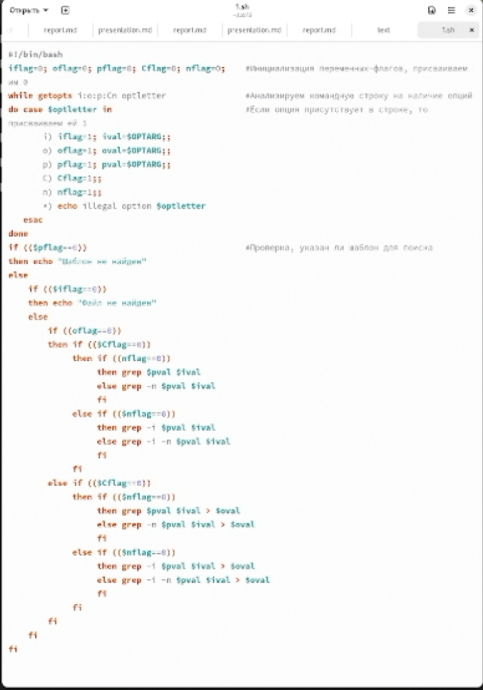{#fig:003 width=70%}

Проверяем как работает код и находится нужная строка (рис. [-@fig:004]).

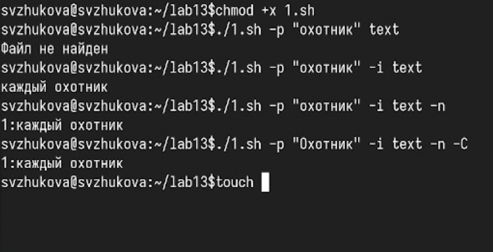{#fig:004 width=70%}

Создадим файлы с расширениями sh и c (рис. [-@fig:005]).

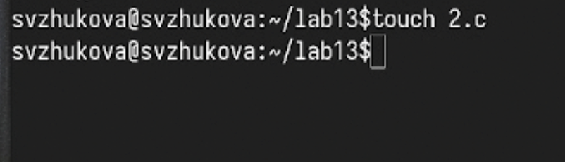{#fig:005 width=70%}

Пишем код, который вводит число и определяет, является ли оно больше нуля, меньше нуля или равно нулю. (рис. [-@fig:006]).

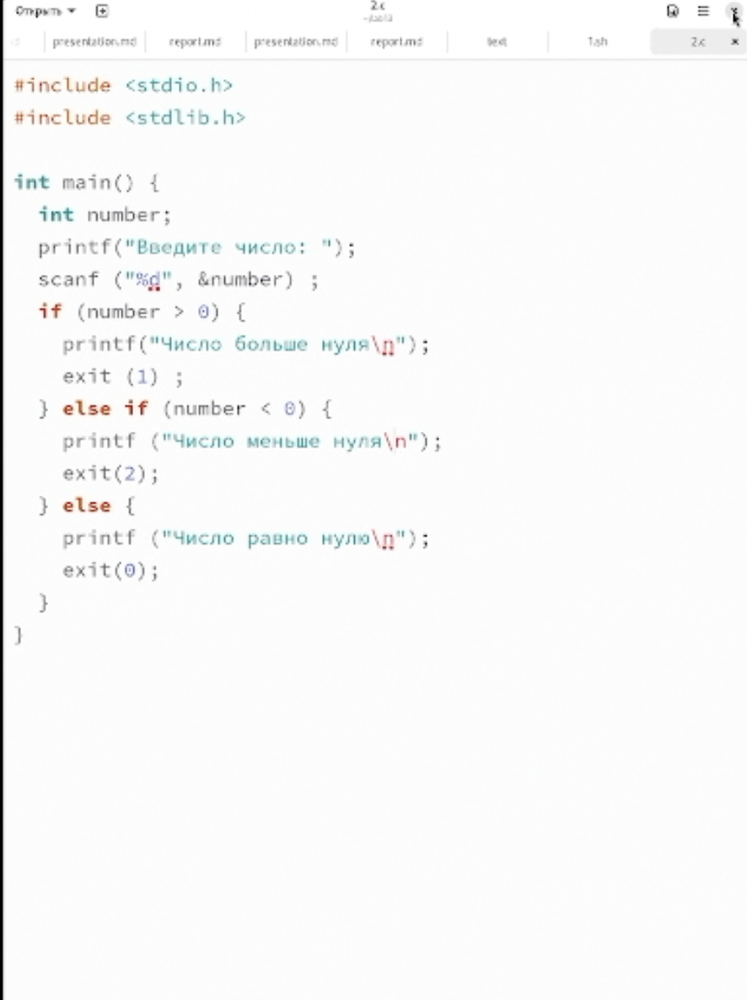{#fig:006 width=70%}

Затем программа завершается с помощью функции exit(n), передавая информацию в о коде завершения в оболочку (рис. [-@fig:007]).

{#fig:007 width=70%}

Проверяем как работает код (рис. [-@fig:008]).

{#fig:008 width=70%}

Создадим файл с расширением sh и присвоим права для запуска кода (рис. [-@fig:009]).

{#fig:009 width=70%}

Пишем код, создающий указанное число файлов, пронумерованных последовательно от 1 до 𝑁 (рис. [-@fig:010]).

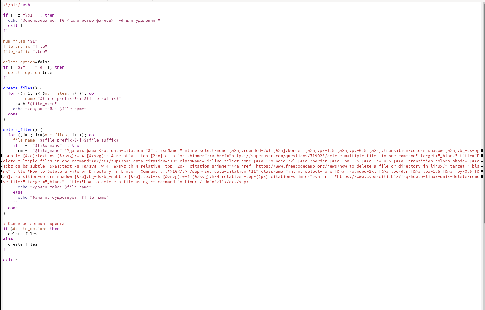{#fig:010 width=70%}

Запускаем код и создаем 5 файлов (рис. [-@fig:011]).

{#fig:011 width=70%}

Проверяем как работает код (рис. [-@fig:012]).

{#fig:012 width=70%}

Запускаем код и удаляем 5 файлов (рис. [-@fig:013]).

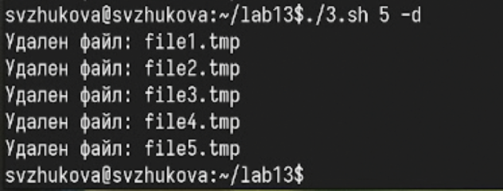{#fig:013 width=70%}

Проверяем, что файлы удалились (рис. [-@fig:014]).

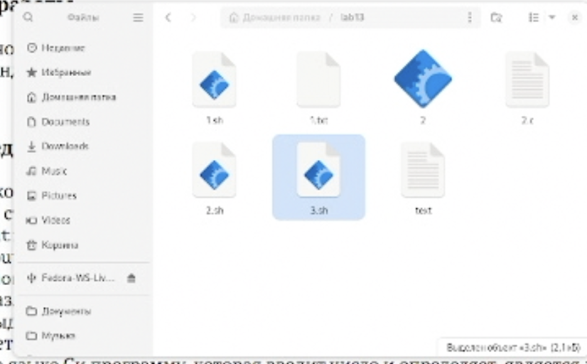{#fig:014 width=70%}

Создадим файл с расширением sh и присвоим права для запуска кода (рис. [-@fig:015]).

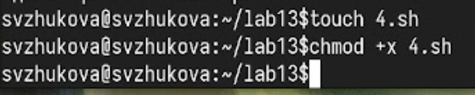{#fig:015 width=70%}

Пишем код, который с помощью команды tar запаковывает в архив все файлы в указанной директории. (рис. [-@fig:016]).

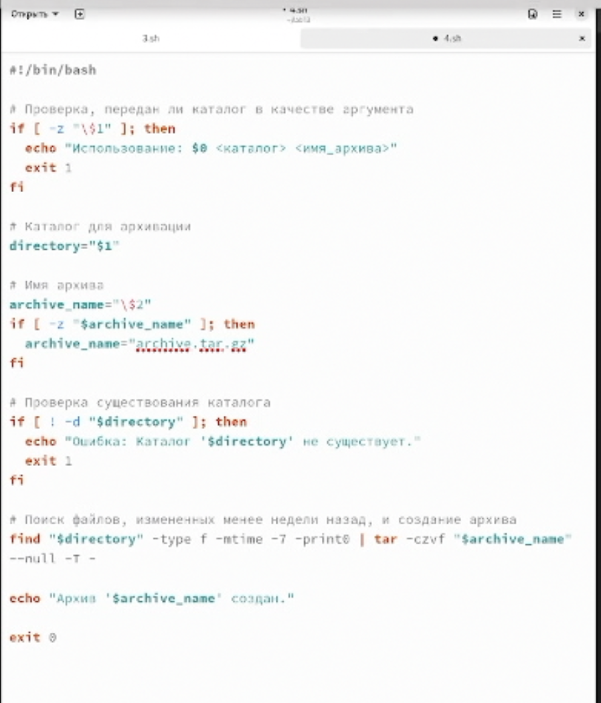{#fig:016 width=70%}

Запускаем код (рис. [-@fig:017]).

{#fig:017 width=70%}

Проверяем как создался архив (рис. [-@fig:019]).

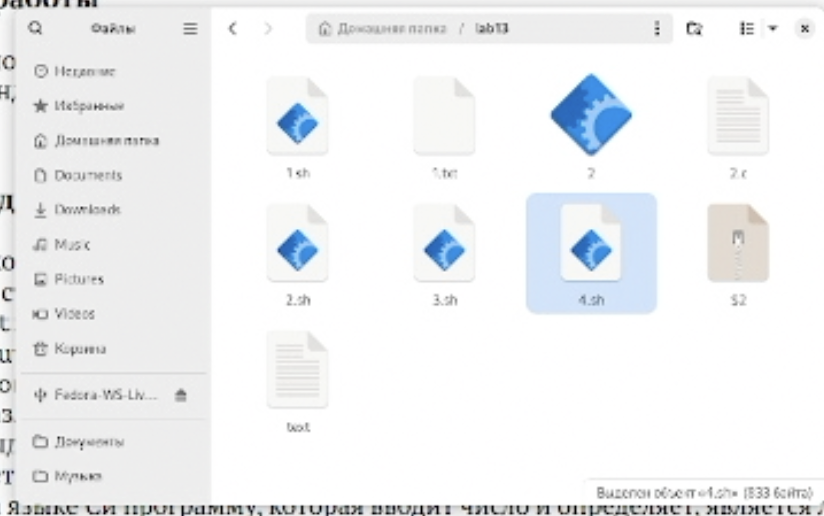{#fig:018 width=70%}

Распаковываем папку  (рис. [-@fig:019]).

{#fig:019 width=70%}

Проверяем содержимое распакованной папки   (рис. [-@fig:020]).

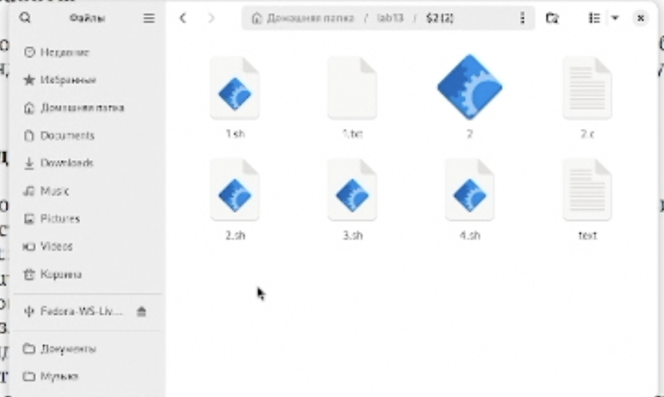{#fig:020 width=70%}

# Выводы

Мы изучили основы программирования в оболочке ОС UNIX, научились писать более
сложные командные файлы с использованием логических управляющих конструкций
и циклов.

