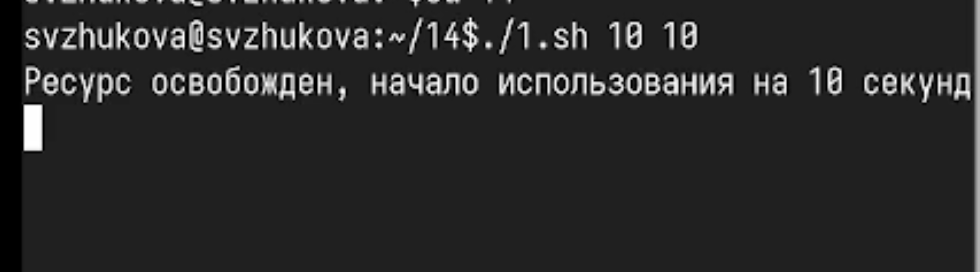
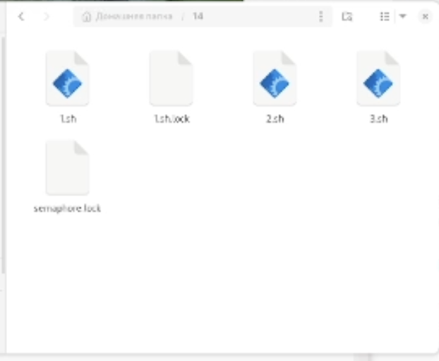
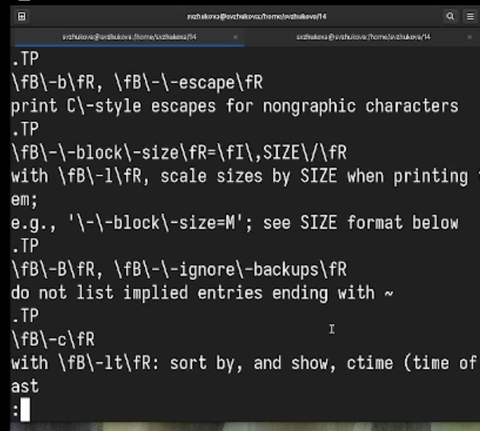
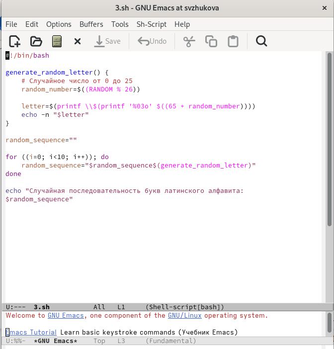

---
## Front matter
title: Лабораторная работа № 14
subtitle: Программирование в командном процессоре ОС UNIX. Расширенное программирование
author:
  - Жукова С. В. НПИбд-01-24
institute:
  - Российский университет дружбы народов, Москва, Россия
date: 17 мая 2025

## Formatting
toc: false
slide_level: 2
theme: metropolis
header-includes: 
 - \metroset{progressbar=frametitle,sectionpage=progressbar,numbering=fraction}
 - '\makeatletter'
 - '\beamer@ignorenonframefalse'
 - '\makeatother'
aspectratio: 43
section-titles: true
---

## Докладчик

:::::::::::::: {.columns align=center}
::: {.column width="70%"}

  * Жукова София Викторовна
  * студентка
  * направления прикладной информатика
  * Российский университет дружбы народов
  * [1032240966@pfur.ru](mailto:1032240966@pfur.ru)
  * <https://svzhukova.github.io/ru/>

:::
::: {.column width="30%"}

:::
::::::::::::::

# Вводная часть

## Цели и задачи

# Цель работы

Изучить основы программирования в оболочке ОС UNIX. Научиться писать более
сложные командные файлы с использованием логических управляющих конструкций
и циклов.

# Выполнение лабораторной работы

## Напишем командный файл, реализующий упрощённый механизм семафоров. 

{#fig:001 width=70%}

## Запустим код в 1 терминале 

{#fig:002 width=70%}

## Запустим код во 2 терминале

{#fig:003 width=70%}

## Проверим как создаются файлы 

{#fig:004 width=70%}

## Реализуем команду man с помощью командного файла. 

{#fig:005 width=70%}

## Запустим код с командой ls

{#fig:006 width=70%}

## Проверим как работает программа 

{#fig:007 width=70%}

## Используя встроенную переменную $RANDOM, напишем командный файл, генерирую-
щий случайную последовательность букв латинского алфавита.

{#fig:008 width=70%}

## Запустим код и проверим как генирируются буквы 

{#fig:009 width=70%}

# Заключение

Мы изучили основы программирования в оболочке ОС UNIX, научились писать более
сложные командные файлы с использованием логических управляющих конструкций
и циклов.

