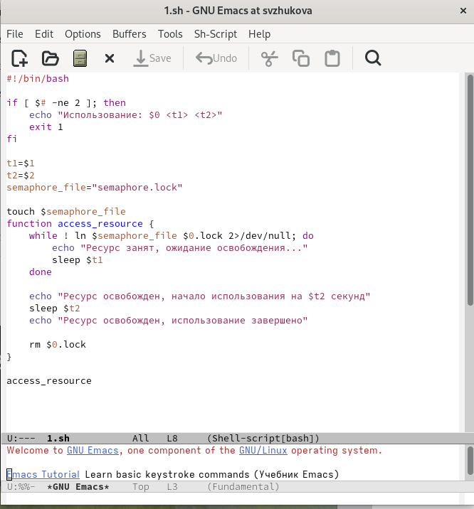
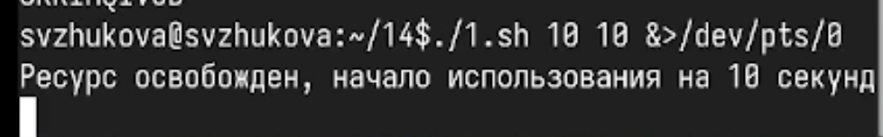
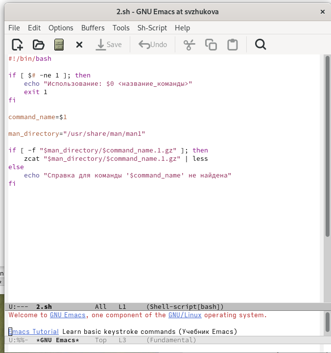
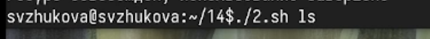
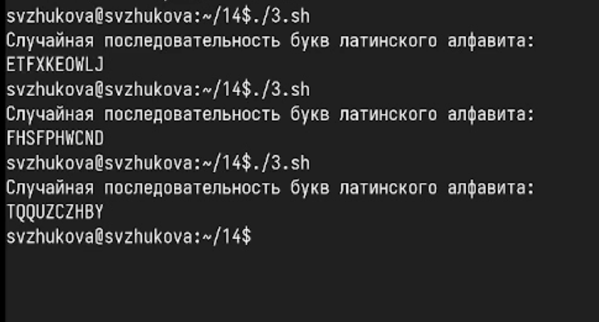

---
## Front matter
title: "Лабораторная работа № 14"
subtitle: "Программирование в командном процессоре ОС UNIX. Расширенное программирование"
author: "Жукова София Викторовна"

## Generic otions
lang: ru-RU
toc-title: "Содержание"

## Bibliography
bibliography: bib/cite.bib
csl: pandoc/csl/gost-r-7-0-5-2008-numeric.csl

## Pdf output format
toc: true # Table of contents
toc-depth: 2
lof: true # List of figures
lot: true # List of tables
fontsize: 12pt
linestretch: 1.5
papersize: a4
documentclass: scrreprt
## I18n polyglossia
polyglossia-lang:
  name: russian
  options:
	- spelling=modern
	- babelshorthands=true
polyglossia-otherlangs:
  name: english
## I18n babel
babel-lang: russian
babel-otherlangs: english
## Fonts
mainfont: IBM Plex Serif
romanfont: IBM Plex Serif
sansfont: IBM Plex Sans
monofont: IBM Plex Mono
mathfont: STIX Two Math
mainfontoptions: Ligatures=Common,Ligatures=TeX,Scale=0.94
romanfontoptions: Ligatures=Common,Ligatures=TeX,Scale=0.94
sansfontoptions: Ligatures=Common,Ligatures=TeX,Scale=MatchLowercase,Scale=0.94
monofontoptions: Scale=MatchLowercase,Scale=0.94,FakeStretch=0.9
mathfontoptions:
## Biblatex
biblatex: true
biblio-style: "gost-numeric"
biblatexoptions:
  - parentracker=true
  - backend=biber
  - hyperref=auto
  - language=auto
  - autolang=other*
  - citestyle=gost-numeric
## Pandoc-crossref LaTeX customization
figureTitle: "Рис."
tableTitle: "Таблица"
listingTitle: "Листинг"
lofTitle: "Список иллюстраций"
lotTitle: "Список таблиц"
lolTitle: "Листинги"
## Misc options
indent: true
header-includes:
  - \usepackage{indentfirst}
  - \usepackage{float} # keep figures where there are in the text
  - \floatplacement{figure}{H} # keep figures where there are in the text
---

# Цель работы

Изучить основы программирования в оболочке ОС UNIX. Научиться писать более
сложные командные файлы с использованием логических управляющих конструкций
и циклов.

# Задание

1. Написать командный файл, реализующий упрощённый механизм семафоров. Ко-
мандный файл должен в течение некоторого времени t1 дожидаться освобождения
ресурса, выдавая об этом сообщение, а дождавшись его освобождения, использовать
его в течение некоторого времени t2<>t1, также выдавая информацию о том, что
ресурс используется соответствующим командным файлом (процессом). Запустить
командный файл в одном виртуальном терминале в фоновом режиме, перенаправив
его вывод в другой (> /dev/tty#, где # — номер терминала куда перенаправляется
вывод), в котором также запущен этот файл, но не фоновом, а в привилегированном
режиме. Доработать программу так, чтобы имелась возможность взаимодействия трёх
и более процессов.
2. Реализовать команду man с помощью командного файла. Изучите содержимое ката-
лога /usr/share/man/man1. В нем находятся архивы текстовых файлов, содержащих
справку по большинству установленных в системе программ и команд. Каждый архив
можно открыть командой less сразу же просмотрев содержимое справки. Командный
файл должен получать в виде аргумента командной строки название команды и в виде
результата выдавать справку об этой команде или сообщение об отсутствии справки,
если соответствующего файла нет в каталоге man1.
3. Используя встроенную переменную $RANDOM, напишите командный файл, генерирую-
щий случайную последовательность букв латинского алфавита. Учтите, что $RANDOM
выдаёт псевдослучайные числа в диапазоне от 0 до 32767.

# Выполнение лабораторной работы

Напишем командный файл, реализующий упрощённый механизм семафоров. (рис. [-@fig:001]).

{#fig:001 width=70%}

Запустим код в 1 терминале (рис. [-@fig:002]).

{#fig:002 width=70%}

Запустим код во 2 терминале (рис. [-@fig:003]).

{#fig:003 width=70%}

Проверим как создаются файлы (рис. [-@fig:004]).

{#fig:004 width=70%}

Реализуем команду man с помощью командного файла. (рис. [-@fig:005]).

{#fig:005 width=70%}

Запустим код с командой ls (рис. [-@fig:006]).

{#fig:006 width=70%}

Проверим как работает программа  (рис. [-@fig:007]).

{#fig:007 width=70%}

Используя встроенную переменную $RANDOM, напишем командный файл, генерирую-
щий случайную последовательность букв латинского алфавита. (рис. [-@fig:008]).

{#fig:008 width=70%}

Запустим код и проверим как генирируются буквы (рис. [-@fig:009]).

{#fig:009 width=70%}

# Выводы

Мы изучили основы программирования в оболочке ОС UNIX, научились писать более
сложные командные файлы с использованием логических управляющих конструкций
и циклов.

