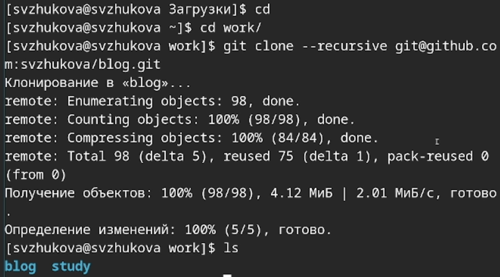
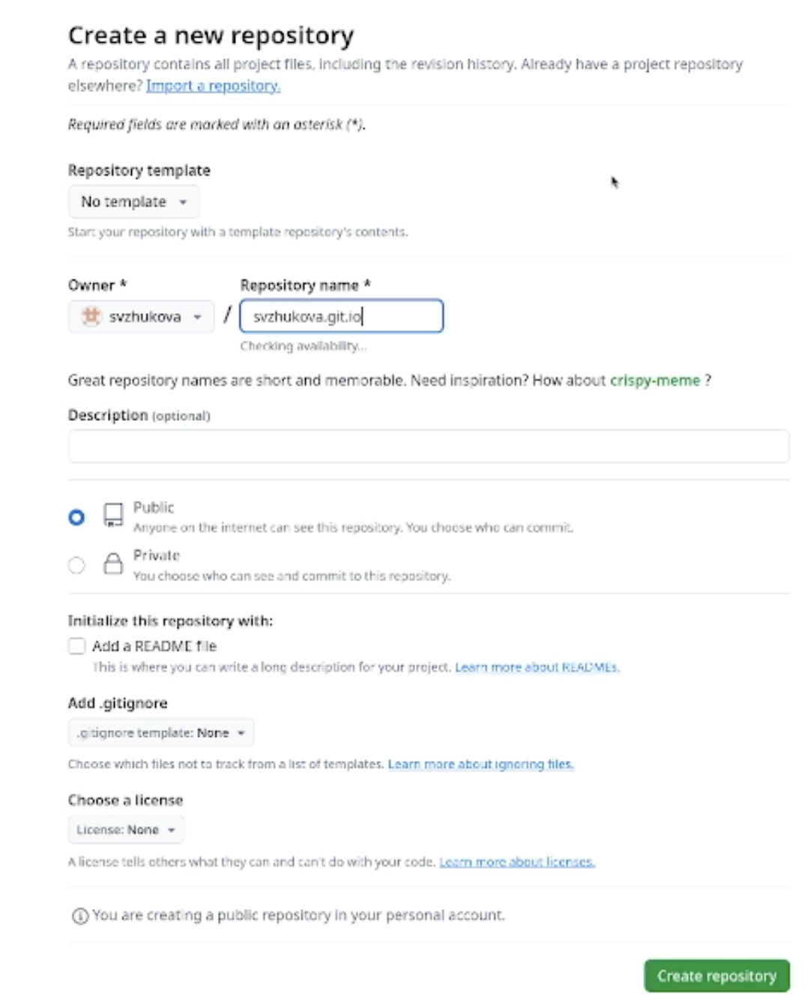

---
## Front matter
title: Первый этап реализации проекта
subtitle: Размещение на Github pages заготовки для персонального сайта.
author:
  - Жукова С. В. НПИбд-01-24
institute:
  - Российский университет дружбы народов, Москва, Россия
date: 7 марта 2024

## Formatting
toc: false
slide_level: 2
theme: metropolis
header-includes: 
 - \metroset{progressbar=frametitle,sectionpage=progressbar,numbering=fraction}
 - '\makeatletter'
 - '\beamer@ignorenonframefalse'
 - '\makeatother'
aspectratio: 43
section-titles: true
---

## Докладчик

:::::::::::::: {.columns align=center}
::: {.column width="70%"}

  * Жукова София Викторовна
  * студентка
  * направления прикладной информатика
  * Российский университет дружбы народов
  * [1032240966@pfur.ru](mailto:1032240966@pfur.ru)
  * <https://svzhukova.github.io/ru/>

:::
::: {.column width="30%"}

:::
::::::::::::::

# Цель работы

Разместить на Github pages заготовки для персонального сайта.

# Задачи

    Установить необходимое программное обеспечение.
    Скачать шаблон темы сайта.
    Разместить его на хостинге git.
    Установить параметр для URLs сайта.
    Разместить заготовку сайта на Github pages.

# Выполнение проекта

## Скачиваем шаблон сайта, исполняемый файл hugo на сайте https://github.com/gohugoio/hugo/releases, архив hugo_extended 

{#fig:001 width=70%}

## Разархивируем файл разделе Загрузки 

{ #fig:002 width=70% }

В домашнем каталоге создаем каталог bin, переходим в него и вставляем hugo.

{ #fig:003 width=70% }

## Создаем новый репозиторий blog, используя скаченный шаблон 

{ #fig:004 width=70% }

## Переходим в каталог work, в который клонируем наш новый репо

{ #fig:005 width=100% }

## В каталоге blog устанавливаем go

{ #fig:006 width=100% }

## Выполняем команду bin hugo 

{ #fig:007 width=100% }

## Вводим команду mc и удаляем каталог public 
	
{ #fig:008 width=70% }

## Вводим команду ~/bin/hugo server и получаем ссылку на наш локальный сайт 

{ #fig:009 width=100% }

## 

{ #fig:010 width=100% }

## Просмотр сайта 

{ #fig:011 width=100% }

## Переходим на Github и создаем еще один репозиторий с нашим именем 

{ #fig:012 width=100% }

## Переходим в каталог "work", клонируем наш репозиторий. Выполняем проверку с помощью команды ls -l 

{ #fig:013 width=70% }

## Переходим в наш новый каталог и переключаемся на ветку main. Создаём пустой файл и отправляем его на github для активации нашего репозитория 

{ #fig:014 width=100% }

## Перейдем в каталог blog, подключим каталог public 

{ #fig:015 width=70% }

## Запускаем команду mc,  находим .gitignore" и переходим в него. Комментируем public 

{ #fig:016 width=100% }

## С помощью команды cat .gitignore выполняем проверку, после чего повторяем действия с подключением каталога 

{ #fig:017 width=100% }

## С помощью команды ~/bin/hugo генирируем автоматически файлы в папку "public" 

{ #fig:018 width=100% }

## git remote 

{ #fig:019 width=100% }

## Переходим в каталог public, проверяем подключение каталога к репозиторию. Выгружаем файлы 

{ #fig:020 width=100% }

## Переходим на github и обновляем страницу репозитория

{ #fig:021 width=100% }

## Копируем ссылку на наш новый сайт и переходим на него 

{ #fig:022 width=100% }

# Выводы

Мы разместили на Github pages заготовки для персонального сайта.

