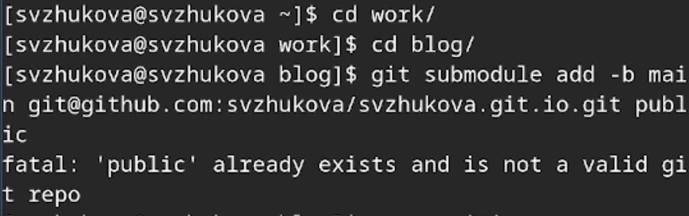

---
## Front matter
title: "Первый этап реализации проекта"
subtitle: "Размещение на Github pages заготовки для персонального сайта."
author: "Жукова София Викторовна"

## Generic otions
lang: ru-RU
toc-title: "Содержание"

## Bibliography
bibliography: bib/cite.bib
csl: pandoc/csl/gost-r-7-0-5-2008-numeric.csl

## Pdf output format
toc: true # Table of contents
toc-depth: 2
lof: true # List of figures
lot: true # List of tables
fontsize: 12pt
linestretch: 1.5
papersize: a4
documentclass: scrreprt
## I18n polyglossia
polyglossia-lang:
  name: russian
  options:
	- spelling=modern
	- babelshorthands=true
polyglossia-otherlangs:
  name: english
## I18n babel
babel-lang: russian
babel-otherlangs: english
## Fonts
mainfont: IBM Plex Serif
romanfont: IBM Plex Serif
sansfont: IBM Plex Sans
monofont: IBM Plex Mono
mathfont: STIX Two Math
mainfontoptions: Ligatures=Common,Ligatures=TeX,Scale=0.94
romanfontoptions: Ligatures=Common,Ligatures=TeX,Scale=0.94
sansfontoptions: Ligatures=Common,Ligatures=TeX,Scale=MatchLowercase,Scale=0.94
monofontoptions: Scale=MatchLowercase,Scale=0.94,FakeStretch=0.9
mathfontoptions:
## Biblatex
biblatex: true
biblio-style: "gost-numeric"
biblatexoptions:
  - parentracker=true
  - backend=biber
  - hyperref=auto
  - language=auto
  - autolang=other*
  - citestyle=gost-numeric
## Pandoc-crossref LaTeX customization
figureTitle: "Рис."
tableTitle: "Таблица"
listingTitle: "Листинг"
lofTitle: "Список иллюстраций"
lotTitle: "Список таблиц"
lolTitle: "Листинги"
## Misc options
indent: true
header-includes:
  - \usepackage{indentfirst}
  - \usepackage{float} # keep figures where there are in the text
  - \floatplacement{figure}{H} # keep figures where there are in the text
---

# Цель работы

Разместить на Github pages заготовки для персонального сайта.

# Задание

    Установить необходимое программное обеспечение.
    Скачать шаблон темы сайта.
    Разместить его на хостинге git.
    Установить параметр для URLs сайта.
    Разместить заготовку сайта на Github pages.

# Выполнение проекта

Скачиваем шаблон сайта, исполняемый файл hugo на сайте https://github.com/gohugoio/hugo/releases, архив hugo_extended (рис. [-@fig:001]).

{#fig:001 width=70%}

Разархивируем файл разделе Загрузки (рис. [-@fig:002]).

{ #fig:002 width=70% }

В домашнем каталоге создаем каталог bin, переходим в него и вставляем hugo.(рис. [-@fig:003]).

{ #fig:003 width=70% }

Создаем новый репозиторий blog, используя скаченный шаблон (рис. [-@fig:004]).

{ #fig:004 width=70% }

Переходим в каталог work, в который клонируем наш новый репозиторий. После чего переходим в наш новый каталог blog (рис. [-@fig:005]).

{ #fig:005 width=100% }

В каталоге blog устанавливаем go  (рис. [-@fig:006]).

{ #fig:006 width=100% }

Выполняем команду bin hugo (рис. [-@fig:007]).

{ #fig:007 width=100% }

Вводим команду mc и удаляем каталог public (рис. [-@fig:008]).
	
{ #fig:008 width=70% }

Вводим команду ~/bin/hugo server и получаем ссылку на наш локальный сайт (рис. [-@fig:009]).

{ #fig:009 width=100% }

(рис. [-@fig:010]).

{ #fig:010 width=100% }

Просмотр сайта (рис. [-@fig:011]).

{ #fig:011 width=100% }

Переходим на Github и создаем еще один репозиторий с нашим именем  (рис. [-@fig:012]).

{ #fig:012 width=100% }

Переходим в каталог "work", клонируем наш репозиторий. Выполняем проверку с помощью команды ls -l (рис. [-@fig:013]). 

{ #fig:013 width=70% }

Переходим в наш новый каталог и переключаемся на ветку main. Создаём пустой файл и отправляем его на github для активации нашего репозитория (рис. [-@fig:014]).

{ #fig:014 width=100% }

Перейдем в каталог blog, подключим каталог public (рис. [-@fig:015]). 

{ #fig:015 width=70% }

Запускаем команду mc,  находим .gitignore" и переходим в него. Комментируем public (рис. [-@fig:016]).

{ #fig:016 width=100% }

С помощью команды cat .gitignore выполняем проверку, после чего повторяем действия с подключением каталога (рис. [-@fig:017]).

{ #fig:017 width=100% }

С помощью команды ~/bin/hugo генирируем автоматически файлы в папку "public"  (рис. [-@fig:018]).

{ #fig:018 width=100% }

Переходим в каталог public, проверяем подключение каталога к репозиторию. Выгружаем файлы (рис. [-@fig:019]).

{ #fig:019 width=100% }

Переходим на github и обновляем страницу репозитория (рис. [-@fig:020]).

{ #fig:020 width=100% }

Копируем ссылку на наш новый сайт и переходим на него (рис. [-@fig:021]).

{ #fig:021 width=100% }

# Выводы

Мы разместили на Github pages заготовки для персонального сайта.

