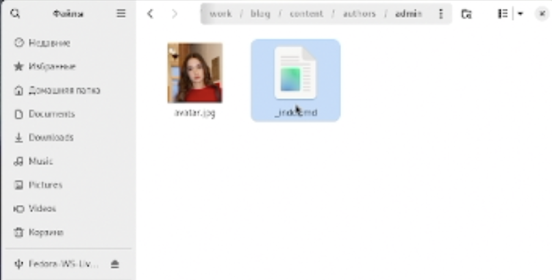
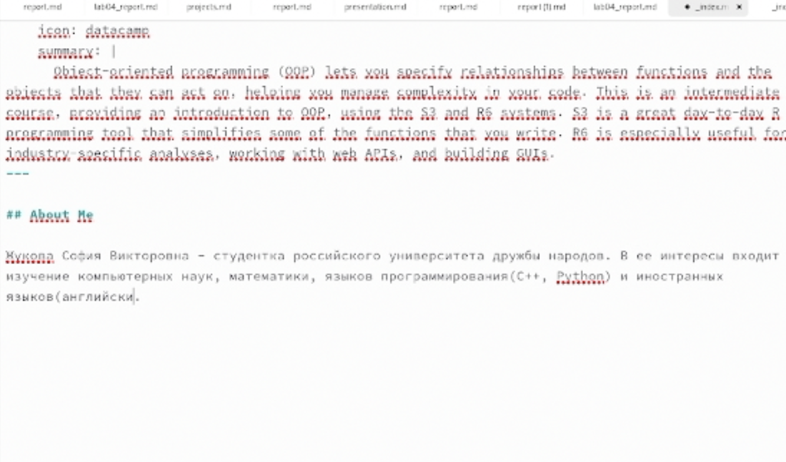
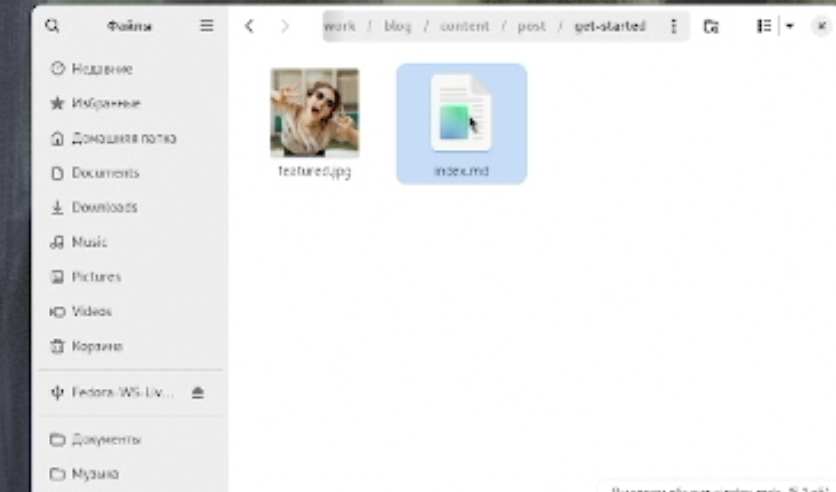
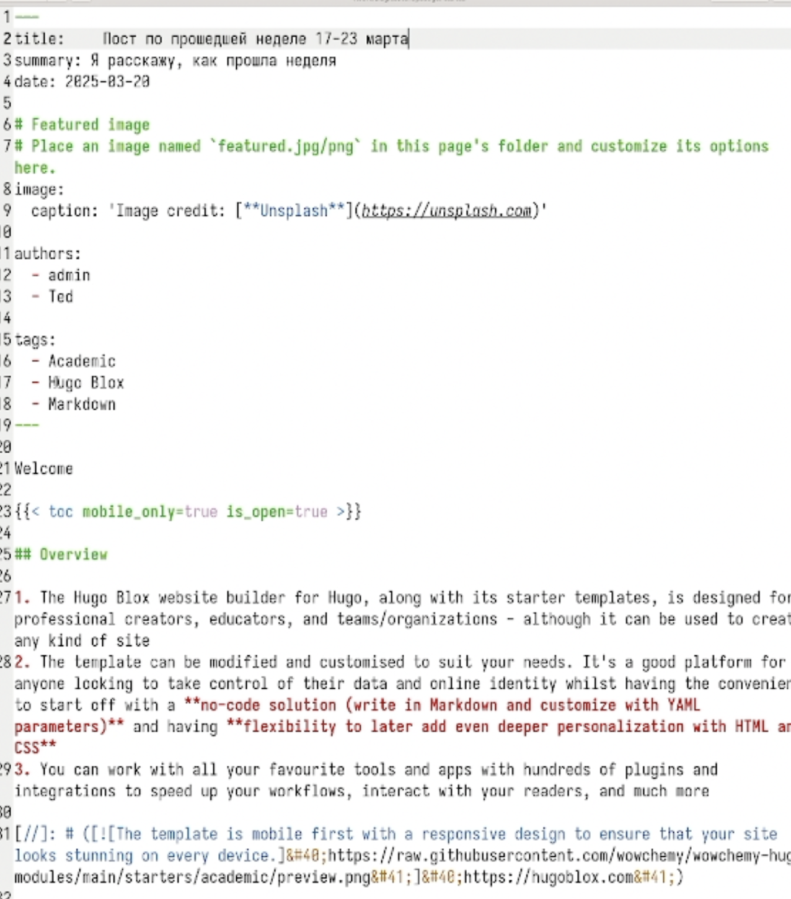
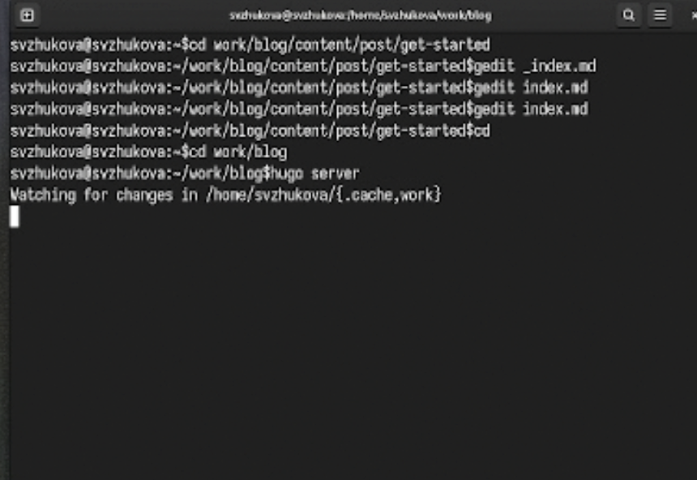
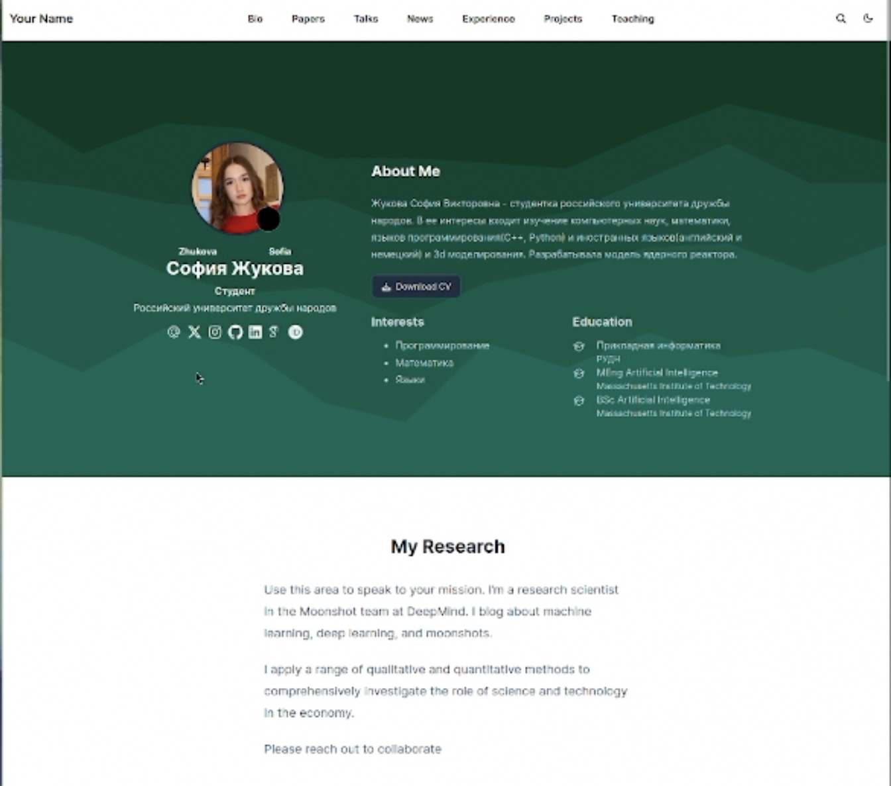
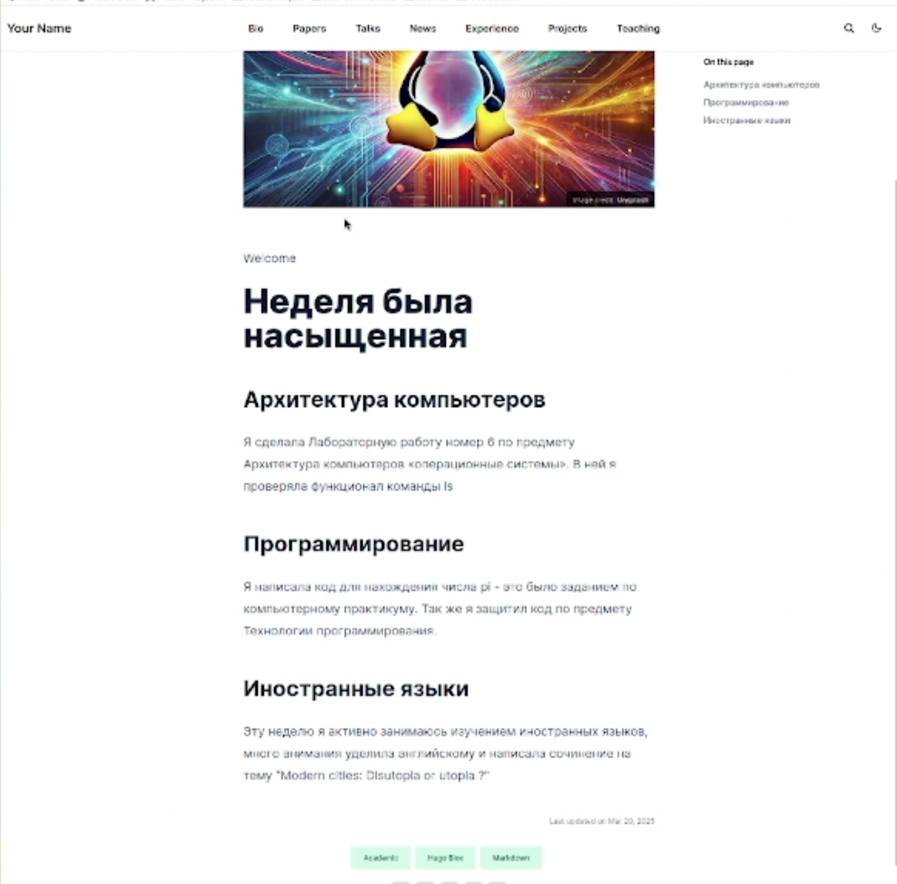
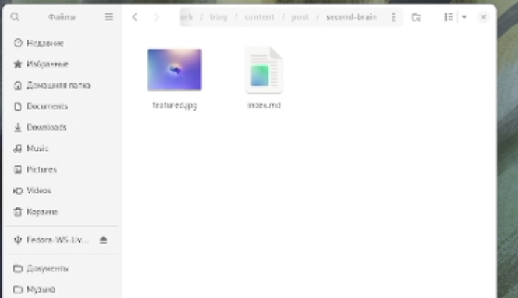
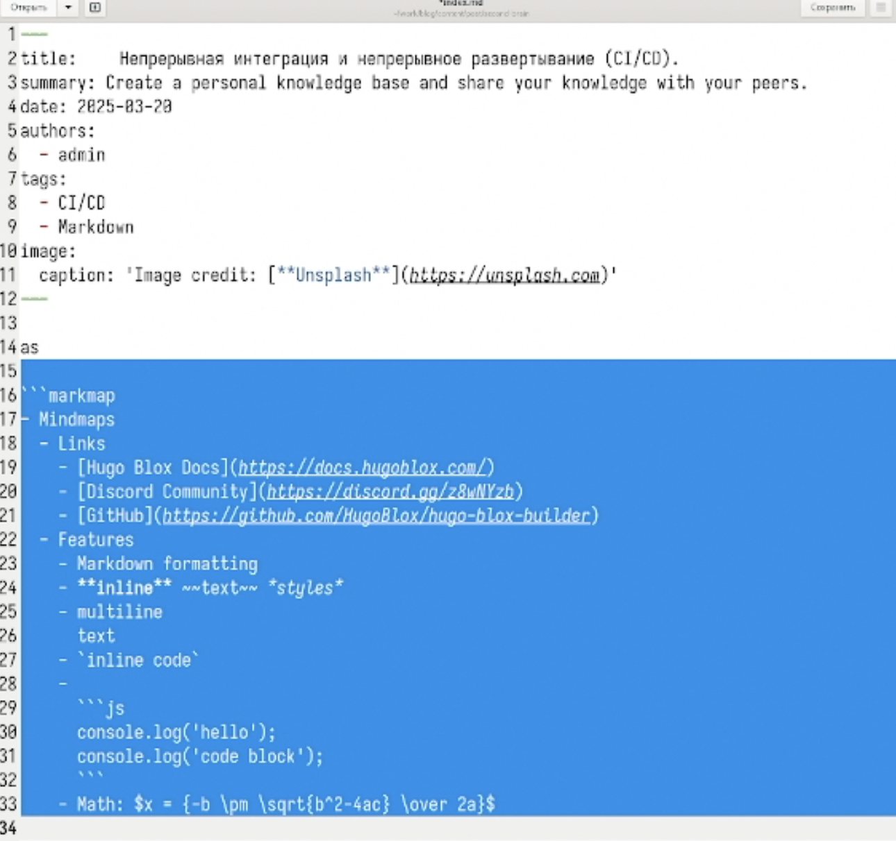
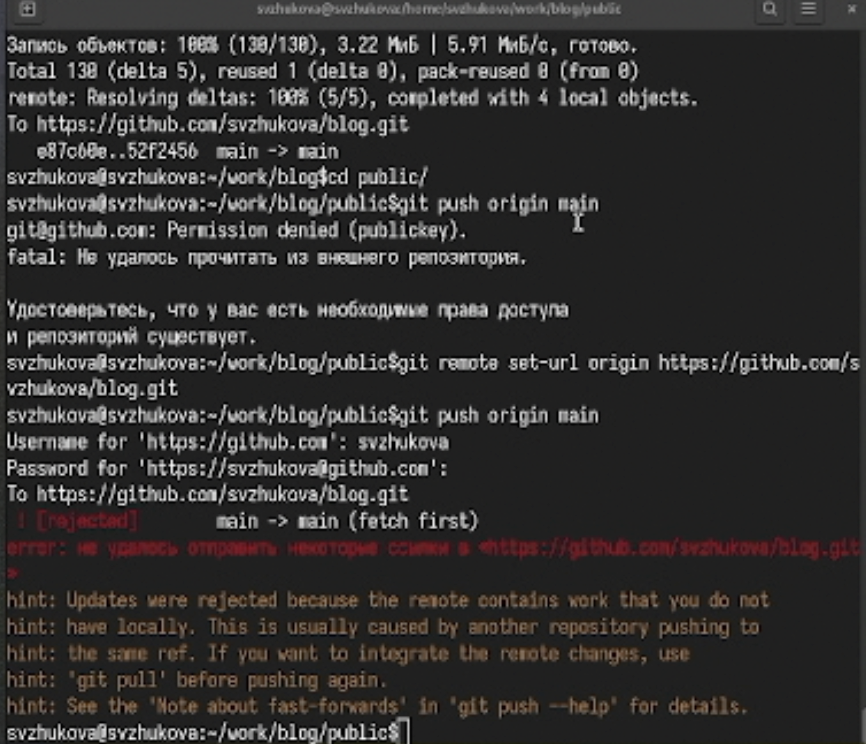

---
## Front matter
title: Второй этап реализации проекта
subtitle: Добавление к сайту данных о себе.
author:
  - Жукова С. В. НПИбд-01-24
institute:
  - Российский университет дружбы народов, Москва, Россия
date: 21 марта 2024

## Formatting
toc: false
slide_level: 2
theme: metropolis
header-includes: 
 - \metroset{progressbar=frametitle,sectionpage=progressbar,numbering=fraction}
 - '\makeatletter'
 - '\beamer@ignorenonframefalse'
 - '\makeatother'
aspectratio: 43
section-titles: true
---

## Докладчик

:::::::::::::: {.columns align=center}
::: {.column width="70%"}

  * Жукова София Викторовна
  * студентка
  * направления прикладной информатика
  * Российский университет дружбы народов
  * [1032240966@pfur.ru](mailto:1032240966@pfur.ru)
  * <https://svzhukova.github.io/ru/>

:::
::: {.column width="30%"}

:::
::::::::::::::

# Вводная часть

## Цель работы

Добавить к сайту данные о себе.

## Задание

**Список добавляемых данных**.  

- Разместить фотографию владельца сайта.
- Разместить краткое описание владельца сайта (Biography).
- Добавить информацию об интересах (Interests).
- Добавить информацию от образовании (Education).

**Сделать пост по прошедшей неделе**.
**Добавить пост на тему по выбору:**  

- Управление версиями. Git.
- Непрерывная интеграция и непрерывное развертывание (CI/CD).

# Выполнение лабораторной работы

##Для начала добавим нашу фотографию. 

Для этого мы должны проделать данный путь: "work", "blog", "content", "authors", "admin". Здесь удаляем предыдущий avatar и добавляем свой.

{ #fig:001 width=60% }

## В этом же каталоге открываем файл "_index.md".

 В него мы внесём наше имя, фамилию. Также добавим биографию, интересы, образование и др. 

{ #fig:002 width=40% }

{ #fig:003 width=60% }

## После этого в каталоге "post" в подкаталоге git-started 

Мы будем добавлять информацию для поста про прошедшую неделю 

{ #fig:004 width=50% }

В этом  каталоге открываем файл "index.md". В него мы внесём информацию для поста про прошедшую неделю. 

## Пост о прошедшей неделе

{ #fig:005 width=50% }

##

Чтобы вся наша информация выгрузилась на сайт, откроем в каталоге "blog" терминал и запустим команду hugo 

{ #fig:006 width=70% }

## Перейдём на наш сайт и посмотрим как сработали изменения.

{ #fig:007 width=60% }

## Добавление поста о прошедшей неделе

{ #fig:008 width=60% }

## После этого в каталоге "post" в подкаталоге second-brain мы будем добавлять информацию для поста CI/CD 

{ #fig:009 width=80% }

## В этом  каталоге открываем файл "index.md". 

В него мы внесём информацию для поста про CI/CD.

{ #fig:010 width=80% }

## Перейдём на наш сайт и добавились ли изменения.

{ #fig:011 width=70% }

## Выгрузка из каталога "blog"

Как только команда hugo выполнилась перейдём первым этапом в подкаталог "blog" и добавим изменения на Github. Вторым этапом проделаем все те же самые действия, но уже в каталоге "public".

{ #fig:012 width=100% }
	
{ #fig:013 width=100% }

## Последним шагом перейдём на наш Github и посмотрим итог работы 

{ #fig:016 width=100% }

# Заключение

Мы добавили к сайту данные о себе и создали новые посты.

