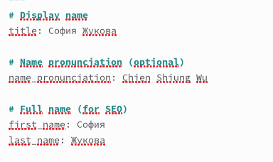
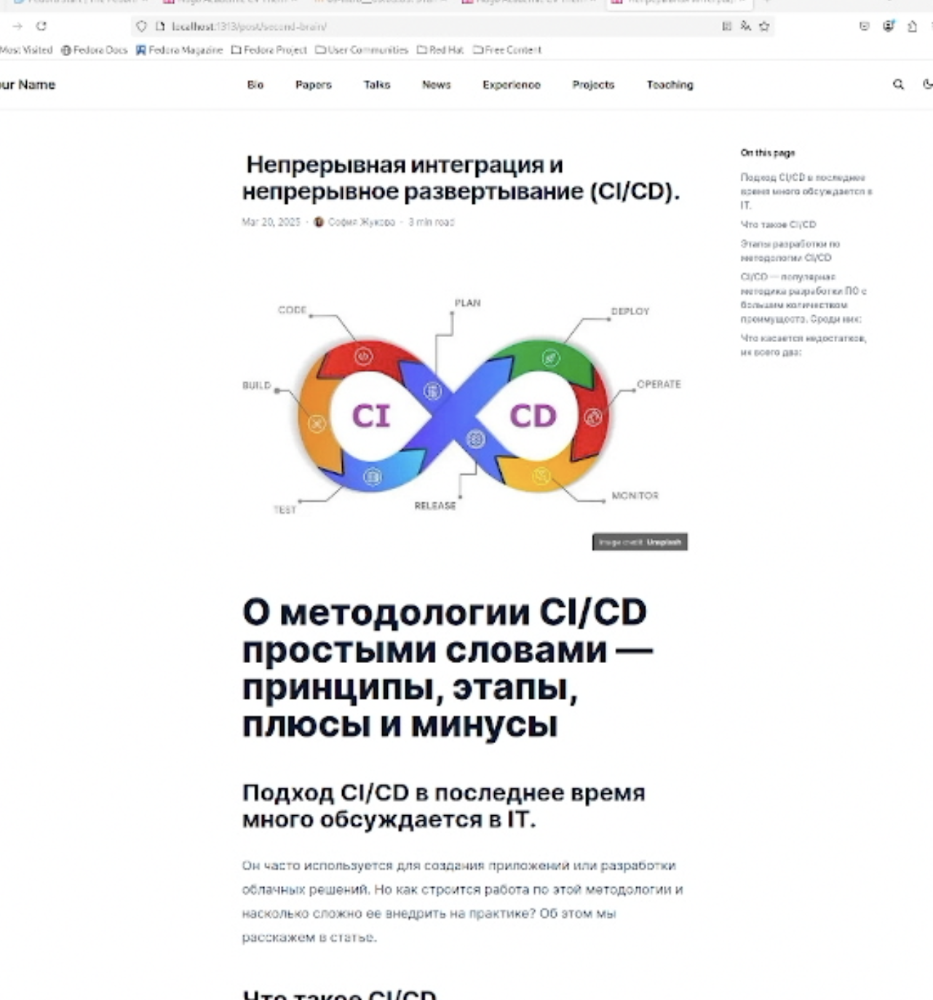
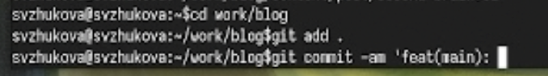
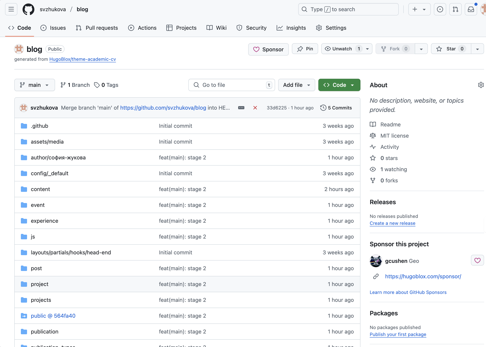

---
## Front matter
title: "Выполнение 2 этапа индивидуального проекта"
subtitle: "Добавление к сайту данных о себе."
author: "Жукова София Викторовна"

## Generic otions
lang: ru-RU
toc-title: "Содержание"

## Bibliography
bibliography: bib/cite.bib
csl: pandoc/csl/gost-r-7-0-5-2008-numeric.csl

## Pdf output format
toc: true # Table of contents
toc-depth: 2
lof: true # List of figures
lot: true # List of tables
fontsize: 12pt
linestretch: 1.5
papersize: a4
documentclass: scrreprt
## I18n polyglossia
polyglossia-lang:
  name: russian
  options:
	- spelling=modern
	- babelshorthands=true
polyglossia-otherlangs:
  name: english
## I18n babel
babel-lang: russian
babel-otherlangs: english
## Fonts
mainfont: IBM Plex Serif
romanfont: IBM Plex Serif
sansfont: IBM Plex Sans
monofont: IBM Plex Mono
mathfont: STIX Two Math
mainfontoptions: Ligatures=Common,Ligatures=TeX,Scale=0.94
romanfontoptions: Ligatures=Common,Ligatures=TeX,Scale=0.94
sansfontoptions: Ligatures=Common,Ligatures=TeX,Scale=MatchLowercase,Scale=0.94
monofontoptions: Scale=MatchLowercase,Scale=0.94,FakeStretch=0.9
mathfontoptions:
## Biblatex
biblatex: true
biblio-style: "gost-numeric"
biblatexoptions:
  - parentracker=true
  - backend=biber
  - hyperref=auto
  - language=auto
  - autolang=other*
  - citestyle=gost-numeric
## Pandoc-crossref LaTeX customization
figureTitle: "Рис."
tableTitle: "Таблица"
listingTitle: "Листинг"
lofTitle: "Список иллюстраций"
lotTitle: "Список таблиц"
lolTitle: "Листинги"
## Misc options
indent: true
header-includes:
  - \usepackage{indentfirst}
  - \usepackage{float} # keep figures where there are in the text
  - \floatplacement{figure}{H} # keep figures where there are in the text
---

# Цель работы

Добавить к сайту данные о себе.

# Задание

Список добавляемых данных.
- Разместить фотографию владельца сайта.
- Разместить краткое описание владельца сайта (Biography).
- Добавить информацию об интересах (Interests).
- Добавить информацию от образовании (Education).

Сделать пост по прошедшей неделе.
 Добавить пост на тему по выбору:
- Управление версиями. Git.
- Непрерывная интеграция и непрерывное развертывание (CI/CD).

# Выполнение лабораторной работы

Для начала добавим нашу фотографию. Для этого мы должны проделать данный путь: "work", "blog", "content", "authors", "admin". Здесь удаляем предыдущий avatar и добавляем свой (рис. [-@fig:001]).

{ #fig:001 width=100% }

В этом же каталоге открываем файл "_index.md". В него мы внесём наше имя, фамилию. Также добавим биографию, интересы, образование и др. (рис. [-@fig:002]).

{ #fig:002 width=100% }

 (рис. [-@fig:003]).

{ #fig:003 width=100% }

После этого в каталоге "post" в подкаталоге git-started  мы будем добавлять информацию для поста про прошедшую неделю (рис. [-@fig:004]).

{ #fig:004 width=100% }

В этом  каталоге открываем файл "index.md". В него мы внесём информацию для поста про прошедшую неделю. (рис. [-@fig:005]).

{ #fig:005 width=100% }

Чтобы вся наша информация выгрузилась на сайт, откроем в каталоге "blog" терминал и запустим команду hugo (рис. [-@fig:006]).

{ #fig:006 width=100% }

Перейдём на наш сайт и посмотрим как сработали изменения (рис. [-@fig:007]).

{ #fig:007 width=100% }

(рис. [-@fig:008]).

{ #fig:008 width=100% }

После этого в каталоге "post" в подкаталоге second-brain мы будем добавлять информацию для поста CI/CD (рис. [-@fig:009]).

{ #fig:009 width=100% }

В этом  каталоге открываем файл "index.md". В него мы внесём информацию для поста про CI/CD. (рис. [-@fig:010]).

{ #fig:010 width=100% }

Перейдём на наш сайт и добавились ли изменения (рис. [-@fig:011]).

{ #fig:011 width=100% }

Как только команда hugo выполнилась перейдём первым этапом в подкаталог "blog" и добавим изменения на Github (рис. [-@fig:012]). Вторым этапом проделаем все те же самые действия, но уже в каталоге "public" (рис. [-@fig:013]).

{ #fig:012 width=100% }
	
{ #fig:013 width=100% }

Последним шагом перейдём на наш Github и посмотрим итог работы (рис. [-@fig:016]) 

{ #fig:016 width=100% }

# Выводы

Мы добавили к сайту данные о себе и создали новые посты.

