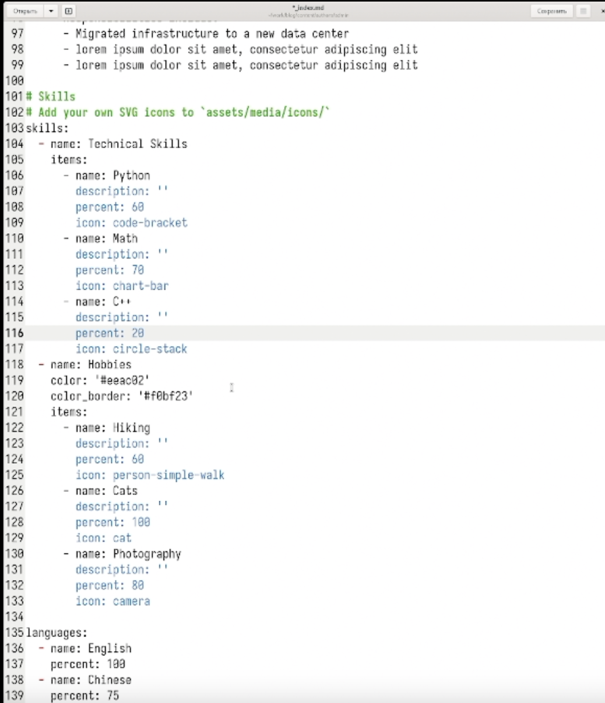
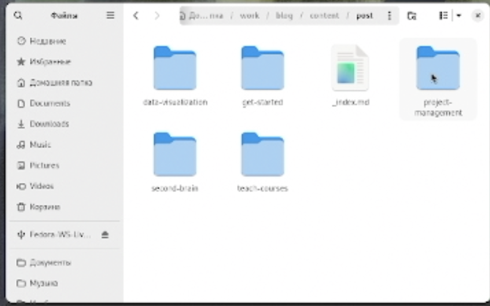
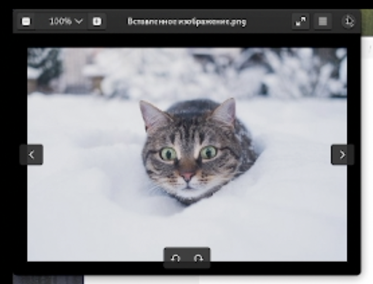
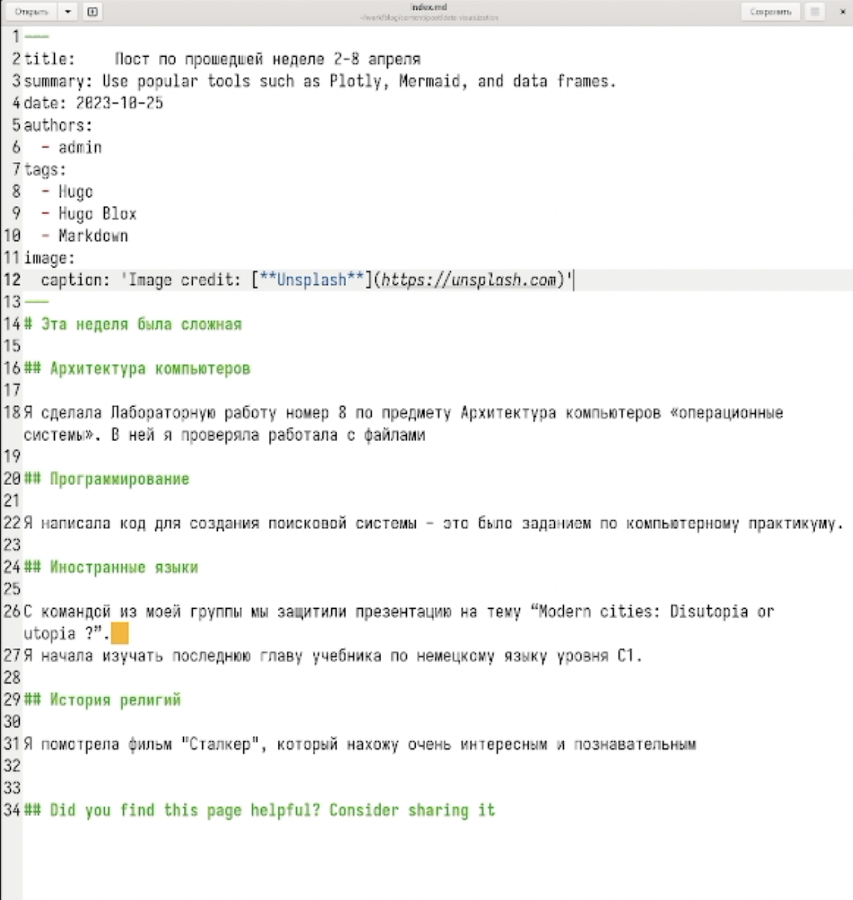
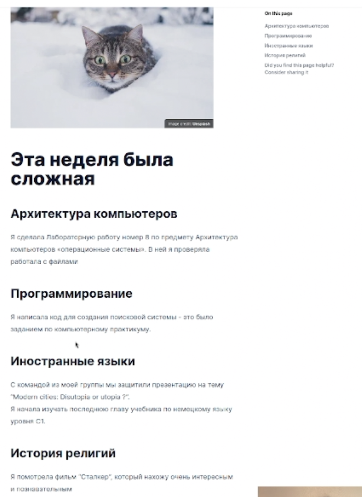
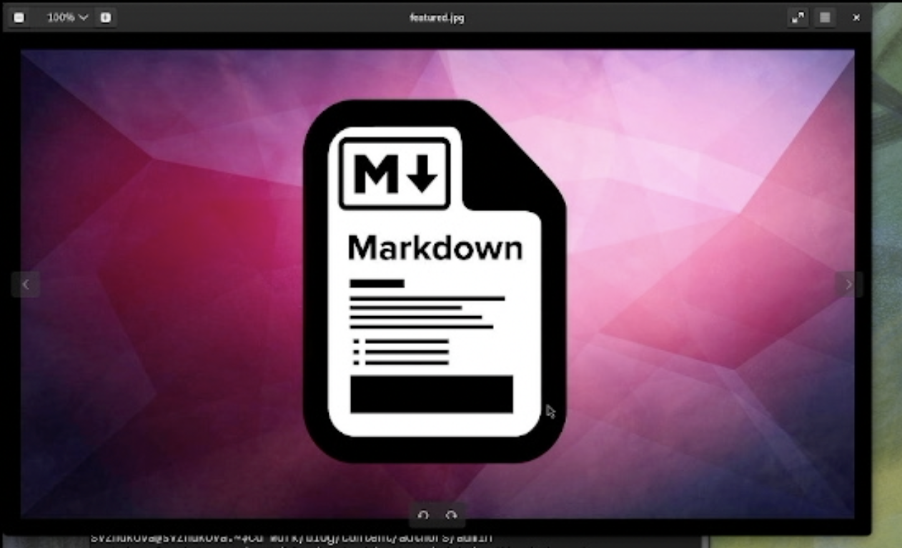
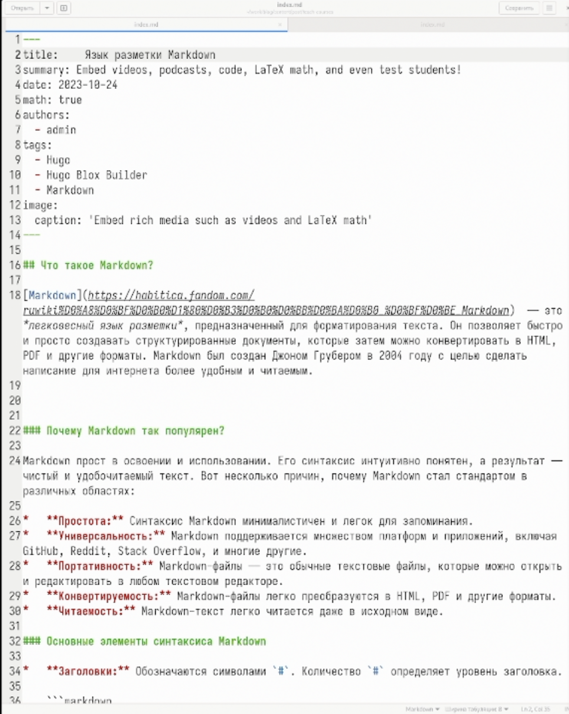
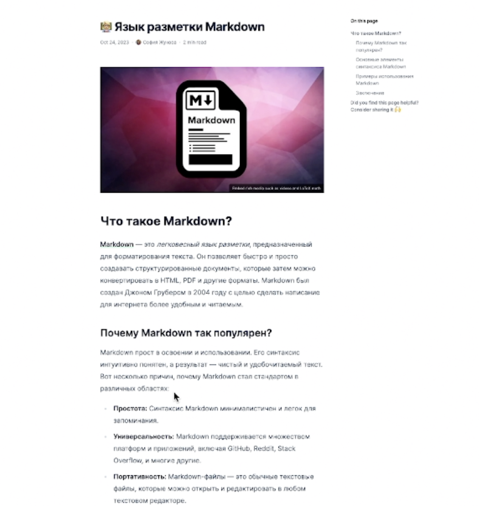

---
## Front matter
title: Третий этап реализации проекта
subtitle: Добавленик к сайту достижения
author:
  - Жукова С. В. НПИбд-01-24
institute:
  - Российский университет дружбы народов, Москва, Россия
date: 9 апреля 2025

## Formatting
toc: false
slide_level: 2
theme: metropolis
header-includes: 
 - \metroset{progressbar=frametitle,sectionpage=progressbar,numbering=fraction}
 - '\makeatletter'
 - '\beamer@ignorenonframefalse'
 - '\makeatother'
aspectratio: 43
section-titles: true
---

## Докладчик

:::::::::::::: {.columns align=center}
::: {.column width="70%"}

  * Жукова София Викторовна
  * студентка
  * направления прикладной информатика
  * Российский университет дружбы народов
  * [1032240966@pfur.ru](mailto:1032240966@pfur.ru)
  * <https://svzhukova.github.io/ru/>

:::
::: {.column width="30%"}

:::
::::::::::::::

# Вводная часть

# Цель работы

Добавить к сайту достижения

# Задание

1. Добавить информацию о навыках (Skills).
2. Добавить информацию об опыте (Experience).
3. Добавить информацию о достижениях (Accomplishments).
4. Сделать пост по прошедшей неделе.
5. Добавить пост на тему по выбору:  
    Язык разметки Markdown.

# Выполнение лабораторной работы

## Для начала добавим информацию о навыках. 

Для этого мы должны проделать данный путь: "work", "blog", "content", "home" и зайти в файл "skills.md". Внутри файла мы изменим шаблонные данные на свои

{ #fig:001 width=100% }

## Проверим как обновилась информация. 

{ #fig:002 width=100% }

## Теперь нам нужно добавить информацию об опыте.

 В каталоге "home" выберим файл "experience.md" для добавления опыта

{ #fig:003 width=100% }

## Последним пунктом для редактирования будет "Awards"

Мы добавим наши достижения 

{ #fig:004 width=70% }

## Проверим как изменились достижения 

{ #fig:005 width=60% }

## Создание постов

В каталоге "post" создаём два каталога "Markdown" и "Моя 2 неделя", в которые добавим написанные нами тексты для постов 

{ #fig:006 width=70% }

## Загружаем фото в папку

{ #fig:007 width=50% }

## Пишем пост в index.md о прошешей неделе 

{ #fig:008 width=100% }

## Перейдём на наш сайт и посмотрим итог работы 

{ #fig:009 width=100% }

## Изменяем картинку в папке

{ #fig:010 width=50% }

## Пишем статью в index.md о  языке разметки Markdown 

{ #fig:011 width=50% }

## Пост на сайте о языке разметки Markdown 

{ #fig:012 width=100% }

# Заключение

Мы научились добавлять к сайту достижения.

