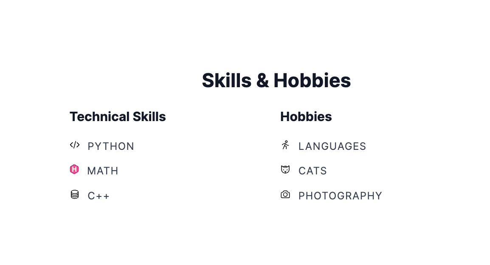
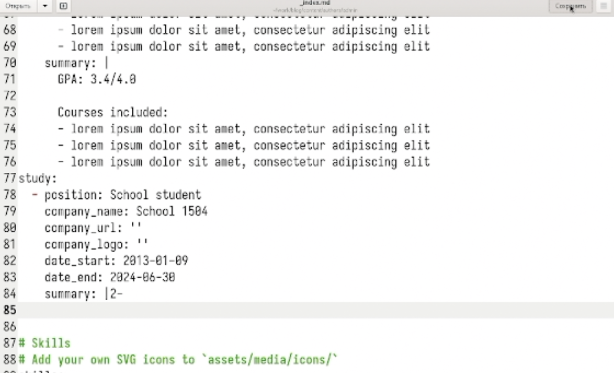
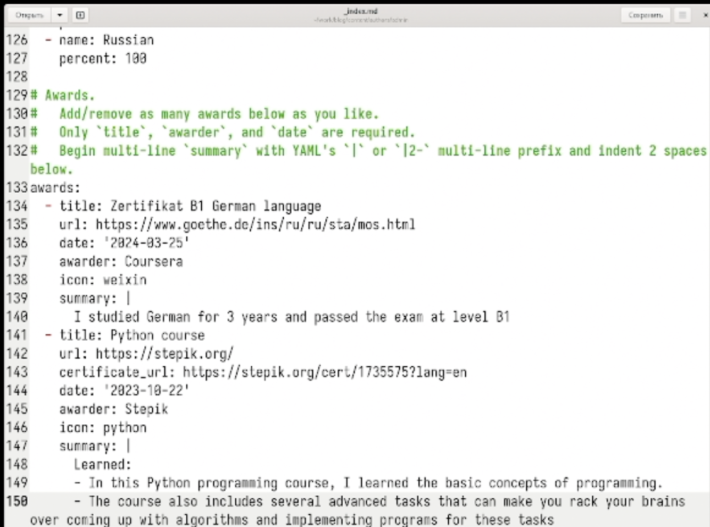
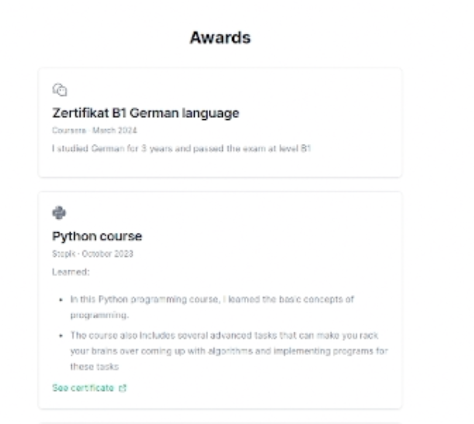

---
## Front matter
title: "Выполнение 3 этапа индивидуального проекта"
subtitle: "Добавление к сайту достижения"
author: "Жукова София Викторовна"

## Generic otions
lang: ru-RU
toc-title: "Содержание"

## Bibliography
bibliography: bib/cite.bib
csl: pandoc/csl/gost-r-7-0-5-2008-numeric.csl

## Pdf output format
toc: true # Table of contents
toc-depth: 2
lof: true # List of figures
lot: true # List of tables
fontsize: 12pt
linestretch: 1.5
papersize: a4
documentclass: scrreprt
## I18n polyglossia
polyglossia-lang:
  name: russian
  options:
	- spelling=modern
	- babelshorthands=true
polyglossia-otherlangs:
  name: english
## I18n babel
babel-lang: russian
babel-otherlangs: english
## Fonts
mainfont: IBM Plex Serif
romanfont: IBM Plex Serif
sansfont: IBM Plex Sans
monofont: IBM Plex Mono
mathfont: STIX Two Math
mainfontoptions: Ligatures=Common,Ligatures=TeX,Scale=0.94
romanfontoptions: Ligatures=Common,Ligatures=TeX,Scale=0.94
sansfontoptions: Ligatures=Common,Ligatures=TeX,Scale=MatchLowercase,Scale=0.94
monofontoptions: Scale=MatchLowercase,Scale=0.94,FakeStretch=0.9
mathfontoptions:
## Biblatex
biblatex: true
biblio-style: "gost-numeric"
biblatexoptions:
  - parentracker=true
  - backend=biber
  - hyperref=auto
  - language=auto
  - autolang=other*
  - citestyle=gost-numeric
## Pandoc-crossref LaTeX customization
figureTitle: "Рис."
tableTitle: "Таблица"
listingTitle: "Листинг"
lofTitle: "Список иллюстраций"
lotTitle: "Список таблиц"
lolTitle: "Листинги"
## Misc options
indent: true
header-includes:
  - \usepackage{indentfirst}
  - \usepackage{float} # keep figures where there are in the text
  - \floatplacement{figure}{H} # keep figures where there are in the text
---

# Цель работы

Добавить к сайту достижения

# Задание

1. Добавить информацию о навыках (Skills).
2. Добавить информацию об опыте (Experience).
3. Добавить информацию о достижениях (Accomplishments).
4. Сделать пост по прошедшей неделе.
5. Добавить пост на тему по выбору:  
    Язык разметки Markdown.

# Выполнение лабораторной работы

Для начала добавим информацию о навыках. Для этого мы должны проделать данный путь: "work", "blog", "content", "home" и зайти в файл "skills.md". Внутри файла мы изменим шаблонные данные на свои  (рис. [-@fig:001]).

{ #fig:001 width=100% }

Проверим как обновилась информация. (рис. [-@fig:002]).

{ #fig:002 width=100% }

Теперь нам нужно добавить информацию об опыте. В каталоге "home" выберим файл "experience.md" для добавления опыта (рис. [-@fig:003]).

{ #fig:003 width=100% }

Последним пунктом для редактирования будет "Awards", где мы добавим наши достижения (рис. [-@fig:004]).

{ #fig:004 width=100% }

Проверим как изменились достижения (рис. [-@fig:005]).

{ #fig:005 width=100% }

В каталоге "post" создаём два каталога "Markdown" и "Моя 2 неделя", в которые добавим написанные нами тексты для постов (рис. [-@fig:006]).

{ #fig:006 width=100% }

Загружаем фото в папку (рис. [-@fig:007]).

{ #fig:007 width=100% }

Пишем пост в index.md о прошешей неделе (рис. [-@fig:008]).

{ #fig:008 width=100% }

Перейдём на наш сайт и посмотрим итог работы (рис. [-@fig:009])

{ #fig:009 width=100% }

 (рис. [-@fig:010])

{ #fig:010 width=100% }

Пишем статью в index.md о  языке разметки Markdown (рис. [-@fig:011])

{ #fig:011 width=100% }

Пост на сайте о языке разметки Markdown (рис. [-@fig:012]).

{ #fig:012 width=100% }

# Выводы

Мы научились добавлять к сайту достижения.

