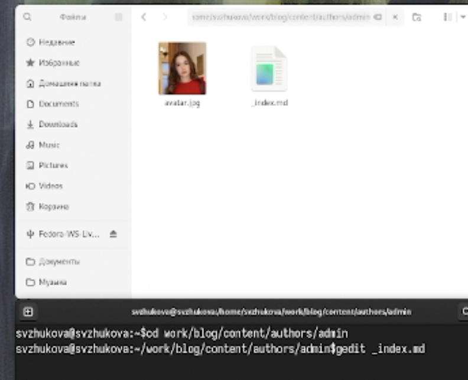
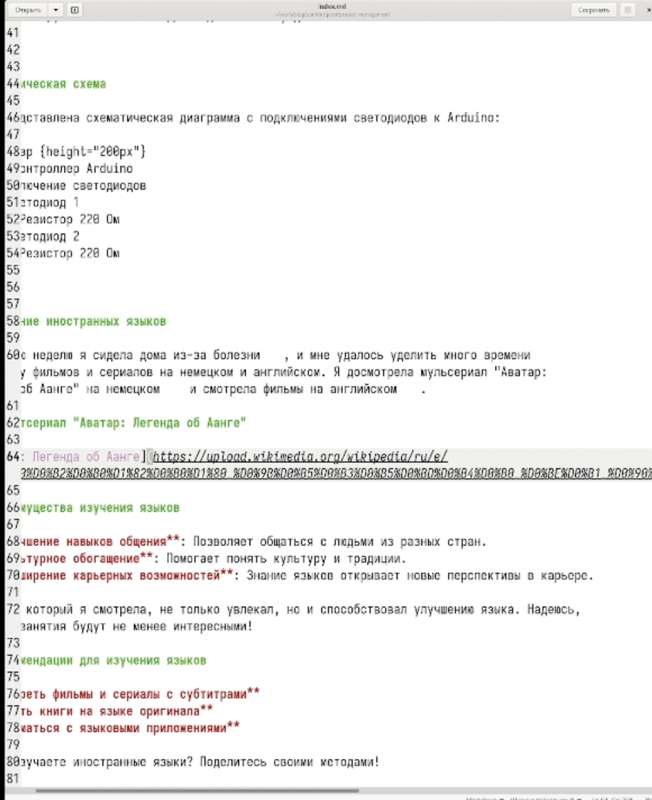
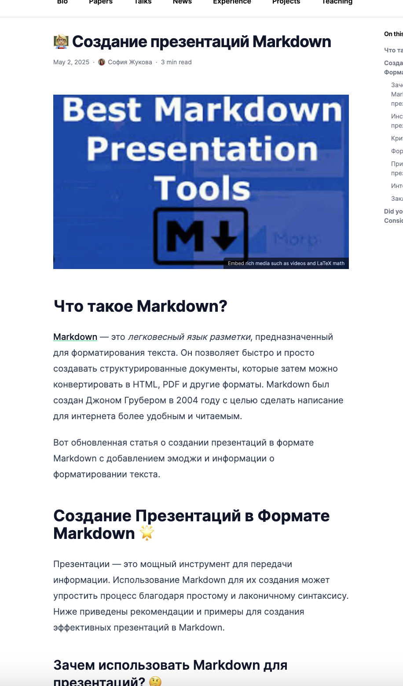

---
## Front matter
title: Четвертый этап реализации проекта
subtitle: Добавление к сайту ссылок на научные и библиометрические ресурсы
author:
  - Жукова С. В. НПИбд-01-24
institute:
  - Российский университет дружбы народов, Москва, Россия
date: 2 мая 2025

## Formatting
toc: false
slide_level: 2
theme: metropolis
header-includes: 
 - \metroset{progressbar=frametitle,sectionpage=progressbar,numbering=fraction}
 - '\makeatletter'
 - '\beamer@ignorenonframefalse'
 - '\makeatother'
aspectratio: 43
section-titles: true
---

## Докладчик

:::::::::::::: {.columns align=center}
::: {.column width="70%"}

  * Жукова София Викторовна
  * студентка
  * направления прикладной информатика
  * Российский университет дружбы народов
  * [1032240966@pfur.ru](mailto:1032240966@pfur.ru)
  * <https://svzhukova.github.io/ru/>

:::
::: {.column width="30%"}

:::
::::::::::::::

# Вводная часть

# Цель работы

Добавить к сайту ссылки на научные и библиометрические ресурсы.

# Выполнение лабораторной работы

## Заходим в папку с информаций об авторе 

{#fig:001 width=70%}

## Добавляем ссылки в документ и меняем иконки 

{#fig:002 width=70%}

## Проверяем, как сохранились изменения и добавились ссылки 

{#fig:003 width=70%}

## Пишем пост о прошедшей неделе 

{#fig:004 width=70%}

## Проверяем, как сохранились изменения и добавилися пост с картинками 

{#fig:005 width=70%}

## Пишем статью о создании презентаций в markdown 

{#fig:006 width=70%}

## Проверяем, как сохранились изменения и добавилась статья с картинками 

{#fig:007 width=70%}

# Заключение

Мы добавили к сайту ссылки на научные и библиометрические ресурсы.

